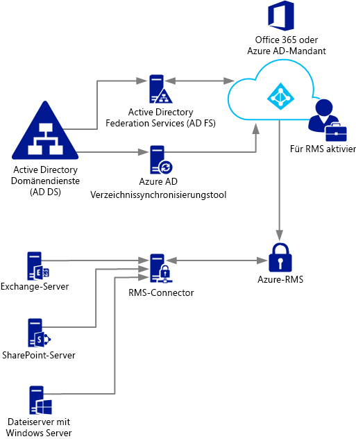
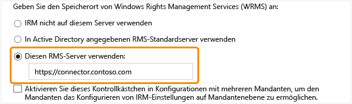

# Bereitstellen des Azure Rights Management-Verbindungsdiensts
Hier erhalten Sie Informationen über den Microsoft Rights Management-Verbindungsdienst und wie Sie mit dessen Hilfe Informationsschutz mit vorhandenen lokalen Bereitstellungen, die Microsoft Exchange Server, Microsoft SharePoint Server oder Dateiserver verwenden, die unter Windows Server ausgeführt werden und die Dateiklassifizierungsinfrastruktur-Funktion des Ressourcen-Managers für Dateiserver verwenden, bereitstellen können.

> [!TIP]
> Ein allgemeines Beispielszenario mit Screenshots finden Sie im Abschnitt [Automatischer Schutz von Dateien auf Dateiservern, auf denen Windows Server und Dateiklassifizierungsinfrastruktur ausgeführt wird](../Topic/What_is_Azure_Rights_Management_.md#BKMK_Example_FCI) im Thema [Was ist Azure Rights Management?](../Topic/What_is_Azure_Rights_Management_.md).

## <a name="OverviewConnector"></a>Übersicht über den Microsoft Rights Management-Verbindungsdienst
Mit dem Microsoft Rights Management-Connector können Sie schnell vorhandene lokale Server für die Verwendung ihrer IRM-Funktionalität mit dem cloudbasierten Microsoft Rights Management Service (Azure RMS) aktivieren. Mit dieser Funktionalität können IT-Abteilungen und Benutzer Dokumente und Bilder, sowohl innerhalb als auch außerhalb der Organisation, ganz einfach schützen, ohne zusätzliche Infrastruktur installieren oder Vertrauensstellungen mit anderen Organisationen einrichten zu müssen. Sie können diesen Connector verwenden, selbst wenn einige der Benutzer Verbindungen mit Online-Diensten in einem Hybridszenario herstellen. Beispielsweise könnte es sein, dass für die Postfächer einiger Benutzer Exchange Online und für die Postfächer einiger anderer Benutzer Exchange Server verwendet wird. Nachdem Sie den RMS-Connector (RMS-Verbindungsdienst) installiert haben, können alle Benutzer E-Mails und Anlagen mithilfe von Azure RMS schützen und nutzen, und der Informationsschutz zwischen den beiden Bereitstellungskonfigurationen funktioniert nahtlos.

Der RMS-Verbindungsdienst ist ein kleiner Dienst, der lokal auf Servern installiert wird, die unter Windows Server 2012 R2, Windows Server 2012 oder Windows Server 2008 R2 ausgeführt werden. Zusätzlich zum Ausführen des Connectors auf physischen Computern können Sie ihn auch auf virtuellen Computern ausführen, einschließlich virtuellen Azure IaaS-Computern. Nachdem Sie den Verbindungsdienst installiert und konfiguriert haben, fungiert er als Kommunikationsschnittstelle (Relay) zwischen den lokalen Servern und dem Cloud-Dienst.

Wenn Sie Ihren eigenen Mandantenschlüssel für Azure RMS verwalten (das "Bring Your Own Key"- oder BYOK-Szenario), greifen der RMS-Verbindungsdienst und die lokalen Server, die ihn verwenden, nicht auf das Hardwaresicherheitsmodul (HSM) zu, das Ihren Mandantenschlüssel enthält. Dies liegt daran, dass alle kryptografischen Vorgänge, in denen der Mandantenschlüssel zum Einsatz kommt, in Azure RMS ausgeführt werden und nicht lokal.



Der RMS-Verbindungsdienst unterstützt die folgenden lokalen Server: Exchange Server, SharePoint Server und Dateiserver, die unter Windows Server ausgeführt werden und die Dateiklassifizierungsinfrastruktur verwenden, um Richtlinien zu klassifizieren und auf Office-Dokumente in einem Ordner anzuwenden. Wenn Sie alle Dateitypen mit Dateiklassifizierung schützen möchten, verwenden Sie nicht den RMS-Connector, sondern die [RMS Protection Cmdlets](https://msdn.microsoft.com/library/azure/mt433195.aspx).

> [!NOTE]
> Informationen zu den unterstützten Versionen dieser lokalen Server finden Sie unter "Lokale Server, die Azure RMS unterstützen" im Abschnitt [Anwendungen, die Azure RMS unterstützen](../Topic/Requirements_for_Azure_Rights_Management.md#BKMK_SupportedApplications) des Themas [Voraussetzungen für Azure Rights Management](../Topic/Requirements_for_Azure_Rights_Management.md).

Die folgende Abschnitte helfen Ihnen dabei, den RMS-Verbindungsdienst zu planen, zu installieren und zu konfigurieren. Sie müssen dann noch einige Konfigurationen nach der Installation vornehmen, damit Ihre Server den Verbindungsdienst verwenden können.

-   [Voraussetzungen für den RMS-Verbindungsdienst](../Topic/Deploying_the_Azure_Rights_Management_Connector.md#BKMK_Prereqs)

-   **Schritt 1:**  [Installieren des RMS-Verbindungsdiensts](../Topic/Deploying_the_Azure_Rights_Management_Connector.md#BKMK_InstallingConnector)

-   **Schritt 2:**  [Eingeben von Anmeldeinformationen](../Topic/Deploying_the_Azure_Rights_Management_Connector.md#EnteringCredentials)

-   **Schritt 3:**  [Autorisieren von Servern für die Verwendung des RMS-Verbindungsdiensts](../Topic/Deploying_the_Azure_Rights_Management_Connector.md#AuthorizingServers)

-   **Schritt 4:**  [Konfigurieren von Lastenausgleich und Hochverfügbarkeit](../Topic/Deploying_the_Azure_Rights_Management_Connector.md#ConfiguringConnector)

-   Optional: [Konfigurieren des RMS-Verbindungsdiensts für die Verwendung von HTTPS](../Topic/Deploying_the_Azure_Rights_Management_Connector.md#BKMK_ConfiguringHTTPS)

-   Optional: [Konfigurieren des RMS-Verbindungsdiensts für einen Webproxyserver](../Topic/Deploying_the_Azure_Rights_Management_Connector.md#BKMK_ConfiguringWebProxy)

-   Optional: [Installieren des Administrationstool des RMS-Verbindungsdiensts auf administrativen Computern](../Topic/Deploying_the_Azure_Rights_Management_Connector.md#BKMK_InstallingStandaloneTool)

-   **Schritt 5:**  [Konfigurieren von Servern für die Verwendung des RMS-Verbindungsdiensts](../Topic/Deploying_the_Azure_Rights_Management_Connector.md#ConfiguringServers)

    -   [Konfigurieren eines Exchange-Servers für die Verwendung des Verbindungsdiensts](../Topic/Deploying_the_Azure_Rights_Management_Connector.md#BKMK_ExchangeServer)

    -   [Konfigurieren eines SharePoint-Servers für die Verwendung des Verbindungsdiensts](../Topic/Deploying_the_Azure_Rights_Management_Connector.md#BKMK_ConfiguringSharePoint)

    -   [Konfigurieren eines Dateiservers, der die Dateiklassifizierungsinfrastruktur verwendet, für die Verwendung des Verbindungsdiensts](../Topic/Deploying_the_Azure_Rights_Management_Connector.md#BKMK_FileServer)

-   [Nächste Schritte](../Topic/Deploying_the_Azure_Rights_Management_Connector.md#BKMK_NextSteps)

## <a name="BKMK_Prereqs"></a>Voraussetzungen für den RMS-Verbindungsdienst
Stellen Sie vor der Installation des RMS-Verbindungsdiensts sicher, dass folgende Voraussetzungen erfüllt sind.

|Anforderung|Weitere Informationen|
|---------------|-------------------------|
|Der RMS-Verbindungsdienst (RMS) ist aktiviert.|[Aktivieren von Azure Rights Management](../Topic/Activating_Azure_Rights_Management.md)|
|Verzeichnissynchronisierung zwischen Ihren Active Directory-Gesamtstrukturen und Azure Active Directory|Nachdem RMS aktiviert wurde, muss Azure Active Directory so konfiguriert werden, dass es mit den Benutzern und Gruppen in Ihrer Active Directory-Datenbank arbeitet. **Important:** Dieser Verzeichnissynchronisierungsschritt ist erforderlich, damit der RMS-Verbindungsdienst funktioniert, und zwar auch bei einem Testnetzwerk. Auch wenn Sie Office 365 und Azure Active Directory verwenden können, indem Sie manuell in Azure Active Directory erstellte Konten verwenden, erfordert der Verbindungsdienst, dass die Konten in Azure Active Directory mit den Active Directory-Domänendiensten synchronisiert werden. Die manuelle Kennwortsynchronisierung ist nicht ausreichend.<br />Weitere Informationen finden Sie in den folgenden Ressourcen:<br /><br />-   [Anleitungen zum Konfigurieren Ihres Azure AD-Mandanten](http://technet.microsoft.com/library/hh967611.aspx)<br />-   [Anleitungen zum Aktivieren der Verzeichnissynchronisierung mit AAD mithilfe von „DirSync“](http://technet.microsoft.com/library/hh967642.aspx)|
|Optional, aber empfohlen:<br /><br />-   Aktivieren Sie den Verbund zwischen Ihrem lokalen Active Directory und Azure Active Directory.|Sie können den Identitätsverbund zwischen Ihrem lokalen Verzeichnis Directory und Azure Active Directory aktivieren. Diese Konfiguration ermöglicht eine nahtlosere Benutzererfahrung durch Verwendung des einmaligen Anmeldens beim RMS-Verbindungsdienst. Ohne einmaliges Anmelden werden Benutzer zur Eingabe ihrer Anmeldeinformationen aufgefordert, bevor sie rechtegeschützte Inhalte verwenden können.<br /><br />Anleitungen zum Konfigurieren des Verbunds mithilfe der Active Directory-Verbunddienste (AD FS) zwischen den Active Directory-Domänendiensten und Azure Active Directory finden Sie in der [Prüfliste: Verwenden von AD FS zur Implementierung und Verwaltung des einmaligen Anmeldens](http://technet.microsoft.com/library/jj205462.aspx) in der Windows Server-Bibliothek.|
|Mindestens zwei Mitgliedscomputer, auf denen der RMS-Verbindungsdienst installiert wird:<br /><br /><ul><li>Ein physischer oder virtueller 64-Bit-Computer unter einem der folgenden Betriebssysteme:<br /><br /><ul><li>Windows Server 2012 R2</li><li>Windows Server 2012</li><li>Windows Server 2008 R2</li></ul></li><li>Mindestens 1 GB RAM</li><li>Mindestens 64 GB Datenträgerspeicherplatz</li><li>Mindestens eine Netzwerkschnittstelle</li><li>Zugriff auf das Internet durch eine Firewall (oder einen Webproxy) ohne Anforderung einer Authentifizierung</li><li>Muss sich in einer Gesamtstruktur oder Domäne befinden, die zu anderen Gesamtstrukturen, in der Organisation, die Installationen von Exchange- oder SharePoint-Servern enthalten und die Sie mit dem RMS-Verbindungsdienst verwenden möchten, eine Vertrauensstellung hat.</li></ul>|Für Fehlertoleranz und Hochverfügbarkeit müssen Sie den RMS-Verbindungsdienst auf mindestens zwei Computern installieren. **Tip:** Wenn Sie Outlook Web Access oder mobile Geräte verwenden, die Exchange ActiveSync IRM nutzen, und es wichtig ist, dass Sie den Zugriff auf E-Mail-Nachrichten und -Anlagen aufrechterhalten, die von Azure RMS geschützt werden, empfiehlt sich die Bereitstellung einer Gruppe von Verbindungsdienstservern mit Lastenausgleich, um hohe Verfügbarkeit zu gewährleisten.<br />Sie benötigen keine dedizierten Server zum Ausführen des Verbindungsdiensts, Sie müssen ihn jedoch auf einem anderen Computer als die Server installieren, die den Verbindungsdienst verwenden werden. **Important:** Installieren Sie den Verbindungsdienst nicht auf einem Computer, auf dem Exchange Server, SharePoint Server oder ein Dateiserver ausgeführt wird, der für die Dateiklassifizierungsinfrastruktur konfiguriert ist, wenn Sie die Funktionalität dieser Dienste mit Azure RMS verwenden möchten. Darüber hinaus dürfen Sie diesen Verbindungsdienst nicht auf einem Domänencontroller installieren.|

## <a name="BKMK_InstallingConnector"></a>Installieren des RMS-Verbindungsdiensts
Nachdem Sie sich von der Erfüllung der im vorangehenden Abschnitt aufgeführten Voraussetzungen überzeugt haben, installieren Sie den RMS-Verbindungsdienst anhand der folgenden Anweisungen:

1.  Identifizieren Sie die Computer (mindestens zwei), auf denen der RMS-Verbindungsdienst ausgeführt werden soll. Sie müssen die im vorangehenden Abschnitt aufgeführte Mindestspezifikation erfüllen.

    > [!NOTE]
    > Sie installieren einen einzelnen RMS-Verbindungsdienst (bestehend aus mehreren Servern zwecks hoher Verfügbarkeit) pro Mandant (Office 365-Mandant oder Azure AD-Mandant). Im Gegensatz zu Active Directory RMS müssen Sie nicht in jeder Gesamtstruktur einen RMS-Verbindungsdienst installieren.

2.  Sie können die Quelldateien für den RMS-Verbindungsdienst im [Microsoft Download Center](http://go.microsoft.com/fwlink/?LinkId=314106) herunterladen.

    Laden Sie zum Installieren des RMS-Verbindungsdiensts die Datei „RMSConnectorSetup.exe“ herunter.

    Zusätzlich:

    -   Wenn Sie den Verbindungsdienst später von einem 32-Bit-Computer aus konfigurieren möchten, laden Sie auch „RMSConnectorAdminToolSetup_x86.exe“ herunter.

    -   Wenn Sie das Serverkonfigurationstool für den RMS-Verbindungsdienst verwenden möchten, um die Konfiguration von Registrierungseinstellungen auf Ihren lokalen Servern zu automatisieren, laden Sie außerdem „GenConnectorConfig.ps1“ herunter.

3.  Führen Sie auf dem Computer, auf dem Sie den RMS-Verbindungsdienst installieren möchten, **RMSConnectorSetup.exe** mit Administratorrechten aus.

4.  Wählen Sie auf der Begrüßungsseite des Installations-Assistenten des Microsoft Rights Management-Verbindungsdiensts **Microsoft Rights Management-Verbindungsdienst auf dem Computer installieren** aus, und klicken Sie auf **Weiter**.

5.  Lesen und akzeptieren Sie die Lizenzbedingungen des RMS-Verbindungsdiensts, und klicken Sie auf **Weiter**.

Geben Sie zum Fortfahren ein Konto und ein Kennwort zum Konfigurieren des RMS-Verbindungsdiensts ein.

## <a name="EnteringCredentials"></a>Eingeben von Anmeldeinformationen
Bevor Sie den RMS-Verbindungsdienst konfigurieren können, müssen Sie Anmeldeinformationen für ein Konto eingeben, das über ausreichende Rechte zum Konfigurieren des RMS-Verbindungsdiensts verfügt.

Außerdem müssen Sie, wenn Sie [Onboarding-Steuerelemente](https://technet.microsoft.com/library/jj658941.aspx) implementiert haben, sicherstellen, dass das von Ihnen angegebene Konto Inhalte schützen kann. Wenn Sie beispielsweise die Fähigkeit, Inhalte zu schützen, auf der Gruppe „IT-Abteilung“ beschränkt haben, muss das hier angegebene Konto ein Mitglied dieser Gruppe sein Andernfalls wird die folgende Fehlermeldung angezeigt: **Fehler beim Versuch, den Speicherort des Verwaltungsdiensts und der Organisation zu ermitteln. Stellen Sie sicher, dass der Microsoft Rights Management Service für Ihre Organisation aktiviert ist.**

Sie können ein Konto verwenden, das eins der folgenden Rechte besitzt:

-   **Office 365-Mandantenadministrator**: Ein Konto, das als globaler Administrator für Ihren Office 365-Mandanten fungiert.

-   **Globaer Azure Rights Management-Administrator**: Ein Konto mit Administratorrechten für den Microsoft RMS-Mandanten.

-   **Microsoft RMS-Verbindungsdienstadministrator**: Ein Konto in Azure Active Directory, dem Rechte zum Installieren und Verwalten des RMS-Verbindungsdiensts für Ihre Organisation gewährt wurden.

    > [!NOTE]
    > Wenn Sie das Microsoft RMS-Verbindungsdienst-Administratorkonto verwenden möchten, müssen Sie zuerst Folgendes ausführen, um die RMS-Verbindungsdienst-Administratorrolle zuzuweisen:
    > 
    > 1.  Laden Sie auf demselben Computer die Windows PowerShell für Rights Management herunter, und installieren Sie sie. Weitere Informationen finden Sie unter [Installieren der Windows PowerShell für Azure Rights Management](../Topic/Installing_Windows_PowerShell_for_Azure_Rights_Management.md).
    > 
    >     Starten Sie die Windows PowerShell mit dem Befehl **Als Administrator ausführen**, und stellen Sie eine Verbindung mit dem Azure RMS-Dienst her, indem Sie den Befehl [Connect-AadrmService](https://msdn.microsoft.com/library/azure/dn629415.aspx) verwenden:
    > 
    >     ```
    >     Connect-AadrmService                   //provide Office 365 tenant administrator or Azure RMS global administrator credentials
    >     ```
    > 2.  Führen Sie dann den Befehl [Add-AadrmRoleBasedAdministrator](https://msdn.microsoft.com/library/azure/dn629417.aspx) aus, indem Sie nur einen der folgenden Parameter verwenden:
    > 
    >     ```
    >     Add-AadrmRoleBasedAdministrator -EmailAddress <email address> -Role "ConnectorAdministrator"
    >     ```
    > 
    >     ```
    >     Add-AadrmRoleBasedAdministrator -ObjectId <object id> -Role "ConnectorAdministrator"
    >     ```
    > 
    >     ```
    >     Add-AadrmRoleBasedAdministrator -SecurityGroupDisplayName <group Name> -Role "ConnectorAdministrator"
    >     ```
    >     Geben Sie z. B. Folgendes ein: **Add-AadrmRoleBasedAdministrator -EmailAddress melisa@contoso.com -Role " ConnectorAdministrator "**
    > 
    >     Obwohl diese Befehle die "ConnectorAdministrator"-Rolle verwenden, können Sie hier die Rolle "GlobalAdministrator" ebenfalls verwenden.

Während der Installation des RMS-Connectors werden alle Softwarevoraussetzungen überprüft und installiert, Internetinformationsdienste (IIS) wird installiert, falls noch nicht vorhanden, und die Conector-Software wird installiert und konfiguriert. Darüber hinaus wird Azure RMS für die Konfiguration vorbereitet, indem Folgendes erstellt wird:

-   Eine leere Tabelle für Server, die autorisiert sind, den Connector dazu zu verwenden, mit RMS zu kommunizieren. Dieser Tabelle fügen Sie später Server hinzu.

-   Eine Reihe von Sicherheitstoken für den Connector, die Vorgänge mit Azure RMS autorisieren. Diese Token werden aus Azure RMS heruntergeladen und auf dem lokalen Computer in der Registrierung installiert. Sie werden geschützt, indem die Datenschutz-API (DPAPI) und die Anmeldeinformationen des Kontos „Lokales System“ verwendet werden.

Führen Sie auf der letzten Seite des Assistenten Folgendes durch, und klicken Sie dann auf **Fertig stellen**:

-   Wenn dies der erste Verbindungsdienst ist, den Sie installiert haben, aktivieren Sie dabei noch nicht **Verbindungsdienst-Administratorkonsole zum Autorisieren von Servern starten**. Diese Option wird aktiviert, nachdem Sie Ihren zweiten (oder letzten) RMS-Verbindungsdienst installiert haben. Führen Sie stattdessen den Assistenten erneut auf mindestens einem weiteren Computer aus. Sie müssen mindestens zwei Verbindungsdienste installieren.

-   Wenn Sie Ihren zweiten (oder letzten) Verbindungsdienst installiert haben, aktivieren Sie **Verbindungsdienst-Administratorkonsole zum Autorisieren von Servern starten**.

> [!TIP]
> Zu diesem Zeitpunkt gibt es einen Überprüfungstest, den Sie ausführen können, um zu testen, ob die Webdienste für den RMS-Verbindungsdienst funktionieren:
> 
> -   Verbinden Sie sich in einem Webbrowser mit **http://&lt;connectoraddress&gt;/_wmcs/certification/servercertification.asmx**, wobei Sie *&lt;connectoraddress&gt;* durch die Adresse oder den Namen des Servers ersetzen, auf dem der RMS-Connector installiert ist. Bei einer erfolgreichen Verbindung wird eine Seite **ServerCertificationWebService** angezeigt.

Wenn Sie den RMS-Verbindungsdienst deinstallieren müssen, führen Sie den Assistenten erneut aus, und wählen Sie die Option „Deinstallieren“ aus.

## <a name="AuthorizingServers"></a>Autorisieren von Servern für die Verwendung des RMS-Verbindungsdiensts
Wenn Sie den RMS-Verbindungsdienst auf mindestens zwei Computern installiert haben, können Sie die Server und Dienste autorisieren, die den RMS-Verbindungsdienst verwenden sollen. Beispielsweise Server, die Exchange Server 2013 oder SharePoint Server 2013 ausführen.

Um diese Server zu definieren, führen Sie das Administrationstool des RMS-Verbindungsdiensts aus, und fügen Sie der Liste zugelassener Server Einträge hinzu. Sie können dieses Tool ausführen, wenn Sie am Ende des Installations-Assistenten des Microsoft Rights Management-Verbindungsdiensts **Verbindungsdienst-Administratorkonsole zum Autorisieren von Servern starten** auswählen, oder Sie führen ihn gesondert aus dem Assistenten heraus aus.

Bedenken Sie Folgendes, wenn Sie diese Server autorisieren:

-   Server, die Sie hinzufügen, erhalten spezielle Rechte. Allen Konten, die Sie für die Exchange Server-Rolle in der Connector-Konfiguration angeben, wird die [Administratorrolle](https://technet.microsoft.com/library/mt147272.aspx) in Azure RMS gewährt, wodurch sie Zugriff auf alle Inhalte für diesen RMS-Mandanten erhalten. Die Administratorfunktion wird zu diesem Zeitpunkt bei Bedarf automatisch aktiviert. Um Sicherheitsrisiken durch Rechteerweiterungen zu vermeiden, müssen Sie darauf achten, nur Konten anzugeben, die von den Exchange-Servern Ihrer Organisation verwendet werden. Alle als SharePoint-Server oder Dateiserver, die FCI verwenden, konfigurierten Server erhalten normale Benutzerrechte.

-   Sie können mehrere Server als einzelnen Eintrag hinzufügen, indem Sie eine Active Directory-Sicherheits- oder -Verteilergruppe angeben oder ein Dienstkonto, das von mehr als einem Server verwendet wird. Wenn Sie diese Konfiguration verwenden, verwendet diese Gruppe von Servern gemeinsam dieselben RMS-Zertifikate, und alle werden als Besitzer von Inhalten angesehen, die einer von ihnen geschützt hat. Um den Verwaltungsaufwand zu minimieren, empfehlen wir, dass Sie diese Konfiguration einer Einzelgruppe statt einzelner Server verwenden, um die Exchange-Server Ihrer Organisation oder eine SharePoint-Serverfarm zu autorisieren.

Klicken Sie auf der Seite **Zur Verwendung des Verbindungsdiensts berechtigte Server** auf **Hinzufügen**.

### <a name="BKMK_AddServer"></a>Hinzufügen eines Servers zur Liste der zugelassenen Server
Geben Sie auf der Seite **Einem Server die Nutzung des Verbindungsdiensts gestatten** den Namen des Objekts ein, oder durchsuchen Sie, um das zu autorisierende Objekt zu identifizieren.

Es ist wichtig, dass Sie das richtige Objekt autorisieren. Für einen Server muss, damit er den Verbindungsdienst verwenden kann, das Konto zur Autorisierung ausgewählt werden, von dem der lokale Dienst (z. B. Exchange oder SharePoint) ausgeführt wird. Wenn der Dienst beispielsweise als konfiguriertes Dienstkonto ausgeführt wird, fügen Sie der Liste den Namen dieses Dienstkontos hinzu. Wenn der Dienst als „Lokales System“ ausgeführt wird, fügen Sie den Namen des Computerobjekts (z. B. SERVERNAME$) hinzu. Asl bewährte Methode erstellen Sie eine Gruppe, die diese Konten enthält, und geben Sie anstelle einzelner Servernamen die Gruppe an.

Weitere Informationen zu den verschiedenen Serverrollen:

-   Für Server, die Exchange ausführen: Sie müssen eine Sicherheitsgruppe angeben, und Sie können die Standardgruppe verwenden (**Exchange-Server**), die von Exchange automatisch erstellt und für alle Exchange-Server in der Gesamtstruktur gepflegt wird.

-   Für Server, die SharePoint ausführen:

    -   Wenn ein SharePoint 2010-Server für die Ausführung als lokales System (es wird kein Dienstkonto verwendet) konfiguriert ist, erstellen Sie manuell eine Sicherheitsgruppe in Active Directory Domain Services, und fügen Sie das Computernamensobjekt für den Server in dieser Konfiguration zu dieser Gruppe hinzu.

    -   Wenn ein SharePoint-Server für die Verwendung eines Dienstkontos konfiguriert ist (empfohlen für SharePoint 2010 und die einzige Option für SharePoint 2013), gehen Sie folgendermaßen vor:

        1.  Fügen Sie das Dienstkonto, das den SharePoint-Zentraladministrationsdienst ausführt, hinzu, damit SharePoint über sein Administratorkonsole konfiguriert werden kann.

        2.  Fügen Sie das Konto hinzu, das für den SharePoint-App-Pool konfiguriert ist.

        > [!TIP]
        > Wenn diese zwei Konten unterschiedlich sind, sollten Sie in Betracht ziehen, eine einzelne Gruppe zu erstellen, die beide Konten enthält, um den Verwaltungsaufwand zu minimieren.

-   Für Dateiserver, die die Dateiklassifizierungsinfrastruktur verwenden, werden die zugeordneten Dienste unter dem Konto „Lokales System“ ausgeführt, sodass Sie das Computerkonto für die Dateiserver (z. B. SERVERNAME$) oder eine Gruppe, die diese Computerkonten enthält, autorisieren müssen.

Wenn Sie mit dem Hinzufügen von Servern zu der Liste fertig sind, klicken Sie auf **Schließen**.

Wenn nicht schon geschehen, müssen Sie jetzt den Lastenausgleich für die Server konfigurieren, auf denen der RMS-Verbindungsdienst installiert ist, und erwägen, ob HTTPS für die Verbindungen zwischen diesen Servern und den Servern, die Sie gerade autorisiert haben, verwendet werden soll.

## <a name="ConfiguringConnector"></a>Konfigurieren von Lastenausgleich und Hochverfügbarkeit
Nachdem Sie die zweite oder letzte Instanz des RMS-Verbindungsdiensts installiert haben, definieren Sie einen Verbindungsdienst-URL-Servernamen, und konfigurieren Sie ein Lastenausgleichssystem.

Der Verbindungsdienst-URL-Servername kann ein beliebiger Name unter einem Namespace sein, den Sie kontrollieren. Beispielsweise können Sie in Ihrem DNS-System einen Eintrag für **rmsconnector.contoso.com** erstellen und diesen Eintrag für die Verwendung einer IP-Adresse in Ihrem Lastenausgleichssystem konfigurieren. Es gibt keine speziellen Anforderungen an diesen Namen, und er muss nicht auf den Verbindungsdienstservern selber konfiguriert werden. Wenn Ihre Exchange- und SharePoint-Server mit dem Verbindungsdienst nicht über das Internet kommunizieren, muss dieser Name im Internet nicht aufgelöst werden können.

> [!IMPORTANT]
> Wir empfehlen Ihnen, diesen Namen nach der Konfiguration von Exchange- oder SharePoint-Servern für die Verwendung des Verbindungsdiensts nicht mehr zu ändern, weil Sie sonst von diesen Servern alle IRM-Konfigurationen entfernen und diese dann neu konfigurieren müssen.

Nachdem der Name in DNS erstellt und für eine IP-Adresse konfiguriert ist, konfigurieren Sie den Lastenausgleich für diese Adresse, die Datenverkehr an die Verbindungsdienstserver leitet. Sie können jedes IP-basierte Lastenausgleichsmodul verwenden, das das NLB-Feature (Network Load Balancing) von Windows Server enthält. Weitere Informationen finden Sie unter [Lastenausgleich – Bereitstellunshandbuch](http://technet.microsoft.com/library/cc754833%28v=WS.10%29.aspx).

Verwenden Sie folgende Einstellungen, um den NLB-Cluster zu konfigurieren:

-   Ports: 80 (für HTTP) oder 443 (für HTTPS)

    Weitere Informationen dazu, ob Sie HTTP oder HTTPS verwenden sollten, finden Sie im nächsten Abschnitt.

-   Affinität: Keiner

-   Verteilungsmethode: Gleich

Dieser Name, den Sie für das System mit Lastenausgleich (für die Server mit dem RMS-Verbindungsdienst) definieren, ist der RMS-Verbindungsdienstname Ihrer Organisation, den Sie später beim Konfigurieren der lokalen Server zur Verwendung von Azure RMS verwenden.

## <a name="BKMK_ConfiguringHTTPS"></a>Konfigurieren des RMS-Verbindungsdiensts für die Verwendung von HTTPS
> [!NOTE]
> Dieser Konfigurationsschritt ist optional, wird aber für zusätzliche Sicherheit empfohlen.

Obgleich die Verwendung von TLS oder SSL für den RMS-Verbindungsdienst optional ist, empfehlen wir es für jeden HTTP-basierten, sicherheitsrelevanten Dienst. Diese Konfiguration authentifiziert die Server, auf denen der Verbindungsdienst ausgeführt wird, gegenüber Ihren Exchange- und SharePoint-Servern, die den Verbindungsdienst verwenden. Zusätzlich werden alle Daten, die von diesen Servern an den Verbindungsdienst gesendet werden, verschlüsselt.

Um den RMS-Verbindungsdienst für die Verwendung von TLS zu aktivieren, installieren Sie auf jedem Server, auf dem der RMS-Verbindungsdienst ausgeführt wird, ein Serverauthentifizierungszertifikat, das den Namen enthält, den Sie für den Verbindungsdienst verwenden werden. Wenn Ihr RMS-Verbindungsdienstname, den Sie in DNS definiert haben, beispielsweise **rmsconnector.contoso.com** lautet, stellen Sie ein Serverauthentifizierungszertifikat bereit, das **rmsconnector.contoso.com** als allgemeinen Namen im Zertifikatantragsteller enthält. Oder geben Sie **rmsconnector.contoso.com** im alternativen Namen des Zertifikats als DNS-Wert an. Das Zertifikat muss den Namen des Servers nicht enthalten. Binden Sie dann in IIS dieses Zertifikat an die Standardwebsite.

Wenn Sie die HTTPS-Option verwenden, stellen Sie sicher, dass alle Server, auf denen der Verbindungsdienst ausgeführt wird, ein gültiges Authentifizierungszertifikat besitzen, das bis zu einer Stammzertifizierungsstelle verkettet ist, zu der Ihre Exchange- und SharePoint-Server eine Vertrauensstellung haben. Darüber hinaus müssen die Exchange- und SharePoint-Server, wenn die Zertifizierungstelle, die die Zertifikate für die Verbindungsdienstserver ausgestellt hat, eine Zertifikatsperrliste veröffentlicht, in der Lage sein, diese Zertifikatsperrliste herunterzuladen.

> [!TIP]
> Sie können mithilfe folgender Informationen und Ressourcen ein Serverauthentifizierungszertifikat anfordern und installieren und dieses Zertifikat an die Standardwebsite in ISS binden:
> 
> -   Wenn Sie die Active Directory-Zertifikatdienste (AD CS) und eine Unternehmenszertifizierungsstelle verwenden, um diese Serverauthentifizierungszertifikate bereitzustellen, können Sie die Webserver-Zertifikatvorlage duplizieren und dann verwenden. Diese Zertifikatvorlage verwendet **Informationen wurden in der Anforderung angegeben** als Zertifikatantragstellernamen, was bedeutet, dass Sie den FQDN des RMS-Verbindungsdienstnamens als Zertifikatnamen für den Zertifikatantragstellernamen oder für den alternativen Antragstellernamen angeben können, wenn Sie das Zertifikat anfordern.
> -   Wenn Sie eine eigenständige Zertifizierungsstelle verwenden oder dieses Zertifikat von einer anderen Firma kaufen, finden Sie hierzu Informationen unter [Konfigurieren von Internetserverzertifikaten (IIS 7)](http://technet.microsoft.com/library/cc731977%28v=ws.10%29.aspx) in der [Webserver (IIS)](http://technet.microsoft.com/library/cc753433%28v=ws.10%29.aspx)-Dokumentationsbibliothek in TechNet.
> -   Informationen zur Konfiguration von ISS für die Verwendung dieses Zertifikats finden Sie unter [Hinzufügen einer Bindung zu einer Website (IIS 7)](http://technet.microsoft.com/library/cc731692.aspx) in der [Webserver (IIS)](http://technet.microsoft.com/library/cc753433%28v=ws.10%29.aspx)-Dokumentationsbibliothek in TechNet.

## <a name="BKMK_ConfiguringWebProxy"></a>Konfigurieren des RMS-Verbindungsdiensts für einen Webproxyserver
Wenn Ihre Verbindungsdienstserver in einem Netzwerk installiert sind, das keine direkte Internetverbindung besitzt und eine manuelle Konfiguration eines Webproxyservers für ausgehenden Internetzugriff erfordert, müssen Sie die Registrierung auf diesen Servern für den RMS-Verbindungsdienst konfigurieren.

#### So konfigurieren Sie den RMS-Verbindungsdienst für die Verwendung eines Webproxyservers

1.  Öffnen Sie auf jedem Server, auf dem der RMS-Verbindungsdienst ausgeführt wird, einen Registrierungs-Editor, z. B. Regedit.

2.  Navigieren Sie zu **HKEY_LOCAL_MACHINE\SOFTWARE\Microsoft\AADRM\Connector**

3.  Fügen Sie den Zeichenfolgenwert **ProxyAddress** hinzu, und legen Sie dann die Daten für diesen Wert auf **http://&lt;MeineProxyDomäneOderIPAdresse&gt;:&lt;MeinProxyPort&gt;** fest.

    Beispiel: **http://proxyserver.contoso.com:8080**

4.  Schließen Sie den Registrierungs-Editor, und starten Sie den Server neu, oder führen Sie einen IISReset-Befehl aus, um IIS neu zu starten.

## <a name="BKMK_InstallingStandaloneTool"></a>Installieren des Administrationstool des RMS-Verbindungsdiensts auf administrativen Computern
Sie können das Verwaltungstool des RMS-Verbindungsdiensts auf einem Computer ausführen, auf dem der RMS-Verbindungsdienst nicht installiert ist, wenn dieser Computer folgende Anforderungen erfüllt:

-   Ein physischer oder virtueller Computer, auf dem Windows Server 2012 oder Windows Server 2012 R2 (alle Editionen), Windows Server 2008 R2 oder Windows Server 2008 R2 Service Pack 1 (alle Editionen), Windows 8.1, Windows 8 oder Windows 7 ausgeführt wird.

-   Mindestens 1 GB RAM.

-   Mindestens 64 GB Datenträgerspeicherplatz.

-   Mindestens eine Netzwerkschnittstelle.

-   Zugriff auf das Internet durch eine Firewall (oder einen Webproxy).

Führen Sie zum Installieren des Administrationstool des RMS-Verbindungsdiensts folgende Dateien aus:

-   Für einen 32-Bit-Computer: RMSConnectorAdminToolSetup_x86.exe

-   Für einen 64-Bit-Computer: RMSConnectorSetup.exe

Wenn Sie diese Dateien noch nicht heruntergeladen haben, können Sie dies im [Microsoft Download Center](http://go.microsoft.com/fwlink/?LinkId=314106).

## <a name="ConfiguringServers"></a>Konfigurieren von Servern für die Verwendung des RMS-Verbindungsdiensts
Nachdem Sie den RMS-Verbindungsdienst installiert und konfiguriert haben, können Sie Ihre lokalen Server konfigurieren, die Rights Management verwenden und mithilfe des Verbindungsdiensts eine Verbindung mit Azure RMS herstellen werden. Dies bedeutet, dass die folgenden Server zu konfigurieren sind:

-   For Exchange 2013: Clientzugriffsserver und Postfachserver

-   For Exchange 2010: Clientzugriffsserver und Hub-Transport-Server

-   Für SharePoint: Front-End-SharePoint-Webserver, einschließlich der Server, die den zentralen Verwaltungsserver hosten

-   Für die Dateiklassifizierungsinfrastruktur: Windows Server-Computer, auf denen der Ressourcen-Manager für Dateien installiert ist

Diese Konfiguration erfordert das Festlegen von Registrierungseinstellungen. Hierzu haben Sie zwei Möglichkeiten:

|Konfigurationsoption|Vorteile|Nachteile|
|------------------------|------------|-------------|
|Automatisch unter Verwendung des Serverkonfigurationstool für den Microsoft RMS-Verbindungsdienst.|Keine direkte Bearbeitung der Registrierung. Diese wird für Sie mithilfe eines Skripts automatisiert.<br /><br />Keine Notwendigkeit zur Ausführung eines Windows PowerShell-Cmdlets, um Ihre Microsoft RMS-URL abzurufen.<br /><br />Die Voraussetzungen werden automatisch für Sie überprüft (aber nicht automatisch behoben), wenn die Ausführung lokal erfolgt.|Wenn Sie das Tool ausführen, müssen Sie eine Verbindung mit einem Server herstellen, auf dem bereits der RMS-Verbindungsdienst ausgeführt wird.|
|Manuell durch Bearbeitung der Registrierung.|Es ist keine Verbindung mit einem Server erforderlich, auf dem der RMS-Verbindungsdienst ausgeführt wird.|Höherer Verwaltungsaufwand, der fehleranfällig ist.<br /><br />Sie müssen Ihre Microsoft RMS-URL abrufen, wofür Sie einen Windows PowerShell-Befehl ausführen müssen.<br /><br />Sie müssen immer alle Überprüfungen der Voraussetzungen selbst durchführen.|
> [!IMPORTANT]
> In beiden Fällen müssen Sie manuell alle vorausgesetzten Komponenten installieren und Exchange, SharePoint und die Dateiklassifizierungsinfrastruktur zur Verwendung von Rights Management konfigurieren.

Für die meisten Organisationen stellt die automatische Konfiguration unter Verwendung des Serverkonfigurationstools für den Microsoft RMS-Verbindungsdienst die bessere Möglichkeit dar, weil sie effizienter und zuverlässiger als eine manuelle Konfiguration ist.

Nachdem Sie die Konfigurationsänderungen auf diesen Servern vorgenommen haben, müssen Sie sie neu starten, wenn auf diesen Exchange oder SharePoint ausgeführt wird und die Server zuvor zur Verwendung von AD RMS konfiguriert waren. Sie brauchen diese Server nicht neu zu starten, wenn Sie sie zum ersten Mal für Rights Management konfigurieren. Der Dateiserver, der zur Verwendung der Dateiklassifizierungsinfrastruktur konfiguriert ist, muss nach diesen Konfigurationsänderungen immer neu gestartet werden.

#### Verwenden des Serverkonfigurationstools für den Microsoft RMS-Verbindungsdienst

1.  Wenn Sie das Skript für das Serverkonfigurationstool für den Microsoft RMS-Verbindungsdienst (GenConnectorConfig.ps1) noch nicht heruntergeladen haben, laden Sie es im [Microsoft Download Center](http://go.microsoft.com/fwlink/?LinkId=314106) herunter.

2.  Speichern Sie die Datei „GenConnectorConfig.ps1“ auf dem Computer, auf dem Sie das Tool ausführen möchten. Wenn Sie das Tool lokal ausführen, muss dies der Server sein, den Sie für die Kommunikation mit dem RMS-Verbindungsdienst konfigurieren möchten. Andernfalls können Sie sie auf einem beliebigen Computer speichern.

3.  Entscheiden Sie, wie das Tool ausgeführt werden soll:

    -   **Lokal**: Sie können das Tool interaktiv auf dem Server ausführen, der für die Kommunikation mit dem RMS-Verbindungsdienst konfiguriert werden soll. Dies ist nützlich für eine einmalige Konfiguration, beispielsweise in einer Testumgebung.

    -   **Softwarebereitstellung**: Sie können das Tool ausführen, um Registrierungsdateien zu erzeugen, die Sie dann auf einem oder mehreren relevanten Servern bereitstellen, indem Sie eine Systemverwaltungsanwendung verwenden, die Softwarebereitstellung unterstützt, z. B. System Center Configuration Manager.

    -   **Gruppenrichtlinie**: Sie können das Tool ausführen, um ein Skript zu erzeugen, das Sie an einen Administrator weitergeben können, der Gruppenrichtlinienobjekte für die zu konfigurierenden Server erstellen kann. Dieses Skript erstellt ein Gruppenrichtlinienobjekt für jeden Servertyp, der konfiguriert werden soll, dem der Administrator dann die relevanten Server zuweisen kann.

    > [!NOTE]
    > Dieses Tool konfiguriert die Server, die mit dem RMS-Verbindungsdienst kommunizieren werden und am Anfang dieses Abschnitts aufgelistet sind. Führen Sie dieses Tool nicht auf den Servern aus, auf denen der RMS-Verbindungsdienst ausgeführt wird.

4.  Starten Sie die Windows PowerShell mit der Option **Als Administrator ausführen**, und verwenden Sie den Befehl „Get-help“, um Anleitungen zur Verwendung des Tools für Ihre gewählte Konfigurationsmethode anzuzeigen:

    ```
    Get-help .\GenConnectorConfig.ps1 -detailed
    ```

Zum Ausführen des Skripts müssen Sie die URL des RMS-Connectors für Ihre Organisation eingeben. Geben Sie das Protokollpräfix (HTTP:// oder HTTPS://) und den Namen des Connectors, den Sie in DNS definiert haben, als Lastenausgleichsadresse Ihres Connectors ein. Zum Beispiel: https://connector.contoso.com. Das Tool verwendet dann diese URL, um sich mit den Servern zu verbinden, auf denen der RMS-Verbindungsdienst ausgeführt wird, und um weitere Parameter abzurufen, die zum Erstellen der erforderlichen Konfigurationen verwendet werden.

> [!IMPORTANT]
> Wenn Sie dieses Tool ausführen, stellen Sie sicher, dass Sie den Namen des RMS-Verbindungsdiensts mit Lastenausgleich für Ihre Organisation angeben, und nicht den Namen eines einzelnen Servers, auf dem der RMS-Verbindungsdienst ausgeführt wird.

In den folgenden Abschnitten finden Sie spezifische Informationen für jeden Diensttyp:

-   [Konfigurieren eines Exchange-Servers für die Verwendung des Verbindungsdiensts](../Topic/Deploying_the_Azure_Rights_Management_Connector.md#BKMK_ExchangeServer)

-   [Konfigurieren eines SharePoint-Servers für die Verwendung des Verbindungsdiensts](../Topic/Deploying_the_Azure_Rights_Management_Connector.md#BKMK_ConfiguringSharePoint)

-   [Konfigurieren eines Dateiservers, der die Dateiklassifizierungsinfrastruktur verwendet, für die Verwendung des Verbindungsdiensts](../Topic/Deploying_the_Azure_Rights_Management_Connector.md#BKMK_FileServer)

> [!NOTE]
> Nachdem diese Server zur Verwendung des Verbindungsdiensts konfiguriert sind, funktionieren Anwendungen, die lokal auf diesen Servern installiert sind, möglicherweise nicht mit RMS. Wenn dies eintritt, liegt das daran, dass die Anwendungen versuchen, den Verbindungsdienst zu verwenden, statt RMS direkt zu verwenden – dies wird aber nicht unterstützt.
> 
> Darüber hinaus, wenn Office 2010 lokal auf einem Exchange-Server installiert ist, funktionieren die IRM-Features der Client-App möglicherweise von diesem Computer aus, nachdem der Server für die Verwendung des Verbindungsdiensts konfiguriert ist – dies wird aber nicht unterstützt.
> 
> In beiden Szenarios müssen Sie die Clientanwendungen auf getrennten Computern installieren, die nicht für die Verwendung des Verbindungsdiensts konfiguriert sind. Sie verwenden dann korrekt RMS direkt.

### <a name="BKMK_ExchangeServer"></a>Konfigurieren eines Exchange-Servers für die Verwendung des Verbindungsdiensts
Die folgenden Exchange-Rollen kommunizieren mit dem RMS-Verbindungsdienst:

-   For Exchange 2013: Clientzugriffsserver und Postfachserver

-   Für Exchange 2010: Clientzugriffsserver und Hub-Transport-Server

Damit diese Server, auf denen Exchange ausgeführt wird, den RMS-Verbindungsdienst verwenden, müssen sie eine der folgenden Softwareversionen ausführen:

-   Exchange Server 2013 mit kumulativem Update 3 für Exchange 2013

-   Exchange Server 2010 mit Exchange 2010 Service Pack 3 Updaterollup 6

Sie müssen auf diesen Servern außerdem eine Version des RMS-Clients installieren, die Unterstützung für den RMS-Kryptografiemodus 2 enthält. Die in Windows Server 2008 unterstützte Mindestversion ist in dem Hotfix enthalten, den Sie unter [Die RSA-Schlüssellänge wurde auf 2048 Bits erhöht für AD RMS in Windows Server 2008 R2 und in Windows Server 2008](http://support.microsoft.com/kb/2627272) herunterladen können. Die Mindestversion für Windows Server 2008 R2 können Sie unter [RSA-Schlüssellänge wird mit 2048 Bits für AD RMS in Windows 7 oder Windows Server 2008 R2 erhöht](http://support.microsoft.com/kb/2627273) herunterladen. Windows Server 2012 und Windows Server 2012 R2 verfügen über systemeigene Unterstützung für Kryptografiemodus 2.

> [!IMPORTANT]
> Wenn diese Versionen oder höhere Versionen von Exchange und der RMS-Client nicht installiert sind, können Sie Exchange nicht für die Verwendung des Verbindungsdiensts konfigurieren. Bevor Sie die nächsten Schritte ausführen, vergewissern Sie sich, dass diese Versionen installiert sind.

##### So konfigurieren Sie Exchange-Server für die Verwendung des Verbindungsdiensts

1.  Führen Sie für die Exchange-Serverrollen, die mit dem RMS-Verbindungsdienst kommunizieren, einen der folgenden Schritte aus:

    -   Führen Sie das Serverkonfigurationstool für den Microsoft RMS-Verbindungsdienst aus. Weitere Informationen finden Sie unter [Verwenden des Serverkonfigurationstools für den Microsoft RMS-Verbindungsdienst](../Topic/Deploying_the_Azure_Rights_Management_Connector.md#BKMK_HowToRunTheTool) in diesem Thema.

        Um beispielsweise das Tool lokal zum Konfigurieren eines Servers mit ausgeführtem Exchange 2013 auszuführen:

        ```
        .\GenConnectorConfig.ps1 -ConnectorUri https://rmsconnector.contoso.com -SetExchange2013
        ```

    -   Bearbeiten Sie manuell die Registrierung, indem Sie die Tabellen aus den folgenden Abschnitten verwenden, um auf den Servern manuell Registrierungseinstellungen hinzuzufügen.

2.  Aktivieren Sie die IRM-Funktion in Exchange. Weitere Informationen finden Sie unter [Verfahren für die Verwaltung von Informationsrechten (IRM)](https://technet.microsoft.com/library/dd351212%28v=exchg.150%29.aspx) in der Exchange-Bibliothek.

Verwenden Sie die Tabellen in den folgenden Abschnitten nur, wenn Sie Registrierungseinstellungen auf diesen Servern manuell hinzufügen oder überprüfen möchten, die die Server zur Verwendung des RMS-Verbindungsdiensts konfigurieren. Anleitungen für den Fall, dass Sie diese Tabellen verwenden:

-   *MicrosoftRMSURL* ist die URL des Microsoft RMS-Diensts Ihrer Organisation. So finden Sie diesen Wert

    1.  Führen Sie das [Get-AadrmConfiguration](http://msdn.microsoft.com/library/windowsazure/dn629410.aspx)-Cmdlet für Azure RMS aus. Wenn Sie das Windows PowerShell-Modul für Azure RMS noch nicht installiert haben, siehe [Installieren der Windows PowerShell für Azure Rights Management](../Topic/Installing_Windows_PowerShell_for_Azure_Rights_Management.md).

    2.  Identifizieren Sie in der Ausgabe den Wert von **LicensingIntranetDistributionPointUrl**.

        Beispiel: **LicensingIntranetDistributionPointUrl   : https://5c6bb73b-1038-4eec-863d-49bded473437.rms.na.aadrm.com/_wmcs/licensing**

    3.  Entfernen Sie in dem Wert **/_wmcs/licensing** aus der Zeichenfolge. Die restliche Zeichenfolge ist Ihre Microsoft RMS-URL. In unserem Beispiel hätte die Microsoft RMS-URL folgenden Wert:

        **https://5c6bb73b-1038-4eec-863d-49bded473437.rms.na.aadrm.com**

-   *ConnectorFQDN* ist der Name des Lastenausgleichs, den Sie im DNS für den Verbindungsdienst definiert haben. Beispiel: **rmsconnector.contoso.com**

-   Verwenden Sie das HTTPS-Präfix für die Connector-URL, wenn Sie den Connector für die Verwendung von HTTPS zur Kommunikation mit Ihren lokalen Servern konfiguriert haben. Weitere Informationen finden Sie in diesem Thema im Abschnitt [Konfigurieren des RMS-Verbindungsdiensts für die Verwendung von HTTPS](../Topic/Deploying_the_Azure_Rights_Management_Connector.md#BKMK_ConfiguringHTTPS). Die Microsoft RMS-URLs verwenden immer HTTPS.

#### Tabelle für Exchange 2013-Registrierungseinstellungen

|Registrierungspfad|Typ|Wert|Daten|
|----------------------|-------|--------|---------|
|HKEY_LOCAL_MACHINE\Software\Microsoft\MSDRM\ServiceLocation\Activation|Reg_SZ|Standard|https://*MicrosoftRMSURL/_wmcs/certification*|
|HKEY_LOCAL_MACHINE\Software\Microsoft\MSDRM\ServiceLocation\EnterprisePublishing|Reg_SZ|Standard|https://MicrosoftRMSURL/_wmcs/Licensing|
|HKEY_LOCAL_MACHINE\SOFTWARE\Microsoft\ExchangeServer\v15\IRM\CertificationServerRedirection|Reg_SZ|https://*MicrosoftRMSURL*|Einer der folgenden Einträge, je nachdem, ob Sie HTTP oder HTTPS von Ihrem Exchange-Server zum RMS-Connector verwenden:<br /><br />-   http://*ConnectorFQDN*<br />-   https://*ConnectorFQDN*|
|HKEY_LOCAL_MACHINE\SOFTWARE\Microsoft\ExchangeServer\v15\IRM\LicenseServerRedirection|Reg_SZ|https://*MicrosoftRMSURL*|Einer der folgenden Einträge, je nachdem, ob Sie HTTP oder HTTPS von Ihrem Exchange-Server zum RMS-Connector verwenden:<br /><br />-   http://*ConnectorFQDN*<br />-   https://*ConnectorFQDN*|

#### Tabelle für Exchange 2010-Registrierungseinstellungen

|Registrierungspfad|Typ|Wert|Daten|
|----------------------|-------|--------|---------|
|HKEY_LOCAL_MACHINE\Software\Microsoft\MSDRM\ServiceLocation\Activation|Reg_SZ|Standard|https://*MicrosoftRMSURL*/_wmcs/certification|
|HKEY_LOCAL_MACHINE\Software\Microsoft\MSDRM\ServiceLocation\EnterprisePublishing|Reg_SZ|Standard|https://*MicrosoftRMSURL*/_wmcs/Licensing|
|HKEY_LOCAL_MACHINE\SOFTWARE\Microsoft\ExchangeServer\v14\IRM\CertificationServerRedirection|Reg_SZ|https://*MicrosoftRMSURL*|Einer der folgenden Einträge, je nachdem, ob Sie HTTP oder HTTPS von Ihrem Exchange-Server zum RMS-Connector verwenden:<br /><br />-   http://*ConnectorFQDN*<br />-   https://*ConnectorFQDN*|
|HKEY_LOCAL_MACHINE\SOFTWARE\Microsoft\ExchangeServer\v14\IRM\LicenseServerRedirection|Reg_SZ|https://*MicrosoftRMSURL*|Einer der folgenden Einträge, je nachdem, ob Sie HTTP oder HTTPS von Ihrem Exchange-Server zum RMS-Connector verwenden:<br /><br />-   http://*ConnectorFQDN*<br />-   https://*ConnectorFQDN*|

### <a name="BKMK_ConfiguringSharePoint"></a>Konfigurieren eines SharePoint-Servers für die Verwendung des Verbindungsdiensts
Die folgenden SharePoint-Rollen kommunizieren mit dem RMS-Connector:

-   Front-End-SharePoint-Webserver, einschließlich der Server, die den zentralen Verwaltungsserver hosten

Damit diese Server, auf denen SharePoint ausgeführt wird, den RMS-Verbindungsdienst verwenden, müssen sie eine der folgenden Softwareversionen ausführen:

-   SharePoint Server 2013

-   SharePoint Server 2010

Auf einem SharePoint 2013-Server muss außerdem die neuste Version des MSIPC-Clients 2.1 (1.0.622.34 bis 1.0.10907.0) ausgeführt werden.

> [!WARNING]
> Es gibt mehrere Versionen des MSIPC 2.1-Clients, weshalb Sie sicherstellen müssen, dass Sie die Version installieren, auf die in diesem Artikel verwiesen wird.
> 
> Sie können die Clientversion überprüfen, indem Sie die Versionsnummer der Datei „MSIPC.dll“ prüfen, die sich in **\Program Files\Active Directory Rights Management Services Client 2.1** befindet. Das Dialogfeld „Eigenschaften“ zeigt die Versionsnummer des MSIPC 2.1-Clients.

Auf diesen Servern mit SharePoint 2010 muss eine Version des MSDRM-Clients installiert sein, die Unterstützung für den RMS-Kryptografiemodus 2 enthält. Die in Windows Server 2008 unterstützte Mindestversion ist in dem Hotfix enthalten, den Sie unter [Die RSA-Schlüssellänge wurde auf 2048 Bits erhöht für AD RMS in Windows Server 2008 R2 und in Windows Server 2008](http://support.microsoft.com/kb/2627272)herunterladen können, und die Mindestversion für Windows Server 2008 R2 können Sie unter [Die RSA-Schlüssellänge wurde auf 2048 Bits erhöht für AD RMS in Windows 7 und in Windows Server 2008](http://support.microsoft.com/kb/2627273) herunterladen. Windows Server 2012 und Windows Server 2012 R2 verfügen über systemeigene Unterstützung für Kryptografiemodus 2.

##### So konfigurieren Sie SharePoint-Server für die Verwendung des Verbindungsdiensts

1.  Führen Sie auf den SharePoint-Servern, die mit dem RMS-Verbindungsdienst kommunizieren, einen der folgenden Schritte aus:

    -   Führen Sie das Serverkonfigurationstool für den Microsoft RMS-Verbindungsdienst aus. Weitere Informationen finden Sie unter [Verwenden des Serverkonfigurationstools für den Microsoft RMS-Verbindungsdienst](../Topic/Deploying_the_Azure_Rights_Management_Connector.md#BKMK_HowToRunTheTool) in diesem Thema.

        Um beispielsweise das Tool lokal zum Konfigurieren eines Servers mit ausgeführtem SharePoint 2013 auszuführen:

        ```
        .\GenConnectorConfig.ps1 -ConnectorUri https://rmsconnector.contoso.com -SetSharePoint2013
        ```

    -   Wenn Sie SharePoint 2013 verwenden, bearbeiten Sie manuell die Registrierung, indem Sie die Tabelle aus dem folgenden Abschnitt verwenden, um auf den Servern manuell Registrierungseinstellungen hinzuzufügen.

2.  Aktivieren Sie IRM in SharePoint. Weitere Informationen finden Sie unter [Verfahren zur Verwaltung von Informationsrechten](https://technet.microsoft.com/library/hh545607%28v=office.14%29.aspx) in der SharePoint-Bibliothek.

    Wenn Sie diese Anleitungen befolgen, müssen Sie SharePoint für die Verwendung des Verbindungsdiensts konfigurieren, indem Sie **Diesen RMS-Server verwenden** angeben und dann die URL des Verbindungsdiensts mit Lastenausgleich eingeben, die Sie konfiguriert haben. Geben Sie das Protokollpräfix (HTTP:// oder HTTPS://) und den Namen des Connectors, den Sie in DNS definiert haben, als Lastenausgleichsadresse Ihres Connectors ein. Wenn Ihr Connector beispielsweise den Namen „https://connector.contoso.com“ hat, sieht Ihre Konfiguration wie im folgenden Bild aus:

    

    Nachdem in einer SharePoint-Farm IRM aktiviert ist, können Sie IRM für einzelne Bibliotheken aktivieren, indem Sie die Option **Verwaltung von Informationsrechten** auf der Seite **Bibliothekseinstellungen** für jede der Bibliotheken verwenden.

    > [!IMPORTANT]
    > Damit SharePoint unter Verwendung des Verbindungsdiensts auf RMS zugreift, müssen Sie die entsprechenden Konten im Administrationstool des RMS-Verbindungsdiensts autorisieren. Wenn Sie dies noch nicht getan haben, finden Sie Informationen hierzu unter [Autorisieren von Servern für die Verwendung des RMS-Verbindungsdiensts](../Topic/Deploying_the_Azure_Rights_Management_Connector.md#AuthorizingServers) in diesem Thema.

Verwenden Sie die Tabelle im folgenden Abschnitt nur, wenn Sie Registrierungseinstellungen auf einem Server manuell hinzufügen oder überprüfen möchten, auf dem SharePoint 2013 ausgeführt wird.

#### Tabelle für SharePoint 2013-Registrierungseinstellungen
Anleitungen, wann diese Tabelle zu verwenden ist:

-   *MicrosoftRMSURL* ist die URL des Microsoft RMS-Diensts Ihrer Organisation. So finden Sie diesen Wert

    1.  Führen Sie das [Get-AadrmConfiguration](http://msdn.microsoft.com/library/windowsazure/dn629410.aspx)-Cmdlet für Azure RMS aus. Wenn Sie das Windows PowerShell-Modul für Azure RMS noch nicht installiert haben, siehe [Installieren der Windows PowerShell für Azure Rights Management](../Topic/Installing_Windows_PowerShell_for_Azure_Rights_Management.md).

    2.  Identifizieren Sie in der Ausgabe den Wert von **LicensingIntranetDistributionPointUrl**.

        Beispiel: **LicensingIntranetDistributionPointUrl   : https://5c6bb73b-1038-4eec-863d-49bded473437.rms.na.aadrm.com/_wmcs/licensing**

    3.  Entfernen Sie in dem Wert **/_wmcs/licensing** aus der Zeichenfolge. Die restliche Zeichenfolge ist Ihre Microsoft RMS-URL. In unserem Beispiel hätte die Microsoft RMS-URL folgenden Wert:

        **https://5c6bb73b-1038-4eec-863d-49bded473437.rms.na.aadrm.com**

-   *ConnectorFQDN* ist der Name des Lastenausgleichs, den Sie im DNS für den Verbindungsdienst definiert haben. Beispiel: **rmsconnector.contoso.com**

-   Verwenden Sie das HTTPS-Präfix für die Connector-URL, wenn Sie den Connector für die Verwendung von HTTPS zur Kommunikation mit Ihren lokalen Servern konfiguriert haben. Weitere Informationen finden Sie in diesem Thema im Abschnitt [Konfigurieren des RMS-Verbindungsdiensts für die Verwendung von HTTPS](../Topic/Deploying_the_Azure_Rights_Management_Connector.md#BKMK_ConfiguringHTTPS). Die Microsoft RMS-URLs verwenden immer HTTPS.

|Registrierungspfad|Typ|Wert|Daten|
|----------------------|-------|--------|---------|
|HKEY_LOCAL_MACHINE\SOFTWARE\Microsoft\MSIPC\ServiceLocation\LicensingRedirection|Reg_SZ|https://*MicrosoftRMSURL*/_wmcs/licensing|Einer der folgenden Einträge, je nachdem, ob Sie HTTP oder HTTPS von Ihrem SharePoint-Server zum RMS-Connector verwenden:<br /><br />-   http://*ConnectorFQDN*/_wmcs/licensing<br />-   https://*ConnectorFQDN*/_wmcs/licensing|
|HKEY_LOCAL_MACHINE\SOFTWARE\Microsoft\MSIPC\ServiceLocation\EnterpriseCertification|Reg_SZ|Standard|Einer der folgenden Einträge, je nachdem, ob Sie HTTP oder HTTPS von Ihrem SharePoint-Server zum RMS-Connector verwenden:<br /><br />-   http://*ConnectorFQDN*/_wmcs/certification<br />-   https://*ConnectorFQDN*/_wmcs/certification|
|HKEY_LOCAL_MACHINE\SOFTWARE\Microsoft\MSIPC\ServiceLocation\EnterprisePublishing|Reg_SZ|Standard|Einer der folgenden Einträge, je nachdem, ob Sie HTTP oder HTTPS von Ihrem SharePoint-Server zum RMS-Connector verwenden:<br /><br />-   http://*ConnectorFQDN*/_wmcs/licensing<br />-   https://*ConnectorFQDN*/_wmcs/licensing|

### <a name="BKMK_FileServer"></a>Konfigurieren eines Dateiservers, der die Dateiklassifizierungsinfrastruktur verwendet, für die Verwendung des Verbindungsdiensts
Damit ein Dateiserver den RMS-Connector und die Dateiklassifizierungsinfrastruktur verwendet, um Office-Dokumente zu schützen, muss er eins der folgenden Betriebssysteme ausführen:

-   Windows Server 2012 R2

-   Windows Server 2012

##### So konfigurieren Sie Dateiserver für die Verwendung des Verbindungsdiensts

1.  Führen Sie auf den Dateiservern, die für die Dateiklassifizierungsinfrastruktur konfiguriert sind und mit dem RMS-Verbindungsdienst kommunizieren, einen der folgenden Schritte aus:

    -   Führen Sie das Serverkonfigurationstool für den Microsoft RMS-Verbindungsdienst aus. Weitere Informationen finden Sie unter [Verwenden des Serverkonfigurationstools für den Microsoft RMS-Verbindungsdienst](../Topic/Deploying_the_Azure_Rights_Management_Connector.md#BKMK_HowToRunTheTool) in diesem Thema.

        Um beispielsweise das Tool lokal zum Konfigurieren eines Servers mit ausgeführter FCI auszuführen:

        ```
        .\GenConnectorConfig.ps1 -ConnectorUri https://rmsconnector.contoso.com -SetFCI2012
        ```

    -   Bearbeiten Sie manuell die Registrierung, indem Sie die Tabelle aus dem folgenden Abschnitt verwenden, um auf den Servern manuell Registrierungseinstellungen hinzuzufügen.

2.  Erstellen Sie Klassifizierungsregeln und Dateiverwaltungsaufgaben zum Schützen von Dokumenten mit RMS-Verschlüsselung, und geben Sie dann eine RMS-Vorlage an, um die RMS-Richtlinien automatisch anzuwenden. Weitere Informationen finden Sie unter [Übersicht über den Ressourcen-Manager für Dateiserver](http://technet.microsoft.com/library/hh831701.aspx) in der Windows Server-Dokumentationsbibliothek.

Verwenden Sie die Tabelle im folgenden Abschnitt nur, wenn Sie Registrierungseinstellungen auf einem Dateiserver, der die Dateiklassifizierungsinfrastruktur verwendet, um Dokumente zu schützen, manuell hinzufügen oder überprüfen möchten.

#### Tabelle für Registrierungseinstellungen für Dateiserver, die die Dateiklassifizierungsinfrastruktur verwenden
Anleitungen, wann diese Tabelle zu verwenden ist:

-   *ConnectorFQDN* ist der Name des Lastenausgleichs, den Sie im DNS für den Verbindungsdienst definiert haben. Beispiel: **rmsconnector.contoso.com**

-   Verwenden Sie das HTTPS-Präfix für die Connector-URL, wenn Sie den Connector für die Verwendung von HTTPS zur Kommunikation mit Ihren lokalen Servern konfiguriert haben. Weitere Informationen finden Sie in diesem Thema im Abschnitt [Konfigurieren des RMS-Verbindungsdiensts für die Verwendung von HTTPS](../Topic/Deploying_the_Azure_Rights_Management_Connector.md#BKMK_ConfiguringHTTPS). Die Microsoft RMS-URLs verwenden immer HTTPS.

|Registrierungspfad|Typ|Wert|Daten|
|----------------------|-------|--------|---------|
|HKEY_LOCAL_MACHINE\SOFTWARE\Microsoft\MSDRM\ServiceLocation\EnterprisePublishing|Reg_SZ|Standard|http://*ConnectorFQDN*/_wmcs/licensing|
|HKEY_LOCAL_MACHINE\SOFTWARE\Microsoft\MSDRM\ServiceLocation\Activation|Reg_SZ|Standard|http://*ConnectorFQDN*/_wmcs/certification|

## <a name="BKMK_NextSteps"></a>Nächste Schritte
Jetzt, wo der RMS-Verbindungsdienst installiert und konfiguriert ist und Ihre Server für dessen Verwendung konfiguriert sind, können IT-Administratoren und Benutzer E-Mail-Nachrichten und Dokumente mithilfe von Azure RMS schützen und verwenden. Um dies für Benutzer zu vereinfachen, können Sie die RMS-Freigabeanwendung bereitstellen, die ein Add-On für Office installiert und dem Datei-Explorer neue Kontextmenüoptionen hinzufügt. Weitere Informationen finden Sie im [Rights Management-Freigabeanwendung – Administratorhandbuch](http://technet.microsoft.com/library/%20dn339003%28v=ws.10%29.aspx).

Zusätzlich können Sie ggf. noch Folgendes verwenden, um den RMS-Verbindungsdienst und die Nutzung von Azure RMS in Ihrer Organisation zu überwachen:

-   Die integrierten Leistungsindikatoren des **Microsoft Rights Management-Connectors**.

-   Das [RMS Analyzer-Tool](https://www.microsoft.com/en-us/download/details.aspx?id=46437) unter Verwendung der RMS-Connectoroption zum Überwachen der Integrität des Connectors und Bestimmen etwaiger Konfigurationsprobleme.

-   [Protokollieren und Analysieren der Nutzung von Azure Rights Management](../Topic/Logging_and_Analyzing_Azure_Rights_Management_Usage.md)

Sie können die [Roadmap für die Bereitstellung von Azure Rights Management](../Topic/Azure_Rights_Management_Deployment_Roadmap.md) verwenden, um herauszufinden, ob Sie vor dem Rollout von [!INCLUDE[aad_rightsmanagement_1](../Token/aad_rightsmanagement_1_md.md)] für Benutzer und Administratoren weitere Konfigurationsschritte ausführen möchten. Wenn keine Konfigurationsschritte ausgeführt werden müssen, lesen Sie [Verwenden von Azure Rights Management](../Topic/Using_Azure_Rights_Management.md), um Hilfestellung zum Betrieb zu erhalten, damit die Bereitstellung für Ihre Organisation ein Erfolg wird.

## Siehe auch
[Konfigurieren von Azure Rights Management](../Topic/Configuring_Azure_Rights_Management.md)

