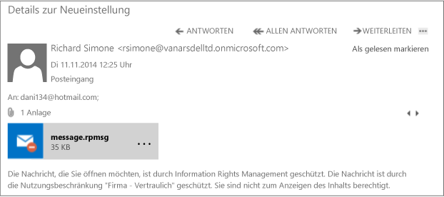

# Vollbild: Eine externe E-Mail, die durch DLP und Azure RMS gesch&#252;tzt wird

Zurück zu [Azure RMS in Aktion: Richtlinien zum automatischen Schützen von E-Mails mit Exchange Online und zum Verhindern von Datenverlusten](http://technet.microsoft.com/library/jj585026.aspx)

