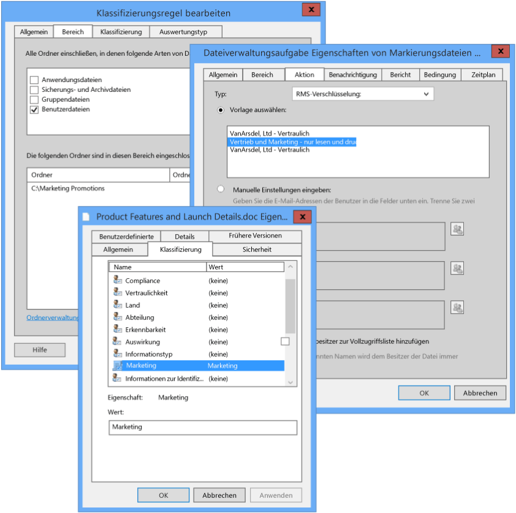

# Vollbild: Konfigurieren von FCI f&#252;r die Marketingklassifizierung

Zurück zu [Azure RMS in Aktion: Automatischer Schutz von Dateien auf Dateiservern, auf denen Windows Server und Dateiklassifizierungsinfrastruktur ausgeführt wird .](http://technet.microsoft.com/library/jj585026.aspx).

