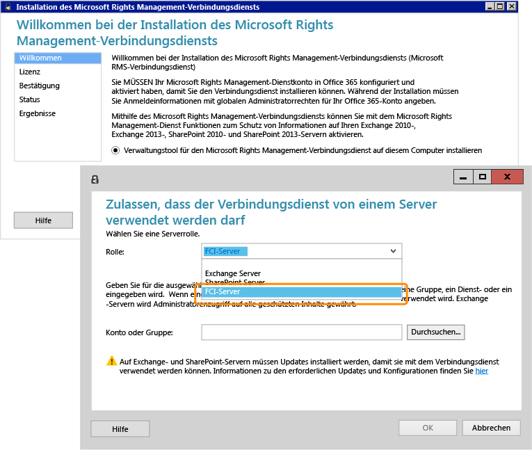

# Vollbild: Installieren und Konfigurieren des RMS-Verbindungsdiensts f&#252;r FCI

Zurück zu [Azure RMS in Aktion: Automatischer Schutz von Dateien auf Dateiservern, auf denen Windows Server und Dateiklassifizierungsinfrastruktur ausgeführt wird](http://technet.microsoft.com/library/jj585026.aspx).

