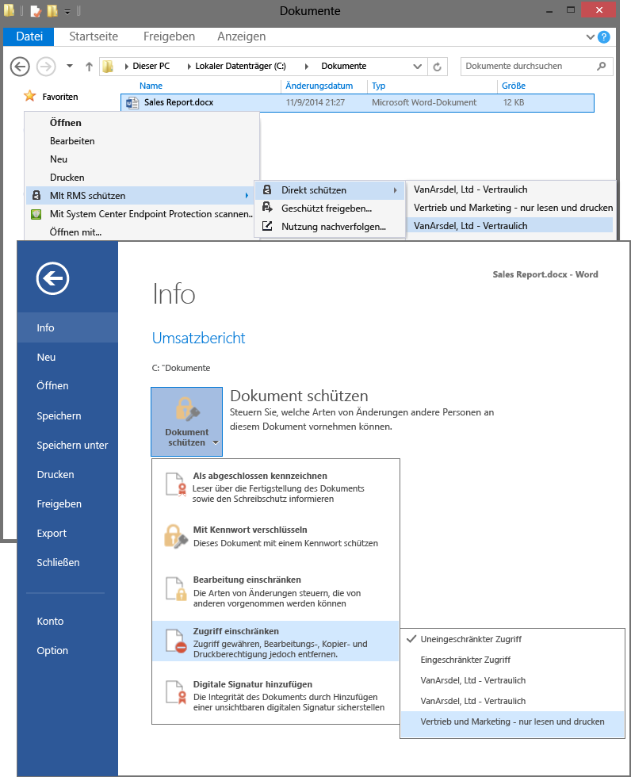

# Vollbild: Ausw&#228;hlen von RMS-Vorlagen in Anwendungen, z. B. Datei-Explorer und Word

Zurück zu [Azure RMS in Aktion: Aktivieren und Konfigurieren von Rights Management](http://technet.microsoft.com/library/jj585026.aspx)

