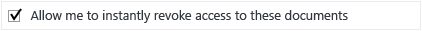

# Sichere Freigabe eines Dokuments per E-Mail

## &lt;Anweisungen für Administratoren – löschen Sie diesen Abschnitt vor der Übergabe an Benutzer&gt;
Verwenden Sie dieses Dokument als Ausgangspunkt für Ihre eigenen Endbenutzeranweisungen, damit Benutzer problemlos Dokumente per E-Mail freigeben können.Nehmen Sie an den Anweisungen im folgenden Abschnitt alle gewünschten Änderungen vor, löschen Sie ihn und übergeben das Dokument anschließend an die Benutzer.

Die folgenden Anweisungen gelten für ein fiktives Unternehmen, **VanArsdel Ltd.**.Bevor Sie diese Anweisungen an Benutzer weitergeben, ersetzen Sie entweder die Screenshots und Anweisungen, damit sie den Namen Ihrer eigenen Organisation anzeigen, oder ändern die Anweisungen, damit Benutzer wissen, dass anstelle von "VanArsdel Ltd." ihr eigener Firmenname angezeigt wird.Andere Anpassungen, die Sie möglicherweise vornehmen möchten:

-   In Schritt 2 empfehlen wir nur zwei der verfügbaren Optionen beim Versenden an Personen außerhalb der Organisation.Möglicherweise möchten Sie diese Vorschläge ändern.

-   In Schritt 2 empfehlen wir Beschreibungen, damit Benutzer sich leichter für die richtige Vorlage entscheiden können.Möglicherweise möchten Sie diese Beschreibungen spezifischer gestalten oder an Ihr Unternehmen und Ihre Benutzer anpassen.

-   In Schritt 3 empfehlen wir **Zugriff auf Dokumente sofort widerrufen** für die Option **Anzeige – Nur Anzeigen** als Beispiel, wenn diese Konfigurationsoption für Benutzer enthalten sein soll.Möglicherweise möchten Sie aber auch, dass Benutzer diese Option immer oder niemals auswählen, wenn sie das Dokument an jemanden außerhalb des Unternehmens senden.

-   In Schritt 4 empfehlen wir die Option **E-Mail verschicken, sobald jemand dieses Dokument öffnet**.Wenn Benutzer ihre Dokumente mithilfe des Portals für die Dokumentennachverfolgung im Auge behalten möchten, sind E-Mail-Benachrichtigungen möglicherweise nicht erforderlich, und Sie können diesen Schritt löschen.

> [!NOTE]
> Weitere Informationen zu den einzelnen Optionen, die Benutzer auswählen können, finden Sie unter [Optionen des Dialogfelds für die Rights Management-Freigabeanwendung](https://technet.microsoft.com/library/dn574738.aspx).

Damit die Benutzeranweisungen funktionieren, muss Folgendes vorhanden sein:

|Check|Anforderung|Wenn Sie weitere Informationen benötigen|
|---------|---------------|--------------------------------------------|
||Sie haben Konten und Gruppen für Azure Active Directory vorbereitet.|[Vorbereiten für Azure Rights Management](https://technet.microsoft.com/library/jj585029.aspx)|
||Azure Rights Management ist aktiviert|[Aktivieren von Azure Rights Management](https://technet.microsoft.com/library/jj658941.aspx)|
||Die Rights Management-Freigabeanwendung wird auf Benutzercomputern bereitgestellt, auf denen Windows ausgeführt wird.|[Automatische Bereitstellung für die Microsoft Rights Management-Freigabeanwendung](https://technet.microsoft.com/library/dn339003%28v=ws.10%29.aspx)|
||Wenn Sie Exchange Server anstelle von Exchange Online nutzen:  -   Der RMS-Verbindungsdienst ist bereitgestellt und Exchange Server-Rollen sind für die Verwendung konfiguriert.|[Bereitstellen des Azure Rights Management-Verbindungsdiensts](https://technet.microsoft.com/library/dn375964.aspx)|
||Benutzer verwenden Outlook aus Office 2010.|Wenn Benutzer Office 2013 haben, ersetzen Sie die Screenshots mit entsprechenden Versionen, damit sie die Ansicht für Benutzer widerspiegeln.|
||Sie haben wie nachfolgend beschrieben benutzerdefinierte Vorlagen konfiguriert.|[Konfigurieren benutzerdefinierter Vorlagen für Azure Rights Management](https://technet.microsoft.com/library/dn642472.aspx)|

#### So konfigurieren Sie benutzerdefinierte Vorlagen:

1.  Archivieren Sie die beiden Standardvorlagen.

2.  Erstellen Sie drei neue Vorlagen, indem Sie die Standardvorlagen kopieren und die folgenden Änderungen vornehmen:

    |Zu kopierende Vorlage|Neuer Name|Neue Beschreibung|Benutzerdefinierte Rechte gewähren|Andere Einstellungen|
    |-------------------------|--------------|---------------------|--------------------------------------|------------------------|
    |**&lt;Unternehmensname&gt; – Nur vertrauliche Ansicht**|**Streng vertraulich – &lt;Organisationsnam &gt;**|Alle Benutzer von &lt;Organisationsname&gt; haben Berechtigungen zum Anzeigen und Bearbeiten.Kein Offlinezugriff.|**Inhalt anzeigen**  **Datei speichern**  **Inhalt bearbeiten**|Aktualisieren Sie den Namen und die Beschreibung für die Sprachen, die Benutzer verwenden.  Für **Ablauf des Inhalts**: Behalten Sie die Standardeinstellung **Inhalt läuft nie ab**.  Für **Offlinezugriff**: Wählen Sie **Inhalt ist nur mit Internetverbindung verfügbar**.|
    |**&lt;Unternehmensname&gt; – Nur vertrauliche Ansicht**|**Vertraulich – &lt;Organisationsname&gt;**|Alle Benutzer von &lt;Organisationsname&gt; haben Berechtigungen zum Anzeigen und Bearbeiten.|**Inhalt anzeigen**  **Datei speichern**  **Inhalt bearbeiten**|Aktualisieren Sie den Namen und die Beschreibung für die Sprachen, die Benutzer verwenden.  Für **Ablauf des Inhalts**: Behalten Sie die Standardeinstellung **Inhalt läuft nie ab**.  Für **Offlinezugriff**: Wählen Sie **Anzahl der Tage, die der Inhalt ohne Internetverbindung verfügbar ist**, und geben Sie **1** ein.|
    |**&lt;Unternehmensname&gt; – Vertraulich**|**Intern – &lt;Organisationsname&gt;**|Alle Benutzer von &lt;Name der Organisation&gt; besitzen die vollen Rechte, können den Inhaltsschutz allerdings nicht aufheben.|**Inhalt anzeigen**  **Datei speichern**  **Inhalt bearbeiten**  **Inhalt kopieren und extrahieren**  **Drucken**|Aktualisieren Sie den Namen und die Beschreibung für die Sprachen, die Benutzer verwenden.  Für **Ablauf des Inhalts**: Behalten Sie die Standardeinstellung **Inhalt läuft nie ab**.  Für **Offlinezugriff**: Behalten Sie standardmäßig **Anzahl der Tage, die der Inhalt ohne Internetverbindung verfügbar ist** sowie den Standardwert **7** bei.|

3.  Veröffentlichen Sie die drei neuen Vorlagen.

## &lt;Anweisungen für Benutzer beginnen hier, löschen Sie diesen Titel&gt;
Wenn Sie von nun an ein wichtiges Dokument an jemanden per E-Mail senden, verwenden Sie diese Anweisungen, damit das Dokument nicht von Personen gelesen wird, die es nicht sehen dürfen.

1.  Erstellen Sie Ihre E-Mail-Nachricht durch Angabe der E-Mail-Adresse oder -Adressen, geben Sie Ihre Nachricht ein, und fügen Sie die Datei an, die Sie sicher freigeben möchten.Klicken Sie dann auf der Registerkarte **Nachricht** in der Gruppe **RMS** auf **Geschützt freigeben**, und klicken Sie dann erneut auf **Geschützt freigeben**:

    

2.  Geben Sie im Dialogfeld **Geschützt freigeben** Folgendes ein:

    Wenn Sie ein Dokument an mindestens eine Person senden, die für eine andere Organisation arbeitet:

    |Wenn dies zutrifft...|Tun Sie Folgendes:|
    |-------------------------|----------------------|
    |**Allgemeiner Schutz** ist automatisch für Sie ausgewählt    →|Behalten Sie diese Auswahl:  |
    |Informationen im Dokument sollten nicht geändert werden    →|Wählen Sie **Anzeige – Nur Anzeigen**:  |
    |Informationen im Dokument können geändert werden    →|Wählen Sie **Co-Autor – Anzeigen, Bearbeiten, Kopieren und Drucken**:  |
    Wenn Sie ein Dokument an Personen innerhalb Ihrer Organisation senden:

    |Wenn dies zutrifft...|Tun Sie Folgendes:|
    |-------------------------|----------------------|
    |**Allgemeiner Schutz** ist automatisch für Sie ausgewählt    →|Behalten Sie diese Auswahl:  |
    |Die Informationen im Dokument sind sehr sensibel und könnten der Organisation oder deren Mitarbeitern einen sehr großen Schaden zufügen, falls öffentlich verfügbar.    →|Wählen Sie **Streng vertraulich – VanArsdel Ltd.**:  |
    |Die Informationen im Dokument sind sensibel und könnten der Organisation oder deren Mitarbeitern Schaden zufügen, falls öffentlich verfügbar.    →|Wählen Sie **Vertraulich – VanArsdel Ltd.**:  |
    |Informationen im Dokument sollten nicht für Personen außerhalb Ihrer Organisation freigegeben werden, enthalten aber keine sensiblen Informationen zur Organisation oder deren Mitarbeitern.    →|Wählen Sie **Intern – VanArsdel Ltd.**:  |

3.  Wenn Sie **Anzeige – Nur Anzeigen** gewählt haben: Wählen Sie **Zugriff auf Dokumente sofort widerrufen**:

    

4.  Wählen Sie **E-Mail verschicken, sobald jemand diese Dokumente öffnet**:

    

5.  Klicken Sie auf **Jetzt senden**:

    

Wenn eine Person, der Sie ein geschütztes Dokument gesendet haben, die Nachricht empfängt, erhält diese Person eine Nachricht mit Anweisungen, wie es gelesen werden kann.Die Person kann es auf vielen Geräten lesen, einschließlich iPads, iPhones, Android-Tablets und -Telefonen, Mac- und Windows-Computern.

Um nachzuverfolgen, ob die Personen, der Sie geschützte Dokumente gesendet haben, auf diese zugegriffen haben, verwenden Sie die [Website zur Dokumentnachverfolgung](https://track.azurerms.com/).

**Benötigen Sie Unterstützung?**

-   Zusätzliche Informationen:

    -   [Schützen einer Datei, die per E-Mail freigegebene ist](https://technet.microsoft.com/library/dn574735%28v=ws.10%29.aspx)

    -   [Verfolgen und Widerrufen von Dokumenten](https://technet.microsoft.com/library/dn986611.aspx)

-   Wenden Sie sich an den Helpdesk:

    -   &lt;Kontaktdetails&gt;

