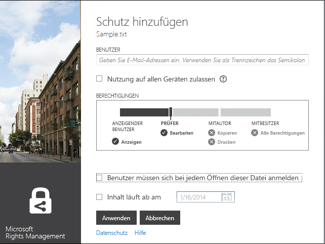
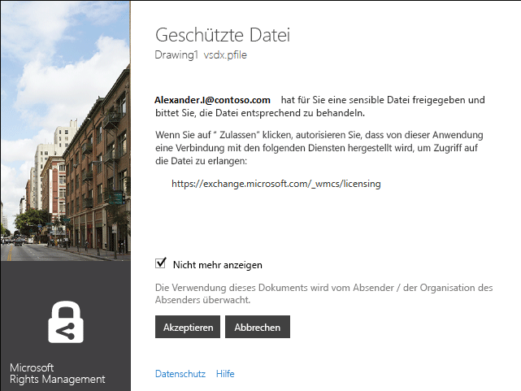

# Microsoft Rights Management-Freigabeanwendung – Benutzerhandbuch – urspr&#252;ngliche Ver&#246;ffentlichung
Dieses Benutzerhandbuch für die Microsoft Rights Management-Freigabeanwendung für Windows enthält die folgenden Abschnitte:

-   [Auswerten und Installieren der Microsoft Rights Management-Freigabeanwendung](../Topic/Microsoft_Rights_Management_sharing_application_user_guide_-_original_publication.md#BKMK_Eval)

-   [Verwenden der Microsoft Rights Management-Freigabeanwendung](../Topic/Microsoft_Rights_Management_sharing_application_user_guide_-_original_publication.md#BKMK_UsingMSRMSApp)

-   [Verwenden von vom Benutzer autorisierten Berechtigungen und Freigeben geschützter Inhalte](../Topic/Microsoft_Rights_Management_sharing_application_user_guide_-_original_publication.md#BKMK_Custom)

-   [Verwenden des Office-Symbolleisten-Add-ins](../Topic/Microsoft_Rights_Management_sharing_application_user_guide_-_original_publication.md#BKMK_OfficeToolbar)

-   [Administratorhandbuch für die Microsoft Rights Management-Freigabeanwendung](../Topic/Microsoft_Rights_Management_sharing_application_user_guide_-_original_publication.md#BKMK_AdminGuide)

Häufig gestellte Fragen und Informationen zur Problembehandlung finden Sie unter [Häufig gestellte Fragen (FAQ) zur Rights Management-Freigabeanwendung für Windows](http://go.microsoft.com/fwlink/?LinkId=303971).

## <a name="BKMK_Eval"></a>Bewerten und Installieren der Microsoft Rights Management-Freigabeanwendung
In diesem Abschnitt wird erklärt, was die Microsoft Rights Management-Freigabeanwendung ist und wie Sie sie installieren:

-   [Was ist die Microsoft Rights Management-Freigabeanwendung?](../Topic/Microsoft_Rights_Management_sharing_application_user_guide_-_original_publication.md#BKMK_WhatIs)

-   [Anforderungen für die Microsoft Rights Management-Freigabeanwendung](../Topic/Microsoft_Rights_Management_sharing_application_user_guide_-_original_publication.md#BKMK_Reqs)

-   [Installieren der Microsoft Rights Management-Freigabeanwendung](../Topic/Microsoft_Rights_Management_sharing_application_user_guide_-_original_publication.md#BKMK_Install)

### <a name="BKMK_WhatIs"></a>Was ist die Microsoft Rights Management-Freigabeanwendung?
Bei der Microsoft Rights Management-Freigabeanwendung handelt es sich um eine optional herunterladbare Anwendung für Microsoft Windows, die folgende Funktionen bietet:

-   Verbessert Datei-Explorer (in Windows 7 und früheren Versionen als „Windows-Explorer“ bezeichnet), damit Sie eine einzelne Datei, mehrere Dateien gleichzeitig oder alle Dateien in einem ausgewählten Ordner schützen können.

-   Fügt Unterstützung für den Schutz einer beliebigen Datei sowie eine integrierte Anzeige für häufig verwendete Text- und Bilddateitypen hinzu.

-   Fügt neue Schaltflächen zur Microsoft Office-Symbolleiste für Word, PowerPoint und Excel hinzu.

### <a name="BKMK_Reqs"></a>Anforderungen für die Microsoft Rights Management-Freigabeanwendung
Um die Microsoft Rights Management-Freigabeanwendung verwenden zu können, muss auf Ihrem Computer Windows 8.1, Windows 8 oder Windows 7 ausgeführt werden.

Die Microsoft Rights Management-Freigabeanwendung erfordert den AD RMS-Client 2.1, der als Teil des Installationspakets installiert wird. Die Microsoft Rights Management-Freigabeanwendung funktioniert nur mit dieser Version des AD RMS-Clients.

### <a name="BKMK_Install"></a>Installieren der Microsoft Rights Management-Freigabeanwendung
Um die Microsoft Rights Management-Freigabeanwendung zu installieren, gehen Sie wie folgt vor:

1.  Navigieren Sie zur Seite [Microsoft Rights Management](http://go.microsoft.com/fwlink/?LinkId=303970) der Microsoft-Website.

2.  Klicken Sie im Abschnitt **Computer** auf das Symbol für die **RMS-App für Windows**, und speichern Sie das Installationspaket der Microsoft Rights Management-Freigabeanwendung auf Ihrem Computer.

3.  Doppelklicken Sie auf die heruntergeladene komprimierte Datei und dann auf **setup.exe**. Wenn Sie dazu aufgefordert werden, den Vorgang fortzusetzen, klicken Sie auf **Ja**.

4.  Klicken Sie auf der Seite **Microsoft RMS-Setup** auf **Weiter**, und warten Sie, bis die Installation abgeschlossen wurde.

5.  Klicken Sie bei Abschluss der Installation auf **Neu starten**, um den Computer neu zu starten und die Installation abzuschließen. Klicken Sie alternativ auf **Schließen**, und starten Sie den Computer später manuell neu, um die Installation abzuschließen.

## <a name="BKMK_UsingMSRMSApp"></a>Verwenden der Microsoft Rights Management-Freigabeanwendung
Dieser Abschnitt enthält verschiedene Möglichkeiten der Verwendung der Microsoft Rights Management-Freigabeanwendung:

-   [Erstellen einer geschützten Textdatei (PTXT-Datei)](../Topic/Microsoft_Rights_Management_sharing_application_user_guide_-_original_publication.md#BKMK_CreatePTXT)

-   [Anzeigen einer geschützten Textdatei (PTXT-Datei) oder einer geschützten Bilddatei](../Topic/Microsoft_Rights_Management_sharing_application_user_guide_-_original_publication.md#BKMK_ViewPTXT)

-   [Erstellen einer generischen geschützten Datei (PFILE-Datei)](../Topic/Microsoft_Rights_Management_sharing_application_user_guide_-_original_publication.md#BKMK_CreatePFILE)

-   [Anzeigen einer generischen geschützten Datei (PFILE-Datei)](../Topic/Microsoft_Rights_Management_sharing_application_user_guide_-_original_publication.md#BKMK_ViewPFILE)

-   [Aufheben des Schutzes für eine Datei](../Topic/Microsoft_Rights_Management_sharing_application_user_guide_-_original_publication.md#BKMK_Unprotect)

### <a name="BKMK_CreatePTXT"></a>Erstellen einer geschützten Textdatei (.ptxt)
Die Microsoft Rights Management-Freigabeanwendung kann dazu verwendet werden, eine normale Textdatei (.txt) in eine geschützte Datei (.ptxt) zu konvertieren.

##### So erstellen Sie eine geschützte Textdatei (.ptxt)

1.  Klicken Sie im Datei-Explorer mit der rechten Maustaste in einen Ordner, zeigen Sie auf **Neu**, und klicken Sie dann auf **Textdokument**.

2.  Benennen Sie die Datei um (z. B. „Beispiel.txt“).

3.  Doppelklicken Sie auf die Datei, um sie im Editor zu öffnen.

4.  Fügen Sie im Editor Textzeilen wie im folgenden Beispiel hinzu, und speichern Sie sie:

    ```
    This is a sample text file.
    This is a sample text file.
    This is a sample text file.
    This is a sample text file. 
    This is a sample text file.
    This is a sample text file.
    ```

5.  Klicken Sie mit der rechten Maustaste auf die Datei, zeigen Sie auf **Direkt schützen**, und wählen Sie eine Vorlage aus der Liste aus. (Beachten Sie, dass Sie bei der ersten Verwendung des Tools **Unternehmensschutz** auswählen müssen, um den Download der Vorlagen für Ihre Organisation zu initiieren.)

6.  Bestätigen Sie auf dem Bildschirm **Microsoft Rights Management-Freigabeanwendung** die anzuwendende Richtlinie, klicken Sie auf **Übernehmen**, und klicken Sie, nachdem die Datei geschützt ist, auf **Schließen**.

### <a name="BKMK_ViewPTXT"></a>Anzeigen einer geschützten Text- (.ptxt) oder Bilddatei
Um eine geschützte Textdatei (.ptxt) im Datei-Explorer anzuzeigen, doppelklicken Sie auf die Datei (z. B. Beispiel.ptxt). Sie werden möglicherweise dazu aufgefordert, die Anwendung dazu zu autorisieren, die Rechte abzurufen. Die Schutzrichtlinie wird am oberen Rand der Datei angezeigt.

Geschützte Bilder können auf ähnliche Weise geöffnet und angezeigt werden.

### <a name="BKMK_CreatePFILE"></a>Erstellen einer allgemeinen geschützten Datei (.pfile)
Das Dateiformat für allgemeinen Schutz (.pfile) kann verwendet werden, um ein grundlegendes Maß an Schutz für Dateitypen zu bieten, die von der Microsoft Rights Management-Freigabeanwendung oder von anderen Anwendungen, die integrierten RMS-Schutz bieten, nicht direkt unterstützt werden.

Das allgemeine Schutzformat kann beispielsweise .vsd-Dateien schützen, die über Microsoft Visio erstellt wurden (und die den integrierten Schutz derzeit nicht unterstützen).

> [!NOTE]
> Dateien, die allgemeinen Schutz verwenden, werden nur für die Authentifizierung gesichert. Ein Benutzer, der für die Verwendung der geschützten Datei (.pfile) berechtigt ist, wird authentifiziert, und die Rechte und Berechtigungen des Benutzers werden angezeigt. Diese können jedoch nicht durchgesetzt werden, wenn die Datei im ursprünglichen Format geöffnet ist (z. B. wenn die .vsd-Datei in Visio geöffnet ist). Ein Benutzer, der nicht autorisiert ist oder nicht authentifiziert werden kann, kann die geschützte Datei nicht öffnen.

##### So erstellen Sie eine allgemeine geschützte Datei (.pfile) aus einer Visio-Zeichnungsdatei (.vsd)

1.  Klicken Sie im Datei-Explorer mit der rechten Maustaste in einen Ordner, zeigen Sie auf **Neu**, und klicken Sie dann auf **Neues Visio-Dokument**.

2.  Benennen Sie die Datei um (z. B. „Beispiel.vsd“).

3.  Doppelklicken Sie auf die Datei, um sie in Visio zu öffnen.

4.  Fügen Sie in Visio Elemente zur Zeichnung hinzu, und speichern und schließen Sie die Datei daraufhin.

5.  Klicken Sie mit der rechten Maustaste auf die Datei, zeigen Sie auf **Direkt schützen**, und wählen Sie eine Richtlinienvorlage aus der Liste aus. (Beachten Sie, dass Sie bei der ersten Verwendung des Tools **Unternehmensschutz** auswählen müssen, um den Download der Vorlagen für Ihre Organisation zu initiieren.)

6.  Bestätigen Sie auf dem Bildschirm **Microsoft Rights Management-Freigabeanwendung** die anzuwendende Richtlinie, und klicken Sie dann auf **Übernehmen**.

7.  Eine Meldung weist darauf hin, dass die geschützte Datei als Beispiel.vsd.pfile gespeichert wurde (die ursprüngliche Datei wird gelöscht).

### <a name="BKMK_ViewPFILE"></a>Anzeigen einer allgemeinen geschützten Datei (.pfile)
Um eine allgemeine geschützte Datei (.pfile) anzuzeigen, doppelklicken Sie im Datei-Explorer auf die allgemeine geschützte Datei (.pfile, z. B. Beispiel.vsd.pfile), und klicken Sie auf **Öffnen**.

### <a name="BKMK_Unprotect"></a>Entfernen des Schutzes von einer Datei
Die Microsoft Rights Management-Freigabeanwendung bietet Ihnen die Option, den Schutz von Dateien zu entfernen, die Sie zuvor geschützt haben.

Um den Schutz von einer zuvor geschützten Datei zu entfernen (also aufzuheben), verwenden Sie die Option **Schutz entfernen** wie folgt:

1.  Klicken Sie mit der rechten Maustaste auf **Beispiel.ptxt**, zeigen Sie auf **Direkt schützen**, und klicken Sie auf **Schutz entfernen**. Sie werden möglicherweise dazu aufgefordert, die Anwendung dazu zu autorisieren, die Rechte abzurufen.

2.  Beispiel.ptxt wird gelöscht und durch „Beispiel.txt“ ersetzt.

## <a name="BKMK_Custom"></a>Verwenden von benutzerdefinierten Berechtigungen und Freigeben geschützter Inhalte
In diesem Abschnitt wird beschrieben, wie Sie eine Datei mit benutzerdefinierten Berechtigungen schützen und verwenden, geschützte Inhalte freigeben und mehrere Dateien schützen können:

-   [Schützen einer Datei mit vom Benutzer autorisierten Berechtigungen](../Topic/Microsoft_Rights_Management_sharing_application_user_guide_-_original_publication.md#BKMK_ProtectCustom)

-   [Verwenden von Dateien mit vom Benutzer autorisiertem Schutz](../Topic/Microsoft_Rights_Management_sharing_application_user_guide_-_original_publication.md#BKMK_UserDefined)

-   [Freigeben geschützter Inhalte](../Topic/Microsoft_Rights_Management_sharing_application_user_guide_-_original_publication.md#BKMK_ShareProtected)

-   [Verwenden von Tastenkombinationen](../Topic/Microsoft_Rights_Management_sharing_application_user_guide_-_original_publication.md#BKMK_AccessKeys)

-   [Anwenden von Schutz auf mehrere Dateien und Ordner](../Topic/Microsoft_Rights_Management_sharing_application_user_guide_-_original_publication.md#BKMK_Multiple)

### <a name="BKMK_ProtectCustom"></a>Schützen einer Datei mit benutzerdefinierten Berechtigungen
Der benutzerdefinierte Schutz kann verwendet werden, um Folgendes zu erzielen:

-   Beschränkung des Dateizugriffs auf eine Liste einzelner Benutzer, angegeben durch ihre E-Mail-Adressen.

-   Beschränkung der Dateiverwendung auf bestimmte Berechtigungen, wie z. B. den reinen Lesezugriff auf ein Dokument.

Um eine Datei mit benutzerdefinierten Berechtigungen zu schützen, klicken Sie mit der rechten Maustaste auf die Datei, klicken Sie auf **Direkt schützen**, und klicken Sie auf **Benutzerdefinierte Berechtigungen**. Der folgende Bildschirm wird angezeigt:



Geben Sie die E-Mail-Adressen der Liste der Benutzer ein, verwenden Sie den Schieberegler für die Datei, und klicken Sie auf **Übernehmen**.

### <a name="BKMK_UserDefined"></a>Verwenden von Dateien mit benutzerdefiniertem Schutz
Die meisten geschützten Dateien, die von der Microsoft Rights Management-Freigabeanwendung verarbeitet werden, werden durch die Anwendung vorlagenbasierter Schutzstufen geschützt. Die Microsoft Rights Management-Freigabeanwendung unterstützt jedoch auch Dateien, denen eine benutzerdefinierte Schutzstufe zugewiesen wurde.

Der benutzerdefinierte Schutz kann verwendet werden, um folgende Schutzarten für Dateien zu erzielen:

-   Beschränkung des Dateizugriffs auf eine begrenzte Liste einzelner Benutzer, angegeben durch ihre E-Mail-Adressen.

-   Beschränkung der Dateiverwendung auf eine bestimmte Berechtigung, wie z. B. den reinen Druckzugriff auf das Dokument.

Für Text- und Bilddateiformate erfordert es diese Schutzstufe, dass alle Anwendungen, die verwendet werden, um Text- oder Bilddateien zu bearbeiten, zu speichern oder zu beschränken, RMS-Schutz unterstützen und die im AD RMS-SDK bereitgestellten Schutz-APIs implementieren.

Bei der Anzeige einer geschützten Textdatei, auf die benutzerdefinierter Schutz angewendet wurde, werden Sie einen geringfügigen Unterschied der Berechtigungen feststellen, da diese für die Datei wie im folgenden Beispiel angezeigt werden.

Für Dateien, die mit dem allgemeinen Schutzdateiformat (.pfile) geschützt sind, werden die entsprechenden Rechte oder Berechtigungen, die vom Benutzer zugewiesen wurden, anstelle des Namens der Vorlage, die für den Schutz der Datei verwendet wurde, im Bestätigungsbildschirm angezeigt (wie in der folgenden Abbildung gezeigt).



### <a name="BKMK_ShareProtected"></a>Freigeben geschützter Inhalte
Um Inhalte zu schützen und freizugeben, klicken Sie mit der rechten Maustaste auf die Datei und anschließend auf **Geschützt freigeben**. Der folgende Bildschirm wird angezeigt:


Geben Sie die E-Mail-Adressen der Liste der Benutzer ein, verwenden Sie den Schieberegler für die Datei, und klicken Sie auf **Senden**. Die Anwendung startet Outlook mit einer Vor-E-Mail, an welche die geschützte Datei angehängt ist. Die ursprüngliche Datei wird nicht geschützt.

Um Benutzern das Anzeigen geschützter Dateien auf Geräten ohne Windows zu ermöglichen, klicken Sie auf **Nutzung auf allen Geräten zulassen**. Benutzer müssen die [Microsoft Rights Management-Freigabeanwendung](http://go.microsoft.com/fwlink/?LinkId=303970) für ihr Gerät herunterladen.

### <a name="BKMK_AccessKeys"></a>Verwenden von Tastenkombinationen
Drücken Sie die **Alt**-Taste, um die verfügbaren Tastenkombinationen anzuzeigen. Drücken Sie **Alt** + Kombinationstaste, um die entsprechende Option auszuwählen. Beispiel: Drücken Sie im Dialogfenster **Geschützt freigeben** auf **Alt**, um die Tastenkombinationen anzuzeigen, und drücken Sie **Alt + u**, um **Benutzer müssen sich bei jedem Öffnen dieser Datei anmelden** auszuwählen.


### <a name="BKMK_Multiple"></a>Anwenden von Schutz auf mehrere Dateien und Ordner
Die Microsoft Rights Management-Freigabeanwendung kann auch dazu verwendet werden, Schutz auf mehr als eine Datei anzuwenden, z. B. durch Auswählen mehrerer Dateien oder eines Ordners, der ungeschützte Dateien enthält, im Datei-Explorer.

##### So schützen Sie mehrere Dateien oder alle Dateien in einem ausgewählten Ordner

1.  Wählen Sie im Datei-Explorer mehrere zu schützende Dateien einen Ordner mit mehreren entsprechenden Dateien aus.

2.  Klicken Sie mit der rechten Maustaste auf den ausgewählten Ordner/die Datei, zeigen Sie auf **Direkt schützen**, und wählen Sie eine Vorlage aus der Liste aus. (Beachten Sie, dass Sie bei der ersten Verwendung des Tools **Unternehmensschutz** auswählen müssen, um den Download der Vorlagen für Ihre Organisation zu initiieren.)

3.  Überprüfen Sie auf dem Bildschirm **Microsoft Rights Management-Freigabeanwendung**, ob die Dateien geschützt wurden.

Wenn bei Ihnen Fehler auftreten, finden Sie entsprechende Informationen unter [Häufig gestellte Fragen (FAQ) zur Rights Management-Freigabeanwendung für Windows](http://go.microsoft.com/fwlink/?LinkId=303971).

## <a name="BKMK_OfficeToolbar"></a>Verwenden des Office-Symbolleisten-Add-Ins
Sie können Word-, PowerPoint- und Excel-Dateien direkt aus Microsoft Office heraus schützen und freigeben, indem Sie das Office-Menüband-Add-in für die Microsoft Rights Management-Freigabeanwendung verwenden. Klicken Sie im Menüband auf **Geschützt freigeben**, um die Microsoft Rights Management-Freigabeanwendung zu starten.


## <a name="BKMK_AdminGuide"></a>Administratorleitfaden zur Rights Management-Freigabeanwendung
Dieser Administratorleitfaden für die Microsoft Rights Management-Freigabeanwendung enthält die folgenden Abschnitte:

-   [Microsoft Rights Management-Freigabe – Technische Übersicht](../Topic/Microsoft_Rights_Management_sharing_application_user_guide_-_original_publication.md#BKMK_AdminOverview)

-   [Unterstützte Dateitypen](../Topic/Microsoft_Rights_Management_sharing_application_user_guide_-_original_publication.md#BKMK_SupportFileTypes)

-   [Automatische Bereitstellung für die Microsoft Rights Management-Freigabeanwendung](../Topic/Microsoft_Rights_Management_sharing_application_user_guide_-_original_publication.md#BKMK_ScriptedInstall)

### <a name="BKMK_AdminOverview"></a>Technische Übersicht der Microsoft Rights Management-Freigabeanwendung
Bei der Microsoft Rights Management-Freigabeanwendung handelt es sich um eine optional herunterladbare Anwendung für Microsoft Windows und andere Plattformen, die folgende Funktionen bietet:

-   Schutz einzelner Dateien, mehrerer Dateien gleichzeitig oder aller in einem ausgewählten Ordner enthaltenen Dateien.

-   Vollständige Unterstützung für den Schutz beliebiger Dateitypen sowie eine integrierte Anzeige für häufig verwendete Text- und Bilddateitypen.

-   Allgemeiner Schutz für Dateien, die RMS-Schutz nicht unterstützen.

-   Vollständige Interoperabilität mit Dateien, die mit Office Information Rights Management (IRM) geschützt sind.

-   Vollständige Interoperabilität mit PDF-Dateien, die mit SharePoint, FCI und unterstützten PDF-Erstellungstools geschützt sind.

Die Microsoft Rights Management-Freigabeanwendung verwendet die neue [AD RMS-Client 2.1-Runtime](http://www.microsoft.com/download/details.aspx?id=38396). Sie bietet Benutzern die Möglichkeit, Inhalte mithilfe vordefinierter oder benutzerdefinierter Vorlagen zu schützen, die Sie für Ihre Organisation anpassen und bereitstellen können. Mithilfe der Funktionalität von AD RMS 2.1 bietet die Microsoft Rights Management-Freigabeanwendung Endbenutzern eine einfache Schutz- und Nutzungserfahrung.

Mit der Windows Azure AD RMS-Version vom Oktober 2013 können Sie Dokumente direkt in Office 2010 schützen und sie an Personen in einem anderen Unternehmen senden, die sie wiederum durch Verwendung von Windows Azure AD RMS öffnen können. Darüber hinaus können Sie bei dieser Version – wenn Sie AD RMS im Kryptografiemodus 2 verwenden – RMS for Individuals verwenden und Inhalte von Personen in einem anderen Unternehmen nutzen, die Windows Azure AD RMS verwenden. Weitere Informationen zum Kryptografiemodus 2 finden Sie unter [AD RMS-Kryptografiemodi](http://technet.microsoft.com/library/hh867439%28v=ws.10%29.aspx).

Um die Microsoft Rights Management-Freigabeanwendung herunterzuladen, führen Sie folgende Schritte aus:

1.  Melden Sie sich mit Ihrem Microsoft-Konto (früher als „Live ID“ bezeichnet) bei [Microsoft Connect](http://connect.microsoft.com/) an.

2.  Suchen Sie auf der Seite **Start** nach **Rights Management Services**, und treten Sie der Gruppe bei.

3.  Klicken Sie auf **Downloads**, und klicken Sie dann auf **Microsoft Rights Management-Freigabeanwendung**.

4.  Wählen Sie auf der Seite **Downloaddetails** die **Microsoft Rights Management-Freigabeanwendung.zip** aus, und klicken Sie auf **Herunterladen**.

5.  Installieren Sie bei Bedarf den Microsoft-Dateiübertragungs-Manager, und führen Sie die Schritte zum Herunterladen der Microsoft Rights Management-Freigabeanwendung durch.

#### Von Microsoft Rights Management-Freigabeanwendung unterstützte Schutzstufen
Die Microsoft Rights Management-Freigabeanwendung unterstützt den Schutz auf zwei unterschiedlichen Ebenen (wie in der folgenden Tabelle beschrieben).

||||
|-|-|-|
|Art des Schutzes|Systemeigenes Format|Generisch|
|Beschreibung|Für Text-, Bild-, Microsoft Office- (Word, Excel, PowerPoint) und PDF-Dateien sowie für Dateitypen anderer Anwendungen, die AD RMS unterstützen, bietet der systemeigene Schutz ein hohes Maß an Sicherheit, die sowohl Verschlüsselung als auch die Durchsetzung von Rechten (Berechtigungen) bietet.|Für alle anderen Anwendungen und Dateitypen bietet der allgemeine Schutz ein Maß an Sicherheit, das sowohl die Dateikapselung mithilfe des Dateityps .pfile als auch eine Authentifizierung bietet, um sicherzustellen, dass der Benutzer zum Öffnen der Datei berechtigt ist.|
|Schutz|Die Dateien werden vollständig verschlüsselt, und der Schutz wird auf folgende Arten durchgesetzt:<br /><br />-   Bevor geschützte Inhalte gerendert werden, muss eine erfolgreiche Authentifizierung für die Personen durchgeführt werden, welche die Datei per E-Mail erhalten oder denen durch Datei- oder Freigabeberechtigungen Zugriff darauf gewährt wird.<br />-   Darüber hinaus werden die vom Inhaltsbesitzer beim Schützen der Dateien angegebenen Nutzungsrechte und -richtlinien vollständig durchgesetzt, wenn der Inhalt in IP Viewer (für geschützte Text- und Bilddateien) oder einer entsprechenden anderen Anwendung (für die anderen unterstützten Dateitypen) gerendert wird.|Der Dateischutz wird auf folgende Weise durchgesetzt:<br /><br />-   Bevor geschützter Inhalt gerendert wird, muss eine erfolgreiche Authentifizierung der Personen erfolgen, die dazu autorisiert sind, die Datei zu öffnen, bzw. Zugriff darauf haben. Wenn die Autorisierung fehlschlägt, wird die Datei nicht geöffnet.<br />-   Nutzungsrechte und Richtlinien, die vom Inhaltsbesitzer festgelegt wurden, werden angezeigt, um autorisierte Benutzer über die vorgesehene Nutzungsrichtlinie zu informieren.<br />-   Die Überwachungsprotokollierung wird für autorisierte Benutzer durchgeführt, die die Datei öffnen, jedoch werden keine Nutzungsrechte von nicht unterstützenden Anwendungen erzwungen.|
|Standardwert für Dateitypen|Dies ist die standardmäßige Schutzstufe für die folgenden Dateitypen:<br /><br />-   Text- und Bilddateien<br />-   Microsoft Office-Dateien (Word, Excel, PowerPoint)<br />-   Portable Document Format (PDF)<br /><br />Weitere Informationen finden Sie unter „Unterstützte Dateitypen“.|Dies ist der Standardschutz für alle anderen Dateitypen (z. B. .vsdx, .rtf usw.), die nicht vom vollständigen Schutz unterstützt werden.|

### <a name="BKMK_SupportFileTypes"></a>Unterstützte Dateitypen
Die folgende Tabelle enthält die Dateitypen, die von der Microsoft Rights Management-Freigabeanwendung unterstützt werden.

|Dateierweiterung|Beschreibung|Ursprüngliche Dateierweiterung|
|--------------------|----------------|----------------------------------|
|PTXT|Geschützte Textdatei|TXT|
|PXML|Geschützte XML-Datei|XML|
|PJPG|Geschützte JPG-Bilddatei|JPG|
|PJPEG|Geschützte JPEG-Bilddatei|JPEG|
|PPNG|Geschützte PNG-Bilddatei|PNG|
|PTIFF|Geschützte TIFF-Bilddatei|TIFF|
|PBMP|Geschützte Windows-Bitmapdatei|BMP|
|PGIF|Geschützte GIF-Datei|GIF|
|PGIFF|Geschützte GIFF-Datei|GIFF|
|PJPE|Geschützte JPE-Datei|JPE|
|PJFIF|Geschützte JFIF-Datei|JFIF|
|PJIF|Geschützte JIF-Datei|JIF|
In der folgende Tabelle werden die Dateitypen aufgeführt, die von Microsoft Office 2013, Office 2010 und Office 2007 unterstützt werden. Es gibt zwei Arten von Schutzvorrichtungen: MsoIrmProtector und OpcIrmProtector. Weitere Informationen zu diesen Schutzvorrichtungstypen finden Sie unter [Schutzvorrichtungen des Microsoft Office-Dateiformats](http://archive.msdn.microsoft.com/OfficeProtectors).

|||
|-|-|
|MsoIrmProtector unterstützt die folgenden Dateitypen:<br /><br />-   DOC<br />-   DOT<br />-   XLA<br />-   XLS<br />-   XLT<br />-   PPS<br />-   PPT|OpcIrmProtector unterstützt die folgenden Dateitypen:<br /><br />-   DOCM<br />-   DOCX<br />-   DOTM<br />-   DOTX<br />-   XLAM<br />-   XLSB<br />-   XLSM<br />-   XLSX<br />-   XLTM<br />-   XLTX<br />-   XPS<br />-   POTM<br />-   POTX<br />-   PPSX<br />-   PPSM<br />-   PPTM<br />-   PPTX<br />-   THMX|

### <a name="BKMK_ScriptedInstall"></a>Automatische Bereitstellung für die Microsoft Rights Management-Freigabeanwendung
Die Windows-Version der RMS-Freigabeanwendung unterstützt eine Skriptinstallation, durch die sie für Bereitstellungen in Unternehmen geeignet ist.

##### So laden Sie die RMS-Freigabeanwendung für die automatische Bereitstellung herunter

1.  Navigieren Sie zur Seite [Microsoft Rights Management-Freigabeanwendung für Windows](http://www.microsoft.com/download/details.aspx?id=40857) Microsoft Download Center, und klicken Sie auf **Herunterladen**.

2.  Wählen Sie die benötigten Dateien aus, und laden Sie sie herunter. Es sind zwei Client-Installationspakete verfügbar: eines für Windows 64 Bit (Microsoft Rights Management-Freigabeanwendung x64.zip) und eines für Windows 32 Bit (Microsoft Rights Management-Freigabeanwendung x86.zip).

3.  Extrahieren Sie die Dateien aus den komprimierten Installationspaketen, z. B. durch Doppelklick. Kopieren Sie dann die extrahierten Dateien an einen Speicherort im Netzwerk, auf den Clientcomputer zugreifen können.

Die Setuppakete für die RMS-Freigabeanwendung unterstützen verschiedene Bereitstellungsszenarien und enthalten Folgendes:

|Beschreibung|Bereitstellungsszenario|
|----------------|---------------------------|
|Microsoft Online-Anmelde-Assistent|Für Folgendes erforderlich:<br /><br />-   Office 2010 und Windows Azure RMS|
|Hotfix für Office (KB 2596501)|Für Folgendes erforderlich:<br /><br />-   Office 2010 und Windows Azure RMS|
|Hotfix für Kryptografiemodus 2 (KB 2627273)|Für Folgendes erforderlich:<br /><br />-   Office 2010 und Windows Azure RMS|
|AD RMS-Client und RMS-Freigabeanwendung|Für Folgendes erforderlich:<br /><br />-   Office 2013 und Windows Azure RMS<br />-   Office 2010 und Windows Azure RMS<br />-   Office 2013 und AD RMS<br />-   Office 2010 und AD RMS<br />-   Upgrade der RMS-Freigabeanwendung|
|Office-Add-in für Menüband|Für Folgendes erforderlich:<br /><br />-   Office 2013 und Windows Azure RMS<br />-   Office 2013 und AD RMS<br />-   Office 2010 und AD RMS<br />-   Upgrade der RMS-Freigabeanwendung|
|Vorbereitungstool für Windows Azure Active Directory Rights Management|Für Folgendes erforderlich:<br /><br />-   Office 2010 und Windows Azure RMS|
> [!NOTE]
> In dem Szenario **Office 2010 und Windows Azure RMS** verwenden Sie möglicherweise Windows Azure RMS, oder Sie verwenden Active Directory RMS, möchten jedoch Dokumente auf sichere Weise an Personen in einem anderen Unternehmen senden, die Windows Azure RMS verwenden.
> 
> Beim Installieren und Ausführen des Vorbereitungstools für Windows Azure Active Directory Rights Management zur Unterstützung von Office 2010 geschieht Folgendes:
> 
> -   Es bearbeitet die Registrierung, um die RMS-Freigabeanwendung zu unterstützen.
> -   Es führt einen Bootstrap des Benutzers durch. Das bedeutet, dass der Computer den AD RMS-Server oder Windows Azure RMS kontaktiert und die Zertifikate abruft, die der Computer bzw. der Benutzer benötigt, um RMS zu verwenden.

Verwenden Sie die folgenden Prozeduren, um die Befehle zum Bereitstellen der RMS-Freigabeanwendung für diese Bereitstellungsszenarien zu identifizieren:

-   Office 2013 und Windows Azure RMS

-   Office 2010 und Windows Azure RMS

-   Office 2013 oder Office 2010 und Active Directory RMS

-   Upgrade der RMS-Freigabeanwendung

Bei den Beispielen in den Befehlen wird davon ausgegangen, dass Sie die heruntergeladenen und extrahierten Dateien auf eine Netzwerkfreigabe kopiert haben, auf die Clientcomputer mithilfe von **\\server5\apps\rms** zugreifen, und dass die Clientcomputer bereits über einen Ordner namens **C:\Log files** verfügen, in dem Sie die Installationsprotokolldateien der Anwendung speichern. Für jede Installation können Sie den Namen der Protokolldatei auswählen, die Dateierweiterung muss jedoch .log lauten.

> [!IMPORTANT]
> Bevor Sie die RMS-Freigabeanwendung bereitstellen, müssen Sie die erforderlichen Befehle in diesen Prozeduren packen, damit sie den Computerkontext für alle Benutzer installieren und die Installation mit lokalen Administratorrechten durchführen können. Sie können das Paket daraufhin auf Computern bereitstellen, indem Sie das Standardverfahren für die Anwendungsbereitstellung verwenden, z. B. Gruppenrichtlinien oder System Center Configuration Manager.
> 
> Die Ausnahme ist das Vorbereitungstool für Windows Azure Active Directory Rights Management: Dieses Tool muss einmal für jeden Benutzer auf dem Computer ausgeführt werden. Darüber hinaus muss es mit erweiterten Berechtigungen ausgeführt werden, um die Registrierung erfolgreich zu bearbeiten. Es gibt verschiedene Möglichkeiten, um dies zu erreichen, einschließlich der Aufforderung der Benutzer dazu, den Befehl auszuführen (z. B. ein Link in einer E-Mail-Nachricht oder ein Link im Helpdesk-Portal). Alternativ können Sie ihn zu ihrem Anmeldeskript hinzufügen. Wenn Sie den Befehl „runas“ nicht verwenden können, da die Benutzer nicht über ein lokales Administratorkonto verfügen, stehen Ihnen Bereitstellungstools zur Verfügung, welche die Berechtigung eines Befehls gemäß den von Ihnen festgelegten Regeln automatisch erweitern können.

##### So stellen Sie die RMS-Freigabeanwendung für Office 2013 und Windows Azure RMS bereit

1.  Installieren Sie den AD RMS-Client und die RMS-Freigabeanwendung mit den folgenden Befehlen:

    -   Für 64-Bit-Windows: x64\setup_ipviewer.exe /norestart /quiet /msicl "MSIRESTARTMANAGERCONTROL=Disable" /log "&lt;Protokolldateipfad und -name&gt;"

        ```
        x64\setup_ipviewer.exe /norestart /quiet /msicl "MSIRESTARTMANAGERCONTROL=Disable" /log "<log file path and name>"
        ```

    -   Für 32-Bit-Windows:

        ```
        X86\setup_ipviewer.exe /norestart /quiet /msicl "MSIRESTARTMANAGERCONTROL=Disable" /log "<log file path and name>"
        ```

    Beispiel: `\\server5\apps\rms\x64\setup_ipviewer.exe /norestart /quiet /msicl "MSIRESTARTMANAGERCONTROL=Disable" /log "C:\Log files\ipviewerinstall.log"`

2.  Installieren Sie das Office-Add-in mit den folgenden Befehlen:

    -   Für 64-Bit-Version von Office:

        ```
        msiexec.exe /norestart /quiet MSIRESTARTMANAGERCONTROL=Disable /i "x64\Setup64.msi" /L*v "<log file path and name>"
        ```

    -   Für 32-Bit-Version von Office:

        ```
        msiexec.exe /norestart /quiet MSIRESTARTMANAGERCONTROL=Disable /i "x86\Setup.msi" /L*v "<log file path and name>"
        ```

    > [!NOTE]
    > Um die Installation abzuschließen, muss der Computer neu gestartet werden. Sie können einen automatischen Neustart initiieren, indem Sie einen Befehl wie „shutdown /i“ verwenden.

    Beispiel: `\\server5\apps\rms\msiexec.exe /norestart /quiet MSIRESTARTMANAGERCONTROL=Disable /i "x64\Setup64.msi" /L*v "C:\Log files\rmsoffice.log"`

##### So stellen Sie die RMS-Freigabeanwendung für Office 2010 und Windows Azure RMS bereit

1.  Installieren Sie den Microsoft Online-Anmelde-Assistenten mit den folgenden Befehlen:

    -   Für 64-Bit-Windows:

        ```
        msiexec.exe /norestart /quiet MSIRESTARTMANAGERCONTROL=Disable /i "x64\msoidcli_64bit.msi" /L*v "<log file path and name >"
        ```

    -   Für 32-Bit-Windows:

        ```
        msiexec.exe /norestart /quiet MSIRESTARTMANAGERCONTROL=Disable /i "x64\msoidcli_64bit.msi" /L*v "<log file path and name>"
        ```

    Beispiel: `\\server5\apps\rms\msiexec.exe /norestart /quiet MSIRESTARTMANAGERCONTROL=Disable /i "x64\msoidcli_64bit.msi" /L*v "C:\Log files\assistant.log"`

2.  Installieren Sie das Office-Update mit den folgenden Befehlen:

    -   Für 64-Bit-Version von Office:

        ```
        x64\office2010-kb2596501-fullfile-x64-glb.exe /norestart /quiet /log:"<log file path and name >"
        ```

    -   Für 32-Bit-Version von Office:

        ```
        x86\office2010-kb2596501-fullfile-x86-glb.exe /norestart /quiet /log:"<log file path and name>"
        ```

    Beispiel: `\\server5\apps\rms\x64\office2010-kb2596501-fullfile-x64-glb.exe /norestart /quiet /log:"C:\Log files\kb2596501install.log"`

3.  Installieren Sie den Hotfix für Kryptografiemodus 2 mit den folgenden Befehlen:

    -   Für 64-Bit-Windows:

        ```
        wusa.exe /norestart /quiet "x64\Windows6.1-KB2627273-v4-x64.msu" /log:"<log file path and name >"
        ```

    -   Für 32-Bit-Windows:

        ```
        wusa.exe /norestart /quiet "x86\Windows6.1-KB2627273-v4-x86.msu" /log:"<log file path and name>"
        ```

    Beispiel: `\\server5\apps\rms\wusa.exe /norestart /quiet "x64\Windows6.1-KB2627273-v4-x64.msu" /log:"C:\Log files\kb267273.log"`

4.  Installieren Sie den AD RMS-Client und die RMS-Freigabeanwendung mit dem folgenden Befehl:

    -   Für 64-Bit-Windows:

        ```
        x64\setup_ipviewer.exe /norestart /quiet /msicl "MSIRESTARTMANAGERCONTROL=Disable" /log "<log file path and name >"
        ```

    -   Für 32-Bit-Windows:

        ```
        X86\setup_ipviewer.exe /norestart /quiet /msicl "MSIRESTARTMANAGERCONTROL=Disable" /log "<log file path and name>"
        ```

    Beispiel: `\\server5\apps\rms\x64\setup_ipviewer.exe /norestart /quiet /msicl "MSIRESTARTMANAGERCONTROL=Disable" /log "C:\Log files\ipviewerinstall.log"`

5.  Installieren Sie das Office-Add-in mit den folgenden Befehlen:

    -   Für 64-Bit-Version von Office:

        ```
        msiexec.exe /norestart /quiet MSIRESTARTMANAGERCONTROL=Disable /i "x64\Setup64.msi" /L*v "<log file path and name>"
        ```

    -   Für 32-Bit-Version von Office:

        ```
        msiexec.exe /norestart /quiet MSIRESTARTMANAGERCONTROL=Disable /i "x86\Setup.msi" /L*v "<log file path and name>"
        ```

    > [!NOTE]
    > Um die Installation abzuschließen, muss der Computer neu gestartet werden. Sie können einen automatischen Neustart initiieren, indem Sie einen Befehl wie „shutdown /i“ verwenden.

    Beispiel: `\\server5\apps\rms\msiexec.exe /norestart /quiet MSIRESTARTMANAGERCONTROL=Disable /i "x64\Setup64.msi" /L*v "C:\Log files\rmsoffice.log"`

6.  Installieren Sie das Vorbereitungstool für Windows Azure Active Directory Rights Management, indem Sie den folgenden Befehl zu den Anmeldeskripten hinzufügen:

    > [!IMPORTANT]
    > Damit dieser Befehl erfolgreich ausgeführt wird, müssen Benutzer über lokale Administratorrechte verfügen.

    -   Für Windows 8, 64 Bit:

        ```
        x64\aadrmprep.exe /initiateMe /logfile "<log file path and name>"
        ```

    -   Für Windows 8, 32 Bit:

        ```
        X86\aadrmprep.exe /initiateMe /logfile "<log file path and name>"
        ```

    -   Für Windows 7, 64 Bit:

        ```
        x64\win7\aadrmprep.exe /initiateMe /logfile "<log file path and name>"
        ```

    -   Für Windows 7, 32 Bit:

        ```
        X86\win7\aadrmprep.exe /initiateMe /logfile "<log file path and name>"
        ```

    > [!NOTE]
    > Durch diesen Befehl wird der Benutzer möglicherweise zur Eingabe seiner Windows Azure-Anmeldeinformationen aufgefordert. Wenn der Computer keiner Domäne angehört, wird der Benutzer aufgefordert. Wenn der Computer einer Domäne angehört, kann das Tool möglicherweise zwischengespeicherte Anmeldeinformationen verwenden.

    Beispiel: `\\server5\apps\rms\x64\aadrmprep.exe /initiateMe /logfile "C:\Log files\aadrmprepinstall.log"`

##### So stellen Sie die RMS-Freigabeanwendung für Office 2013 oder Office 2010 und Active Directory RMS bereit

1.  Installieren Sie den AD RMS-Client und die RMS-Freigabeanwendung mit den folgenden Befehlen:

    -   Für 64-Bit-Windows:

        ```
        x64\setup_ipviewer.exe /norestart /quiet /msicl "MSIRESTARTMANAGERCONTROL=Disable" /log "<log file path and name>"
        ```

    -   Für 32-Bit-Windows:

        ```
        X86\setup_ipviewer.exe /norestart /quiet /msicl "MSIRESTARTMANAGERCONTROL=Disable" /log "<log file path and name>"
        ```

    Beispiel: `\\server5\apps\rms\x64\setup_ipviewer.exe /norestart /quiet /msicl "MSIRESTARTMANAGERCONTROL=Disable" /log "C:\Log files\ipviewerinstall.log"`

2.  Installieren Sie das Office-Add-in mit den folgenden Befehlen:

    -   Für 64-Bit-Version von Office:

        ```
        msiexec.exe /norestart /quiet MSIRESTARTMANAGERCONTROL=Disable /i "x64\Setup64.msi" /L*v "<log file path and name>"
        ```

    -   Für 32-Bit-Version von Office:

        ```
        msiexec.exe /norestart /quiet MSIRESTARTMANAGERCONTROL=Disable /i "x86\Setup.msi" /L*v "<log file path and name>"
        ```

    > [!NOTE]
    > Um die Installation abzuschließen, muss der Computer neu gestartet werden. Sie können einen automatischen Neustart initiieren, indem Sie einen Befehl wie „shutdown /i“ verwenden.

    Beispiel: `\\server5\apps\rms\msiexec.exe /norestart /quiet MSIRESTARTMANAGERCONTROL=Disable /i "x64\Setup64.msi" /L*v "C:\Log files\rmsofficeinstall.log"`

##### So führen Sie ein Upgrade der RMS-Freigabeanwendung durch

1.  Installieren Sie den AD RMS-Client und die RMS-Freigabeanwendung mit dem folgenden Befehl:

    -   Für 64-Bit-Windows:

        ```
        x64\setup_ipviewer.exe /norestart /quiet /msicl "MSIRESTARTMANAGERCONTROL=Disable" /log "<log file path and name>"
        ```

    -   Für 32-Bit-Windows:

        ```
        X86\setup_ipviewer.exe /norestart /quiet /msicl "MSIRESTARTMANAGERCONTROL=Disable" /log "<log file path and name>"
        ```

    Beispiel: `\\server5\apps\rms\x64\setup_ipviewer.exe /norestart /quiet /msicl "MSIRESTARTMANAGERCONTROL=Disable" /log "C:\Log files\ipviewerinstall.log"`

2.  Installieren Sie das Office-Add-in mit den folgenden Befehlen:

    -   Für 64-Bit-Version von Office:

        ```
        msiexec.exe /norestart /quiet MSIRESTARTMANAGERCONTROL=Disable /i "x64\Setup64.msi" /L*v "<log file path and name>"
        ```

    -   Für 32-Bit-Version von Office:

        ```
        msiexec.exe /norestart /quiet MSIRESTARTMANAGERCONTROL=Disable /i "x86\Setup.msi" /L*v "<log file path and name>"
        ```

    > [!NOTE]
    > Um die Installation abzuschließen, muss der Computer neu gestartet werden. Sie können einen automatischen Neustart initiieren, indem Sie einen Befehl wie „shutdown /i“ verwenden.

    Beispiel: `\\server5\apps\rms\msiexec.exe /norestart /quiet MSIRESTARTMANAGERCONTROL=Disable /i "x64\Setup64.msi" /L*v "C:\Log files\rmsofficeinstall.log"`

#### <a name="BKMK_verifyscripted"></a>Überprüfen des Installationserfolgs
Sie können die Installationsprotokolldateien verwenden, um zu überprüfen, ob die Installation erfolgreich war.

###### So überprüfen Sie, ob die Installation des Microsoft Online-Anmelde-Assistenten erfolgreich war

-   Um zu überprüfen, ob die Installation erfolgreich war, suchen Sie in der Protokolldatei der Installation nach folgendem Text: **Installation success or error status: 0**

    Beispielzeilen einer erfolgreichen Installation:

    **MSI (s) (9C:88) [18:49:04:007]: Product: Microsoft RMS Office Addins -- Installation completed successfully.**

    **MSI (s) (9C:88) [18:49:04:007]: Windows Installer installed the product. Product Name: Microsoft RMS Office Addins. Product Version: 1.0.7. Product Name: 1033. Hersteller: Microsoft. Installation success or error status: 0.**

###### So überprüfen Sie, ob die Installation des Hotfix für Office erfolgreich war

-   Um zu überprüfen, ob die Installation erfolgreich war, suchen Sie in der Protokolldatei der Installation nach einer der folgenden Textzeichenfolgen:

    -   Für 64-Bit-Version von Office:

        -   **office2010-kb2596501-fullfile-x64-glb.exe exited with status SUCCESS**

        -   **office2010-kb2596501-fullfile-x64-glb.exe exited with status NOTAPPLICABLE**

    -   Für 32-Bit-Version von Office:

        -   **office2010-kb2596501-fullfile-x86-glb.exe exited with status SUCCESS**

        -   **office2010-kb2596501-fullfile-x86-glb.exe exited with status NOTAPPLICABLE**

###### So überprüfen Sie, ob die Installation des Hotfix für Kryptografiemodus 2 erfolgreich war

-   Um zu überprüfen, ob die Installation erfolgreich war, suchen Sie in der Protokolldatei der Installation nach einer der folgenden Textzeichenfolgen:

    -   Für 64-Bit-Windows:

        -   **Windows6.1-KB2627273-v4-x64.msu exited with status SUCCESS**

        -   **Windows6.1-KB2627273-v4-x64.msu exited with status NOTAPPLICABLE**

    -   Für 32-Bit-Windows:

        -   **Windows6.1-KB2627273-v4-x86.msu exited with status SUCCESS**

        -   **Windows6.1-KB2627273-v4-x86.msu exited with status NOTAPPLICABLE**

###### So überprüfen Sie, ob die Installation des AD RMS-Clients und der RMS-Freigabeanwendung erfolgreich war

-   Um zu überprüfen, ob die Installation erfolgreich war, suchen Sie in der Protokolldatei der Installation nach folgendem Text: **Installation success or error status: 0**

    Beispielzeilen einer erfolgreichen Installation:

    **MSI (s) (F0:B8) [14:19:57:854]: Product: Active Directory Rights Management Services Client 2.1 -- Installation completed successfully.**

    **MSI (s) (F0:B8) [14:19:57:854]: Windows Installer installed the product. Product Name: Active Directory Rights Management Services Client 2.1. Product Version: 1.0.1179.1. Product Name: 1033. Hersteller: Microsoft Corporation. Installation success or error status: 0.**

###### So überprüfen Sie, ob die Installation des Office-Add-ins erfolgreich war

-   Um zu überprüfen, ob die Installation erfolgreich war, suchen Sie in der Protokolldatei der Installation nach folgendem Text: **Installation success or error status: 0**

    Beispielzeilen einer erfolgreichen Installation:

    **MSI (s) (9C:88) [18:49:04:007]: Product: Microsoft RMS Office Addins -- Installation completed successfully.**

    **MSI (s) (9C:88) [18:49:04:007]: Windows Installer installed the product. Product Name: Microsoft RMS Office Addins. Product Version: 1.0.7. Product Name: 1033. Hersteller: Microsoft. Installation success or error status: 0.**

###### So überprüfen Sie, ob die Installation des Vorbereitungstools für Windows Azure Active Directory Rights Management erfolgreich war

-   Um zu überprüfen, ob die Installation erfolgreich war, suchen Sie in der Protokolldatei der Installation nach folgendem Text: **aadrmprep.exe exited with status SUCCESS**.

    > [!NOTE]
    > In einigen Fällen kann diese Installation zweimal ausgeführt werden: Beim ersten Mal schlägt sie fehl, beim zweiten Mal ist sie erfolgreich.

Wenn Sie die Registrierungsänderungen, die dieses Tool vornimmt, manuell überprüfen möchten, finden Sie diese im Folgenden:

-   [HKEY_LOCAL_MACHINE\SOFTWARE\Microsoft\MSDRM\Federation]

    "FederationHomeRealm"="urn:HostedRmsOnlineService:Certification"

-   [HKEY_LOCAL_MACHINE\SOFTWARE\Wow6432Node\Microsoft\MSDRM\Federation]

    "FederationHomeRealm"="urn:HostedRmsOnlineService:Certification"

-   [HKEY_LOCAL_MACHINE\SOFTWARE\Wow6432Node\Microsoft\MSDRM\ServiceLocation\Activation]

    @="&lt;certification url&gt;"

-   [HKEY_CURRENT_USER\SOFTWARE\Microsoft\Office\14.0\Common\DRM]

    DefaultUser="&lt;default_user&gt;"

#### <a name="BKMK_uninstallscripted"></a>Deinstallationsbefehle
Nicht alle Installationsbefehle, die für diese Bereitstellungen erforderlich sind, unterstützen einen Befehl für die Deinstallation. Sie können den AD RMS-Client, die Freigabeanwendung und das Office-Add-in deinstallieren. Verwenden Sie die folgenden Befehle, um diese Elemente zu deinstallieren.

###### So deinstallieren Sie den AD RMS-Client und die RMS-Freigabeanwendung

-   Verwenden Sie die folgenden Befehle:

    -   Für 64-Bit-Windows:

        ```
        x64\setup_ipviewer.exe /uninstall /quiet
        ```

    -   Für 32-Bit-Windows:

        ```
        x86\setup_ipviewer.exe /uninstall /quiet
        ```

###### So deinstallieren Sie das Office-Add-in

-   Verwenden Sie die folgenden Befehle:

    -   Für 64-Bit-Version von Office:

        ```
        msiexec /x \x64\Setup[64].msi /quiet
        ```

    -   Für 32-Bit-Version von Office:

        ```
        msiexec /x \x86\Setup.msi /quiet
        ```

## Siehe auch
[Download der Microsoft Rights Management-Freigabeanwendung (http://go.microsoft.com/fwlink/?LinkId=303970)](http://go.microsoft.com/fwlink/?LinkId=303970)
 [Häufig gestellte Fragen (FAQ) zur Rights Management-Freigabeanwendung für Windows](http://go.microsoft.com/fwlink/?LinkId=303971)

