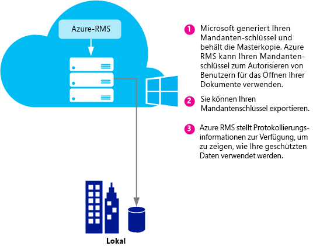
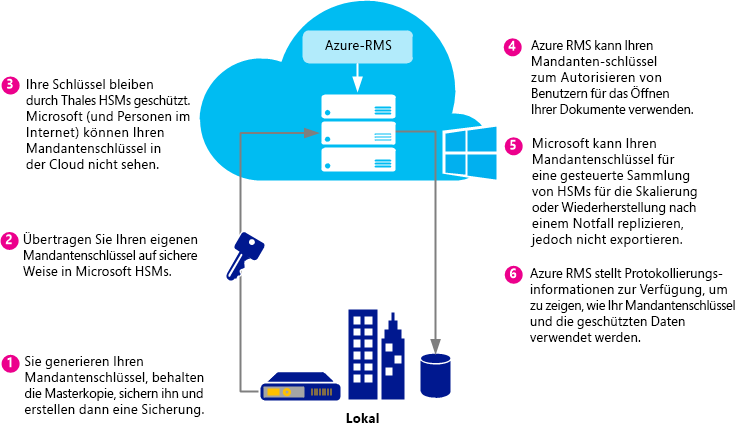
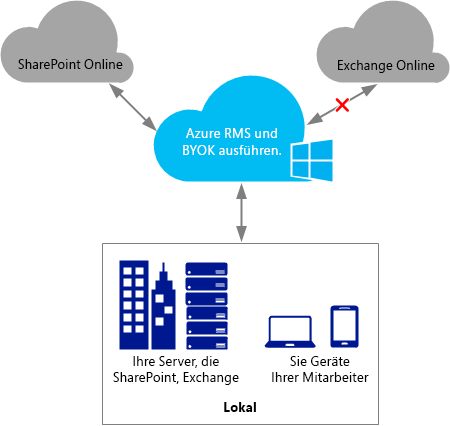
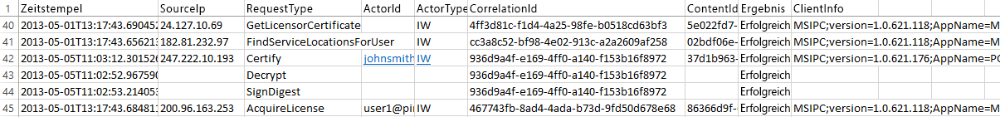

# Planen und Implementieren Ihres Azure Rights Management-Mandantenschl&#252;ssels
Verwenden Sie die Informationen in diesem Thema, um den Mandantenschlüssel Ihres Rechteverwaltungsdiensts (RMS) für Azure RMS zu planen und zu verwalten. Angenommen, Sie möchten die Standardeinstellung ändern, dass Microsoft Ihren Mandantenschlüssel verwaltet, und Ihren eigenen Mandantenschlüssel verwalten, um bestimmte Vorschriften in Ihrer Organisation einzuhalten.  Das Verwalten Ihres eigenen Mandantenschlüssels wird auch als "Bring Your Own Key" (kurz BYOK) bezeichnet.

> [!NOTE]
> Der RMS-Mandantenschlüssel ist auch als SLC-Schlüssel (Server Licensor Certificate, lizenzgebendes Serverzertifikat) bekannt. Azure RMS pflegt für jede Organisation, die Azure RMS abonniert, mindestens einen Schlüssel. Immer, wenn ein Schlüssel für RMS in einer Organisation verwendet wird (z. B. Benutzerschlüssel, Computerschlüssel, Dokumentationsverschlüsselungsschlüssel), wird dieser kryptografisch mit Ihrem RMS-Mandantenschlüssel verkettet.

**Kurz zusammengefasst:** Verwenden Sie die folgende Tabelle als eine kurze Einführung in die empfohlene Mandantenschlüsseltopologie. Weitere Informationen finden Sie in den folgenden Abschnitten.

Wenn Sie Azure RMS mit einem Mandantenschlüssel bereitstellen, der von Microsoft verwaltet wird, können Sie später zu BYOK wechseln. Sie können allerdings derzeit noch nicht Ihren Azure RMS-Mandantenschlüssel von BYOK in die Verwaltung durch Microsoft ändern.

|Geschäftliche Anforderung|Empfohlene Mandantenschlüsseltopologie|
|-----------------------------|------------------------------------------|
|Schnelles Bereitstellen von Azure RMS ohne spezielle Hardware|Von Microsoft verwaltet|
|Volle IRM-Funktionalität in Exchange Online mit Azure RMS|Von Microsoft verwaltet|
|Schlüssel werden von Ihnen erstellt und in einem Hardwaresicherheitsmodul (HSM) geschützt|BYOK<br /><br />Derzeit führt diese Konfiguration zu eingeschränkter IRM-Funktionalität in Exchange Online. Weitere Informationen finden Sie im Abschnitt [BYOK – Preise und Einschränkungen](../Topic/Planning_and_Implementing_Your_Azure_Rights_Management_Tenant_Key.md#BKMK_Pricing).|
Die folgenden Abschnitte sollen Ihnen bei der Entscheidung helfen, welche Mandantenschlüsseltopologie Sie verwenden sollten, Informationen zum Lebenszyklus des Mandantenschlüssels geben, erläutern, wie Sie BYOK (Bring Your Own Key) implementieren, und darlegen, welche die nächsten zu unternehmenden Schritte sind:

-   [Wählen Sie Ihre Mandantenschlüsseltopologie aus: Verwaltet von Microsoft (Standard) oder verwaltet von Ihnen (BYOK)](../Topic/Planning_and_Implementing_Your_Azure_Rights_Management_Tenant_Key.md#BKMK_ChooseTenantKey)

-   [BYOK – Preise und Einschränkungen](../Topic/Planning_and_Implementing_Your_Azure_Rights_Management_Tenant_Key.md#BKMK_Pricing)

-   [Implementierung von "Bring Your Own Key" (BYOK)](../Topic/Planning_and_Implementing_Your_Azure_Rights_Management_Tenant_Key.md#BKMK_ImplementBYOK)

-   [Nächste Schritte](../Topic/Planning_and_Implementing_Your_Azure_Rights_Management_Tenant_Key.md#BKMK_NextSteps)

## <a name="BKMK_ChooseTenantKey"></a>Wählen Sie Ihre Mandantenschlüsseltopologie: Verwaltet von Microsoft (Standard) oder verwaltet von Ihnen (BYOK)
Entscheiden Sie, welche Mandantenschlüsseltopologie für Ihre Organisation am besten geeignet ist. Standardmäßig generiert Azure RMS Ihren Mandantenschlüssel und verwaltet die meisten Aspekte des Lebenszyklus des Mandantenschlüssels. Dies ist die einfachste Möglichkeit mit dem geringsten Verwaltungsaufwand. In den meisten Fällen müssen Sie noch nicht einmal wissen, dass Sie einen Mandantenschlüssel besitzen. Sie registrieren sich einfach für Azure RMS, und der restliche Schlüsselverwaltungsprozess wird von Microsoft erledigt.

Alternativ können Sie, falls gewünscht, die vollständige Kontrolle über Ihren Mandantenschlüssel übernehmen, was das Erstellen Ihres Mandantenschlüssels und die Aufbewahrung der Masterkopie bei Ihnen vor Ort umfasst. Dieses Szenario wird häufig als „Bring Your Own Key“ (BYOK) bezeichnet. Bei dieser Option geschieht Folgendes:

1.  Sie generieren Ihren Mandantenschlüssel lokal, entsprechend Ihrer IT-Richtlinien.

2.  Sie übertragen den Mandantenschlüssel sicher von einem Hardwaresicherheitsmodul (HSM), das sich in Ihrem Besitz befindet, auf HSMs, die Microsoft gehören und von Microsoft verwaltet werden. Während dieses Prozesses verlässt Ihr Mandantenschlüssel nie die Hardwareschutzgrenzen.

3.  Wenn Sie Ihren Mandantenschlüssel an Microsoft übertragen, bleibt er durch Thales HSMs geschützt. Microsoft arbeitet mit Thales zusammen, um sicherzustellen, dass Ihr Mandantenschlüssel nicht aus den HSMs von Microsoft extrahiert werden kann.

Obgleich dies optional ist, möchten Sie wahrscheinlich auch die beinahe in Echtzeit erstellten Nutzungsprotokolle von Azure RMS verwenden, um genau verfolgen zu können, wie und wann Ihr Mandantenschlüssel verwendet wird.

> [!NOTE]
> Als zusätzliche Schutzmaßnahme verwendet Azure RMS getrennte Security Worlds für seine Rechenzentren in Nordamerika, EMEA (Europa, Naher Osten und Afrika) und Asien. Wenn Sie Ihren eigenen Mandantenschlüssel verwalten, ist dieser an die Security World der Region gebunden, in der Ihr RMS-Mandant registriert ist. Ein Mandantenschlüssel eines europäischen Kunden kann beispielsweise nicht in Rechenzentren in Nordamerika oder Asien verwendet werden.

## <a name="BKMK_OverviewLifecycle"></a>Der Lebenszyklus des Mandantenschlüssels
Wenn Sie sich entschließen, dass Microsoft Ihren Mandantenschlüssel verwalten soll, wickelt Microsoft die meisten aller Vorgänge des Schlüssellebenszyklus ab. Wenn Sie sich jedoch entschließen, Ihren Mandantenschlüssel selbst zu verwalten, sind Sie für zahlreiche der Vorgänge des Schlüssellebenszyklus sowie einige zusätzliche Verfahren verantwortlich.

Die folgenden Diagramme zeigen und vergleichen diese zwei Optionen. Das erste Diagramm zeigt, wie niedrig der Verwaltungsaufwand in der Standardkonfiguration ist, wenn Microsoft den Mandantenschlüssel verwaltet.



Das zweite Diagramm zeigt die zusätzlichen Schritte, die erforderlich sind, wenn Sie Ihren eigenen Mandantenschlüssel verwalten.



Wenn Sie sich entschließen, Ihren Mandantenschlüssel von Microsoft verwalten zu lassen, müssen Sie nichts mehr unternehmen, damit der Schlüssel generiert wird, und Sie können die folgenden Abschnitte überspringen und sofort unter [Nächste Schritte](../Topic/Planning_and_Implementing_Your_Azure_Rights_Management_Tenant_Key.md#BKMK_NextSteps) fortfahren.

Wenn Sie sich entschließen, Ihren Mandantenschlüssel selbst zu verwalten, finden Sie in den folgenden Abschnitten weitere Informationen hierzu, die Sie lesen sollten.

### Weitere Informationen zu Thales HSMs und Microsoft-Ergänzungen
Azure RMS verwendet Thales HSMs, um Ihre Schlüssel zu schützen.

Thales e-Security ist ein weltweit führender Anbieter von Datenverschlüsselungs- und Cyber-Sicherheitslösungen für Finanzdienstleister, High-Tech-Unternehmen sowie Kunden in den Bereichen Fertigung, Behörden/Verwaltung und Technologie. Nach einer Unternehmensgeschichte von 40 erfolgreichen Jahren beim Schutz von Unternehmens- und Regierungsinformationen werden Thales-Lösungen von vier der fünf größten Energie- und Luftfahrtunternehmen sowie 22 NATO-Ländern eingesetzt und schützen mehr als 80 %aller Zahlungstransaktionen weltweit.

Microsoft hat mit Thales zusammengearbeitet, um den aktuellen technischen Standard von HSMs zu verbessern. Diese Verbesserungen erlauben es Ihnen, die typischen Vorteile von gehosteten Diensten zu genießen, ohne dabei die Kontrolle über Ihre Schlüssel aufgeben zu müssen. Insbesondere ermöglichen diese Verbesserungen Microsoft die Verwaltung der HSMs, sodass Sie sich darum nicht kümmern müssen. Als Cloud-Dienst kann Azure RMS kurzfristig aufwärts skaliert werden, um Nutzungsspitzen Ihrer Organisation abzufangen. Gleichzeitig wird Ihr Schlüssel in den HSMs von Microsoft geschützt: Sie behalten die Kontrolle über den Lebenszyklus des Schlüssels, weil Sie den Schlüssel generieren und auf die HSMs von Microsoft übertragen.

Weitere Informationen finden Sie auf der Thales-Website unter[Thales HSMs und Azure RMS](http://www.thales-esecurity.com/msrms/cloud).

## <a name="BKMK_Pricing"></a>BYOK – Preise und Einschränkungen
Organisationen, die ein IT-verwaltetes Azure-Abonnement haben, können ohne zusätzliche Kosten BYOK verwenden und ihre Nutzung protokollieren. Organisationen, die RMS für Einzelpersonen verwenden, können weder BYOK noch die Protokollierung verwenden, weil sie keinen Mandantenadministrator haben, der diese Features konfiguriert.

> [!NOTE]
> Weitere Informationen zu RMS für Einzelpersonen finden Sie unter [RMS for Individuals und Azure Rights Management](../Topic/RMS_for_Individuals_and_Azure_Rights_Management.md).



BYOK und die Protokollierung arbeiten nahtlos mit jeder Anwendung zusammen, die sich in Azure RMS integriert. Dies umfasst Cloud Services wie SharePoint Online, lokale Server, die Exchange und SharePoint ausführen, die mit Azure RMS unter Verwendung des RMS-Verbindungsdiensts arbeiten, sowie Clientanwendungen wie Office 2013. Sie erhalten Protokolle der Schlüsselnutzung unabhängig davon, welche Anwendung Anforderungen an Azure RMS stellt.

Es gibt eine Ausnahme: Derzeit ist **Azure RMS BYOK nicht mit Exchange Online kompatibel**.  Wenn Sie Exchange Online verwenden möchten, empfehlen wir, dass Sie Azure RMS jetzt im Standard-Schlüsselverwaltungsmodus bereitstellen, in dem Microsoft Ihren Schlüssel generiert und verwaltet. Sie können später zu BYOK wechseln, beispielsweise wenn Exchange Online Azure RMS BYOK unterstützt. Wenn Sie jedoch nicht warten können, haben Sie jetzt die Möglichkeit, Azure RMS mit BYOK mit eingeschränkter RMS-Funktionalität für Exchange Online bereitzustellen (ungeschützte E-Mails und Anlagen bleiben dabei voll funktionsfähig):

-   Geschützte E-Mails oder Anlagen in Outlook Web Access können nicht angezeigt werden.

-   Geschützte E-Mails auf mobilen Geräten, die Exchange ActiveSync IRM verwenden, können nicht angezeigt werden.

-   Die Transport- (z. B. zum Scannen nach Schadsoftware) und Journalentschlüsselung sind nicht möglich, sodass geschützte E-Mails und Anlagen übersprungen werden.

-   Transportschutzregeln und die Verhinderung von Datenverlust (Data Loss Prevention, DLP), die IRM-Richtlinien erzwingen, sind nicht möglich, sodass der RMS-Schutz mit diesen Methoden nicht angewendet werden kann.

-   Serverbasierte Suche für geschützte E-Mails, sodass geschützte E-Mails übersprungen werden.

Bei der Verwendung von Azure RMS BYOK mit eingeschränkter RMS-Funktionalität für Exchange Online funktioniert RMS mit E-Mail-Clients in Outlook auf Windows- und Mac-Computern und mit anderen E-Mail-Clients, die Exchange ActiveSync IRM nicht verwenden.

Wenn Sie von AD RMS nach Azure RMS migrieren, haben Sie möglicherweise Ihren Schlüssel als eine vertrauenswürdige Veröffentlichungsdomäne (TPD) nach Exchange Online importiert zu Exchange (in der Exchange-Terminologie auch als BYOK bezeichnet, was sich von Azure RMS BYOK unterscheidet). In diesem Szenario müssen Sie die vertrauenswürdige Veröffentlichungsdomäne aus Exchange Online entfernen, um in Konflikt stehende Vorlagen und Richtlinien zu vermeiden. Weitere Informationen finden Sie unter [Remove-RMSTrustedPublishingDomain](https://technet.microsoft.com/library/jj200720%28v=exchg.150%29.aspx) in der Cmdlets-Bibliothek für Exchange Online.

In einigen Fällen stellt die Azure RMS BYOK-Ausnahme in der Praxis kein Problem für Exchange Online dar. Beispielsweise führen Organisationen, die BYOK und Protokollierung benötigen, ihre Datenanwendungen (Exchange, SharePoint, Office) lokal aus und verwenden Azure RMS für Funktionen, die bei lokalem AD RMS nicht einfach verfügbar sind (z. B. Zusammenarbeit mit anderen Unternehmen und Zugriff von mobilen Clients aus). Sowohl BYOK als auch die Protokollierung funktionieren gut in diesem Szenario und gestatten der Organisation die Übernahme der vollständigen Kontrolle über ihr Azure RMS-Abonnement.

## <a name="BKMK_ImplementBYOK"></a>Implementierung von "Bring Your Own Key" (BYOK)
Verwenden Sie die Informationen und Verfahren in diesem Abschnitt, wenn Sie sich entschieden haben, Ihren Mandantenschlüssel selber zu generieren und zu verwalten – das BYOK-Szenario (Bring Your Own Key):

-   [Voraussetzungen für BYOK](../Topic/Planning_and_Implementing_Your_Azure_Rights_Management_Tenant_Key.md#BKMK_Preqs)

-   [Generieren und Übertragen Ihres Mandantenschlüssels – über das Internet](../Topic/Planning_and_Implementing_Your_Azure_Rights_Management_Tenant_Key.md#BKMK_BYOK_Internet)

-   [Generieren und Übertragen Ihres Mandantenschlüssels – persönlich](../Topic/Planning_and_Implementing_Your_Azure_Rights_Management_Tenant_Key.md#BKMK_BYOK_InPerson)

> [!IMPORTANT]
> Wenn Sie bereits mit der Verwendung von [!INCLUDE[aad_rightsmanagement_1](../Token/aad_rightsmanagement_1_md.md)] begonnen haben (der Dienst ist aktiviert) und Benutzer haben, die Office 2010 ausführen, wenden Sie sich an den Microsoft-Kundendienst, bevor Sie diese Verfahren ausführen. Abhängig von Ihrem Szenario und den Voraussetzungen können Sie immer noch BYOK verwenden, allerdings mit einigen Einschränkungen bzw. zusätzlichen Schritten.
> 
> Wenden Sie sich auch an den Kundendienst, wenn Ihre Organisation bestimmte Richtlinien für die Behandlung von Schlüsseln vorsieht.

### <a name="BKMK_Preqs"></a>Voraussetzungen für BYOK
In der folgenden Tabelle finden Sie eine Liste der Voraussetzungen für „Bring Your Own Key“ (BYOK).

|Anforderung|Weitere Informationen|
|---------------|-------------------------|
|Ein Abonnement, das Azure RMS unterstützt.|Weitere Informationen zu den verfügbaren Abonnements finden Sie in Thema [Cloud-Abonnements, die Azure RMS unterstützen](../Topic/Requirements_for_Azure_Rights_Management.md#BKMK_SupportedSubscriptions) im Abschnitt [Voraussetzungen für Azure Rights Management](../Topic/Requirements_for_Azure_Rights_Management.md).|
|Sie verwenden nicht RMS for Individuals oder Exchange Online. Oder, falls Sie doch Exchange Online verwenden, verstehen und akzeptieren Sie die Einschränkungen, die bei der Verwendung von BYOK mit dieser Konfiguration einhergehen.|Weitere Informationen zu diesen und anderen Einschränkungen für BYOK finden Sie in diesem Thema im Abschnitt [BYOK – Preise und Einschränkungen](../Topic/Planning_and_Implementing_Your_Azure_Rights_Management_Tenant_Key.md#BKMK_Pricing). **Important:** Derzeit ist BYOK nicht kompatibel mit Exchange Online.|
|Thales HSM, Smartcards und unterstützende Software<br /><br />Wenn Sie von AD RMS zu Azure RMS migrieren, indem Sie Softwareschlüssel zu Hardwareschlüssel, müssen die Thales-Treiber mindestens in der Version 11.62 vorliegen.|Sie benötigen Zugriff auf ein Thales Hardwaresicherheitsmodul sowie grundlegende Kenntnisse zum Betrieb von Thales HSMs. Unter [Thales-Hardwaresicherheitsmodul](http://www.thales-esecurity.com/msrms/buy) finden Sie eine Liste der kompatiblen Modelle und Informationen zum Kauf eines HSM, wenn Sie noch keines besitzen.|
|Wenn Sie Ihren Mandantenschlüssel über das Internet übertragen statt physisch in Redmond, USA, abgeben möchten:<br /><br />1.  Eine offline arbeitende x64-Arbeitsstation mit einem Windows-Betriebssystem der Mindestversion Windows 7 und Thales nShield-Software der Mindestversion 11.62.<br />    Wenn auf dieser Arbeitsstation Windows 7 ausgeführt wird, müssen Sie [Microsoft .NET Framework 4.5 installieren](http://go.microsoft.com/fwlink/?LinkId=225702).<br />2.  Eine Arbeitsstation, die eine Internetverbindung hat und über ein Windows-Betriebssystem der Mindestversion Windows 7 verfügt.<br />3.  Ein USB-Laufwerk oder anderes mobiles Speichergerät mit mindestens 16 MB freiem Speicherplatz.|Diese Voraussetzungen sind nicht erforderlich, wenn Sie nach Redmond reisen und Ihren Mandantenschlüssel persönlich überbringen.<br /><br />Aus Sicherheitsgründen empfehlen wir, dass die erste Arbeitsstation nicht mit einem Netzwerk verbunden ist. Dies ist jedoch nicht programmtechnisch erforderlich. **Note:** In den folgenden Anleitungen wird diese Arbeitsstation als nicht verbundene Arbeitsstation bezeichnet.<br />Wenn Ihr Mandantenschlüssel für ein Produktionsnetzwerk bestimmt ist, empfehlen wir zusätzlich, dass Sie eine zweite getrennte Arbeitsstation verwenden, um das Toolset herunterzuladen und den Mandantenschlüssel hochzuladen. Zu Testzwecken können Sie aber dieselbe Arbeitsstation wie die erste verwenden. **Note:** In den folgenden Anleitungen wird diese zweite Arbeitsstation als Arbeitsstation mit Internetverbindung bezeichnet.|
|Optional: Azure-Abonnement|Wenn Sie die Verwendung Ihres Mandantenschlüssels (und die Rights Management-Nutzung) protokollieren möchten, müssen Sie ein Abonnement von Azure sowie ausreichenden Speicherplatz auf Azure besitzen, um Ihre Protokolle zu speichern.|
Die Verfahren zum Generieren und Verwenden Ihres eigenen Mandantenschlüssels hängen davon ab, ob Sie dies über das Internet oder persönlich vornehmen möchten:

-   **Über das Internet:** Dies erfordert einige zusätzliche Konfigurationsschritte wie das Herunterladen und Verwenden eines Toolsets und von Windows PowerShell-Cmdlets. Sie müssen sich jedoch nicht physisch in einer Einrichtung von Microsoft aufhalten, um Ihren Mandantenschlüssel zu übertragen. Die Sicherheit wird mithilfe der folgenden Methoden aufrechterhalten:

    -   Sie generieren den Mandantenschlüssel auf einer Offlinearbeitsstation, was die Angriffsfläche verringert.

    -   Der Mandantenschlüssel wird mit einem Schlüsselaustauschschlüssel (Key Exchange Key, KEK) verschlüsselt und bleibt verschlüsselt, bis er auf die Azure RMS-HSMs übertragen wurde. Nur die verschlüsselte Version Ihres Mandantenschlüssels verlässt die ursprüngliche Arbeitsstation.

    -   Ein Toolset legt Eigenschaften Ihres Mandantenschlüssels fest, die den Mandantenschlüssel an die Azure RMS Security World binden. Somit können ausschließlich die Azure RMS-HSMs, nachdem sie Ihren Mandantenschlüssel empfangen und entschlüsselt haben, diesen verwenden. Ihr Mandantenschlüssel kann nicht exportiert werden. Diese Bindung wird von den Thales HSMs erzwungen.

    -   Der Schlüsselaustauschschlüssel, mit dem Ihr Mandantenschlüssel verschlüsselt wird, wird in den Azure RMS-HSMs generiert und kann nicht exportiert werden. Die HSMs erzwingen, dass keine unverschlüsselte Version des Schlüsselaustauschschlüssels außerhalb der HMSs vorhanden sein kann. Zusätzlich enthält das Toolset eine Beglaubigung von Thales, dass der Schlüsselaustauschschlüssel nicht exportiert werden kann und in einem von Thales hergestellten Original-HSM generiert wurde.

    -   Das Toolset enthält eine Beglaubigung von Thales, dass die Azure RMS Security World ebenfalls auf einem von Thales hergestellten Original-HSM generiert wurde. Dies weist Ihnen gegenüber nach, dass Microsoft Originalhardware verwendet.

    -   Microsoft verwendet in jeder geografisch getrennten Region getrennte Schlüsselaustauschschlüssel sowie getrennte Security Worlds, was sicherstellt, dass Ihr Mandantenschlüssel nur in Rechenzentren in der Region verwendet werden kann, in der Sie ihn verschlüsselt haben. Beispielsweise kann ein Mandantenschlüssel eines europäischen Kunden nicht in Rechenzentren in Nordamerika oder Asien verwendet werden.

    > [!NOTE]
    > Ihr Mandantenschlüssel kann nicht vertrauenswürdige Computer und Netzwerke sicher passieren, weil er verschlüsselt und mit Berechtigungen auf Zugriffssteuerungsebene gesichert ist, wodurch er nur in Ihren HSMs und in den HSMs für Azure RMS von Microsoft verwendet werden kann. Sie können die im Toolset bereitgestellten Skripts verwenden, um die Sicherheitsmaßnahmen zu überprüfen, und Sie können weitere Informationen von Thales zur Funktionsweise lesen: [Verwalten von Hardwareschlüsseln in der RMS-Cloud](https://www.thales-esecurity.com/knowledge-base/white-papers/hardware-key-management-in-the-rms-cloud).

-   **Persönlich:** Dies erfordert, dass Sie sich an den Microsoft-Kundendienst wenden, um einen Termin für die Schlüsselübertragung für Azure RMS zu vereinbaren. Sie müssen zu einer Microsoft-Niederlassung in Redmond, Washington, USA, reisen, um Ihren Mandantenschlüssel in die Azure RMS Security World zu übertragen.

### <a name="BKMK_BYOK_Internet"></a>Generieren und Übertragen Ihres Mandantenschlüssels – über das Internet
Verwenden Sie die folgenden Verfahren, wenn Sie Ihren Mandantenschlüssel über das Internet übertragen möchten, statt zu einer Microsoft-Einrichtung zu reisen, um den Mandantenschlüssel persönlich zu übertragen:

-   [Vorbereiten Ihrer Arbeitsstation mit Internetverbindung](../Topic/Planning_and_Implementing_Your_Azure_Rights_Management_Tenant_Key.md#BKMK_InternetPrepareWorkstation)

-   [Vorbereiten Ihrer nicht verbundenen Arbeitsstation](../Topic/Planning_and_Implementing_Your_Azure_Rights_Management_Tenant_Key.md#BKMK_DisconnectedPrepareWorkstation)

-   [Generieren Ihres Mandantenschlüssels](../Topic/Planning_and_Implementing_Your_Azure_Rights_Management_Tenant_Key.md#BKMK_InternetGenerate)

-   [Vorbereiten Ihres Mandantenschlüssels für die Übertragung](../Topic/Planning_and_Implementing_Your_Azure_Rights_Management_Tenant_Key.md#BKMK_InternetPrepareTransfer)

-   [Übertragen Ihres Mandantenschlüssels an Azure RMS](../Topic/Planning_and_Implementing_Your_Azure_Rights_Management_Tenant_Key.md#BKMK_InternetTransfer)

#### <a name="BKMK_InternetPrepareWorkstation"></a>Vorbereiten Ihrer Arbeitsstation mit Internetverbindung
Um Ihre Arbeitsstation mit Internetverbindung vorzubereiten, führen Sie diese 3 Schritte aus:

-   [Schritt 1: Installieren Sie die Windows PowerShell für Azure Rights Management](../Topic/Planning_and_Implementing_Your_Azure_Rights_Management_Tenant_Key.md#BKMK_PrepareInternetConnectedWorkstation1)

-   [Schritt 2: Rufen Sie Ihre Azure Active Directory-Mandanten-ID ab](../Topic/Planning_and_Implementing_Your_Azure_Rights_Management_Tenant_Key.md#BKMK_PrepareInternetConnectedWorkstation2)

-   [Schritt 3: Laden Sie das BYOK-Toolset herunter](../Topic/Planning_and_Implementing_Your_Azure_Rights_Management_Tenant_Key.md#BKMK_PrepareInternetConnectedWorkstation3)

##### <a name="BKMK_PrepareInternetConnectedWorkstation1"></a>Schritt 1: Installieren Sie die Windows PowerShell für Azure Rights Management
Laden Sie auf der Arbeitsstation mit Internetverbindung das Windows PowerShell-Modul für Rights Management herunter, und installieren Sie es.

> [!NOTE]
> Wenn Sie dieses Windows PowerShell-Modul zuvor heruntergeladen haben, führen Sie den folgenden Befehl aus, um zu überprüfen, ob Ihre Version mindestens 2.1.0.0 ist: `(Get-Module aadrm -ListAvailable).Version`

Anweisungen zur Installation finden Sie unter [Installieren der Windows PowerShell für Azure Rights Management](../Topic/Installing_Windows_PowerShell_for_Azure_Rights_Management.md).

##### <a name="BKMK_PrepareInternetConnectedWorkstation2"></a>Schritt 2: Rufen Sie Ihre Azure Active Directory-Mandanten-ID ab
Starten Sie Windows PowerShell mit der Option **Als Administrator ausführen**, und führen Sie dann die folgenden Befehle aus:

-   Verwenden Sie das [Connect-AadrmService](http://msdn.microsoft.com/library/windowsazure/dn629415.aspx)-Cmdlet zum Verbinden mit dem RMS-Dienst:

    ```
    Connect-AadrmService
    ```
    Wenn Sie dazu aufgefordert werden, geben Sie die Administratoranmeldeinformationen des [!INCLUDE[aad_rightsmanagement_1](../Token/aad_rightsmanagement_1_md.md)]-Mandanten ein (in der Regel verwenden Sie das Konto eines globalen Administrators für Azure Active Directory oder Office 365).

-   Verwenden Sie das [Get-AadrmConfiguration](http://msdn.microsoft.com/library/windowsazure/dn629410.aspx)-Cmdlet, um die Konfiguration Ihres Mandanten anzuzeigen:

    ```
    Get-AadrmConfiguration
    ```
    Speichern Sie aus der Ausgabe die GUID aus der ersten Zeile (BPOSId). Dies ist Ihre Azure Active Directory-Mandanten-ID, die Sie später benötigen, wenn Sie Ihren Mandantenschlüssel für den Upload vorbereiten.

-   Verwenden Sie das [Disconnect-AadrmService](http://msdn.microsoft.com/library/windowsazure/dn629416.aspx)-Cmdlet zum Trennen des Azure RMS-Diensts, bis Sie für das Hochladen Ihres Schlüssels bereit sind:

    ```
    Disconnect-AadrmService
    ```

Schließen Sie das Windows PowerShell-Fenster nicht.

##### <a name="BKMK_PrepareInternetConnectedWorkstation3"></a>Schritt 3: Laden Sie das BYOK-Toolset herunter
Wechseln Sie zum Microsoft Download Center und [laden Sie BYOK-Toolset herunter](http://go.microsoft.com/fwlink/?LinkId=335781) (für Ihre Region):

|Region|Paketname|
|----------|-------------|
|Nordamerika|AzureRMS-BYOK-tools-UnitedStates.zip|
|Europa|AzureRMS-BYOK-tools-Europe.zip|
|Asien|AzureRMS-BYOK-tools-AsiaPacific.zip|
Das Toolset enthält Folgendes:

-   Ein KEK-Paket (Schlüsselaustauschschlüssel), das einen Namen trägt, der mit **BYOK-KEK-pkg-** beginnt.

-   Ein Security World-Paket, das einen Namen trägt, der mit **BYOK-SecurityWorld-pkg-** beginnt.

-   Ein Python-Skript namens **verifykeypackage.py**.

-   Eine ausführbare Befehlszeilendatei namens **KeyTransferRemote.exe**, eine Metadatendatei namens **KeyTransferRemote.exe.config** und die zugehörigen DLLs.

-   Ein Visual C++ Redistributable Package namens **vcredist_x64.exe**.

Kopieren Sie das Paket auf ein USB-Laufwerk oder einen anderen mobilen Speicher.

#### <a name="BKMK_DisconnectedPrepareWorkstation"></a>Vorbereiten Ihrer nicht verbundenen Arbeitsstation
Um Ihre nicht mit einem Netzwerk (entweder das Internet oder Ihr internes Netzwerk) verbundene Arbeitsstation vorzubereiten, führen Sie diese 2 Schritte aus:

-   [Schritt 1: Bereiten Sie die nicht verbundene Arbeitsstation mit Thales HSM vor](../Topic/Planning_and_Implementing_Your_Azure_Rights_Management_Tenant_Key.md#BKMK_PrepareDisconnectedWorkstation1)

-   [Schritt 2: Installieren Sie das BYOK-Toolset auf der nicht verbundenen Arbeitsstation](../Topic/Planning_and_Implementing_Your_Azure_Rights_Management_Tenant_Key.md#BKMK_PrepareDisconnectedWorkstation2)

##### <a name="BKMK_PrepareDisconnectedWorkstation1"></a>Schritt 1: Bereiten Sie die nicht verbundene Arbeitsstation mit Thales HSM vor
Installieren Sie auf der nicht verbundenen Arbeitsstation die unterstützende nCipher-Software (Thales) auf einem Windows-Computer, und schließen Sie dann ein Thales HSM an diesen Computer an.

Stellen Sie sicher, dass sich die Thales-Tools in Ihrem Pfad **(%nfast_home%\bin** (und **%nfast_home%\python\bin**) befinden. Geben Sie zum Beispiel Folgendes ein:

```
set PATH=%PATH%;”%nfast_home%\bin”;”%nfast_home%\python\bin”
```
Weitere Informationen finden Sie im Benutzerhandbuch, das im Thales-HSM enthalten ist, oder Sie besuchen die Thales-Website für Azure RMS auf [http://www.thales-esecurity.com/msrms/cloud](http://www.thales-esecurity.com/msrms/cloud).

##### <a name="BKMK_PrepareDisconnectedWorkstation2"></a>Schritt 2: Installieren Sie das BYOK-Toolset auf der nicht verbundenen Arbeitsstation
Kopieren Sie das BYOK-Toolsetpaket von dem USB-Laufwerk oder dem anderen mobilen Speicher, und gehen Sie dann wie folgt vor:

1.  Extrahieren Sie die Dateien aus dem heruntergeladenen Paket in einen beliebigen Ordner.

2.  Führen Sie aus diesem Ordner heraus „vcredist_x64.exe“ aus.

3.  Befolgen Sie die Anweisungen zum Installieren der Visual C++-Laufzeitkomponenten für Visual Studio 2012.

#### <a name="BKMK_InternetGenerate"></a>Generieren Ihres Mandantenschlüssels
Befolgen Sie auf der nicht verbundenen Arbeitsstation diese 3 Schritte, um Ihren eigenen Mandantenschlüssel zu generieren:

-   [Schritt 1: Erstellen Sie eine Security World](../Topic/Planning_and_Implementing_Your_Azure_Rights_Management_Tenant_Key.md#BKMK_InternetGenerate1)

-   [Schritt 2: Überprüfen Sie das heruntergeladene Paket](../Topic/Planning_and_Implementing_Your_Azure_Rights_Management_Tenant_Key.md#BKMK_InternetGenerate2)

-   [Schritt 3: Erstellen Sie einen neuen Schlüssel](../Topic/Planning_and_Implementing_Your_Azure_Rights_Management_Tenant_Key.md#BKMK_InternetGenerate3)

##### <a name="BKMK_InternetGenerate1"></a>Schritt 1: Erstellen Sie eine Security World
Starten Sie eine Eingabeaufforderung, und führen Sie das Thales-Programm „new-world“ aus.

```
new-world.exe --initialize --cipher-suite=DLf1024s160mRijndael --module=1 --acs-quorum=2/3
```
Dieses Programm erstellt eine **Security World**-Datei unter „%NFAST_KMDATA%\local\world“, die dem Ordner „C:\ProgramData\nCipher\Key Management Data\local“ entspricht. Sie können verschiedene Werte für das Quorum verwenden, aber in unserem Beispiel werden Sie aufgefordert, für jeden Wert drei leere Karten und PINs einzugeben. Anschließend benötigen Sie zwei Karten, um administrativen Zugriff auf die Security World (das angegebene Quorum) zu erhalten.  Diese Karten werden dann zum **Administrator Card Set** für die neue Security World. Sie können zu diesem Zeitpunkt das Kennwort oder die PIN für jede ACS-Karte angeben, oder dies später mit einem Befehl hinzufügen.

> [!TIP]
> Sie können den aktuellen Konfigurationsstatus Ihres HSMs mit dem Befehl `nkminfo` überprüfen.

Führen Sie dann Folgendes durch:

1.  Installieren Sie den Thales CNG-Anbieter, wie in der Thales-Dokumentation beschrieben, und konfigurieren Sie ihn für die Verwendung der neuen Security World.

2.  Sichern Sie die World-Datei unter **%nfast_kmdata%\local**. Sichern und schützen Sie die World-Datei, die Administrator Cards und deren PINs, und stellen Sie sicher, dass keine einzelne Person Zugriff auf mehr als eine Karte hat.

##### <a name="BKMK_InternetGenerate2"></a>Schritt 2: Überprüfen Sie das heruntergeladene Paket
Dieser Schritt ist optional, wird aber empfohlen, damit Sie Folgendes überprüfen können:

-   Der in dem Toolset enthaltene Schlüsselaustauschschlüssel wurde auf einem Original-HSM von Thales generiert.

-   Der Hash der Azure RMS Security World, die in dem Toolset enthalten ist, wurde in einem Original-HSM von Thales generiert.

-   Der Schlüsselaustauschschlüssel kann nicht exportiert werden.

> [!NOTE]
> Um das heruntergeladene Paket zu überprüfen, muss das HSM angeschlossen und eingeschaltet sein, und es muss sich eine Security World darauf befinden (beispielsweise die gerade von Ihnen erstellte).

###### So überprüfen Sie das heruntergeladene Paket

1.  Führen Sie das Skript „verifykeypackage.py“ aus, indem Sie in Abhängigkeit von Ihrer Region einen der folgenden Befehle eingeben:

    -   Für Nordamerika:

        ```
        python verifykeypackage.py -k BYOK-KEK-pkg-NA-1 -w BYOK-SecurityWorld-pkg-NA-1
        ```

    -   Für Europa:

        ```
        python verifykeypackage.py -k BYOK-KEK-pkg-EU-1 -w BYOK-SecurityWorld-pkg-EU-1
        ```

    -   Für Asien:

        ```
        python verifykeypackage.py -k BYOK-KEK-pkg-AP-1 -w BYOK-SecurityWorld-pkg-AP-1
        ```

    > [!TIP]
    > Die Thales-Software umfasst einen Python-Interpreter unter %NFAST_HOME%\python\bin.

2.  Vergewissern Sie sich, dass Folgendes angezeigt wird, was eine erfolgreiche Überprüfung anzeigt: **Ergebnis:  ERFOLG (SUCCESS)**

Dieses Skript überprüft die Kette der Signaturgeber bis hinauf zum Thales-Stammschlüssel. Der Hash dieses Stammschlüssels ist in das Skript eingebettet, und sein Wert sollte **59178a47 de508c3f 291277ee 184f46c4 f1d9c639** sein. Sie können diesen Wert auch einzeln bestätigen. Besuchen Sie dazu die [Thales-Website](http://www.thalesesec.com/).

Sie sind jetzt bereit, um einen neuen Schlüssel zu erstellen, der dann Ihr RMS-Mandantenschlüssel ist.

##### <a name="BKMK_InternetGenerate3"></a>Schritt 3: Erstellen Sie einen neuen Schlüssel
Generieren Sie einen CNG-Schlüssel unter Verwendung der Thales-Programme **generatekey** und **cngimport**.

Führen Sie folgenden Befehl aus, um den Schlüssel zu generieren:

```
generatekey --generate simple type=RSA size=2048 protect=module ident=contosokey plainname=contosokey nvram=no pubexp=
```
Wenn Sie diesen Befehl ausführen, gehen Sie wie folgt vor:

-   Als Schlüsselgröße empfehlen wir 2048, unterstützt werden aber auch 1024-Bit-RSA-Schlüssel für bestehende AD RMS-Kunden, die solche Schlüssel haben und zu Azure RMS migrieren.

-   Ersetzen Sie den Wert von *contosokey* für **ident** und **plainname** durch einen beliebigen Zeichenfolgenwert. Zur Minimierung des Verwaltungsaufwands und zur Verringerung des Fehlerrisikos empfehlen wir Ihnen die Verwendung desselben Werts für beide sowie die Verwendung von ausschließlich Kleinbuchstaben.

-   Der „pubexp“ bleibt in diesem Beispiel leer (Standard), aber Sie können spezifische Wert angeben. Weitere Informationen finden Sie in der Thales-Dokumentation.

Führen Sie dann den folgenden Befehl aus, um den Schlüssel in CNG zu importieren:

```
cngimport --import -M --key=contosokey --appname=simple contosokey
```
Wenn Sie diesen Befehl ausführen, gehen Sie wie folgt vor:

-   Ersetzen Sie *contosokey* durch den gleichen Wert, den Sie in [Schritt 1: Erstellen Sie eine Security World](../Topic/Planning_and_Implementing_Your_Azure_Rights_Management_Tenant_Key.md#BKMK_InternetGenerate1) aus dem Abschnitt *Generieren Ihres Mandantenschlüssels* angegeben haben.

-   Verwenden Sie die Option **-M**, damit der Schlüssel für dieses Szenario geeignet ist. Ohne dies wird das Resultat ein Schlüssel, der für den aktuellen Benutzer spezifisch ist.

Dieser Befehl erstellt eine Tokenschlüsseldatei in Ihrem Ordner „%NFAST_KMDATA%\local“ mit einem Namen, der mit **key_caping_** beginnt, gefolgt von einer SID. Beispiel: **key_caping_machine--801c1a878c925fd9df4d62ba001b94701c039e2fb**. Diese Datei enthält einen verschlüsselten Schlüssel.

> [!TIP]
> Sie können den aktuellen Konfigurationsstatus Ihrer Schlüssel mit dem Befehl `nkminfo –k` anzeigen.

Sichern Sie diese Tokenschlüsseldatei an einem sicheren Ort.

> [!IMPORTANT]
> Wenn Sie Ihren Schlüssel später an Azure RMS übertragen, kann Microsoft diesen Schlüssel nicht an Sie zurückexportieren, weshalb es äußerst wichtig ist, dass Sie Ihren Schlüssel und die Security World gut geschützt sichern. Anleitungen und bewährte Methoden zum Sichern Ihres Schlüssels erhalten Sie von Thales.

Sie sind jetzt bereit, um Ihren Mandantenschlüssel an Azure RMS zu übertragen.

#### <a name="BKMK_InternetPrepareTransfer"></a>Vorbereiten Ihres Mandantenschlüssels für die Übertragung
Befolgen Sie auf der nicht verbundenen Arbeitsstation diese 4 Schritte, um Ihren eigenen Mandantenschlüssel vorzubereiten:

-   [Schritt 1: Erstellen Sie eine Kopie Ihres Schlüssels mit verringerten Berechtigungen](../Topic/Planning_and_Implementing_Your_Azure_Rights_Management_Tenant_Key.md#BKMK_InternetPrepareTransfer1)

-   [Schritt 2: Untersuchen Sie die neue Kopie des Schlüssels](../Topic/Planning_and_Implementing_Your_Azure_Rights_Management_Tenant_Key.md#BKMK_InternetPrepareTransfer2)

-   [Schritt 3: Verschlüsseln Sie Ihren Schlüssel mithilfe des Schlüsselaustauschschlüssels von Microsoft](../Topic/Planning_and_Implementing_Your_Azure_Rights_Management_Tenant_Key.md#BKMK_InternetPrepareTransfer3)

-   [Schritt 4: Kopieren Sie Ihr Schlüsselübertragungspaket auf die Arbeitsstation mit Internetverbindung](../Topic/Planning_and_Implementing_Your_Azure_Rights_Management_Tenant_Key.md#BKMK_InternetPrepareTransfer4)

##### <a name="BKMK_InternetPrepareTransfer1"></a>Schritt 1: Erstellen Sie eine Kopie Ihres Schlüssels mit verringerten Berechtigungen
Um die Berechtigungen für Ihren Mandantenschlüssel zu verringern, gehen Sie wie folgt vor:

-   Führen Sie in Abhängigkeit von Ihrer Region einen der folgenden Befehle an einer Eingabeaufforderung aus:

    -   Für Nordamerika:

        ```
        KeyTransferRemote.exe -ModifyAcls -KeyAppName simple -KeyIdentifier contosokey -ExchangeKeyPackage BYOK-KEK-pkg-NA-1 -NewSecurityWorldPackage BYOK-SecurityWorld-pkg-NA-1
        ```

    -   Für Europa:

        ```
        KeyTransferRemote.exe -ModifyAcls -KeyAppName simple -KeyIdentifier contosokey -ExchangeKeyPackage BYOK-KEK-pkg-EU-1 -NewSecurityWorldPackage BYOK-SecurityWorld-pkg-EU-1
        ```

    -   Für Asien:

        ```
        KeyTransferRemote.exe -ModifyAcls -KeyAppName simple -KeyIdentifier contosokey -ExchangeKeyPackage BYOK-KEK-pkg-AP-1 -NewSecurityWorldPackage BYOK-SecurityWorld-pkg-AP-1
        ```

Wenn Sie diesen Befehl ausführen, ersetzen Sie *contosokey* durch den gleichen Wert, den Sie in [Schritt 1: Erstellen Sie eine Security World](../Topic/Planning_and_Implementing_Your_Azure_Rights_Management_Tenant_Key.md#BKMK_InternetGenerate1) aus dem Abschnitt *Generieren Ihres Mandantenschlüssels* angegeben haben.

Sie werden aufgefordert, Ihre Security World ACS-Karten einzustecken und, falls festgelegt, das Kennwort oder die PIN.

Wenn der Befehl ausgeführt wurde, erhalten Sie folgendes **Ergebnis: ERFOLG (SUCCESS)** wird angezeigt, und die Kopie Ihres Mandantenschlüssels mit verringerten Berechtigungen befindet sich in der Datei mit dem Namen *key_xferacId_contosokey*.

##### <a name="BKMK_InternetPrepareTransfer2"></a>Schritt 2: Untersuchen Sie die neue Kopie des Schlüssels
Führen Sie optional die Thales-Hilfsprogramme aus, um die minimalen Berechtigungen des neuen Mandantenschlüssels sicherzustellen:

-   aclprint.py:

    ```
    "%nfast_home%\bin\preload.exe" -m 1 -A xferacld -K contosokey "%nfast_home%\python\bin\python" "%nfast_home%\python\examples\aclprint.py"
    ```

-   kmfile-dump.exe:

    ```
    "%nfast_home%\bin\kmfile-dump.exe" "%NFAST_KMDATA%\local\key_xferacld_contosokey"
    ```

Wenn Sie diesen Befehl ausführen, ersetzen Sie *contosokey* durch den gleichen Wert, den Sie in [Schritt 1: Erstellen Sie eine Security World](../Topic/Planning_and_Implementing_Your_Azure_Rights_Management_Tenant_Key.md#BKMK_InternetGenerate1) aus dem Abschnitt *Generieren Ihres Mandantenschlüssels* angegeben haben.

##### <a name="BKMK_InternetPrepareTransfer3"></a>Schritt 3: Verschlüsseln Sie Ihren Schlüssel mithilfe des Schlüsselaustauschschlüssels von Microsoft
Führen Sie in Abhängigkeit von Ihrer Region einen der folgenden Befehle aus:

-   Für Nordamerika:

    ```
    KeyTransferRemote.exe -Package -KeyIdentifier contosokey -ExchangeKeyPackage BYOK-KEK-pkg-NA-1 -NewSecurityWorldPackage BYOK-SecurityWorld-pkg-NA-1 -TenantBposId GUID -KeyFriendlyName ContosoFirstkey
    ```

-   Für Europa:

    ```
    KeyTransferRemote.exe -Package -KeyIdentifier contosokey -ExchangeKeyPackage BYOK-KEK-pkg-EU-1 -NewSecurityWorldPackage BYOK-SecurityWorld-pkg-EU-1 -TenantBposId GUID -KeyFriendlyName ContosoFirstkey
    ```

-   Für Asien:

    ```
    KeyTransferRemote.exe -Package -KeyIdentifier contosokey -ExchangeKeyPackage BYOK-KEK-pkg-AP-1 -NewSecurityWorldPackage BYOK-SecurityWorld-pkg-AP-1 -TenantBposId GUID -KeyFriendlyName ContosoFirstkey
    ```

Wenn Sie diesen Befehl ausführen, gehen Sie wie folgt vor:

-   Ersetzen Sie *contosokey* durch den Bezeichner, den Sie in [Schritt 1: Erstellen Sie eine Security World](../Topic/Planning_and_Implementing_Your_Azure_Rights_Management_Tenant_Key.md#BKMK_InternetGenerate1) im Abschnitt *Generieren Ihres Mandantenschlüssels* zum Generieren des Schlüssels verwendet haben.

-   Ersetzen Sie *GUID* durch Ihre Azure Active Directory-Mandanten-ID, die Sie in [Schritt 2: Rufen Sie Ihre Azure Active Directory-Mandanten-ID ab](../Topic/Planning_and_Implementing_Your_Azure_Rights_Management_Tenant_Key.md#BKMK_PrepareInternetConnectedWorkstation2) im Abschnitt *Vorbereiten Ihrer Arbeitsstation mit Internetverbindung* abgerufen haben.

-   Ersetzen Sie *ContosoFirstKey* durch eine Bezeichnung, die als Ausgabedateiname verwendet werden soll.

Wenn dieser Befehl erfolgreich abgeschlossen wird, wird **Ergebnis: ERFOLG (SUCCESS)** angezeigt, und es befindet sich eine neue Datei im aktuellen Ordner, die diesen Namen aufweist: Transferpackage-*ContosoFirstkey*.byok

##### <a name="BKMK_InternetPrepareTransfer4"></a>Schritt 4: Kopieren Sie Ihr Schlüsselübertragungspaket auf die Arbeitsstation mit Internetverbindung
Verwenden Sie ein USB-Laufwerk oder einen anderen mobilen Speicher, um die Ausgabedatei aus dem vorherigen Schritt (KeyTransferPackage-*ContosoFirstkey*.byok) auf Ihre Arbeitsstation mit Internetverbindung zu kopieren.

> [!NOTE]
> Verwenden Sie Sicherheitsmaßnahmen, um die Datei zu schützen, denn sie enthält Ihren privaten Schlüssel.

#### <a name="BKMK_InternetTransfer"></a>Übertragen Ihres Mandantenschlüssels an Azure RMS
Befolgen Sie auf der Arbeitsstation mit Internetverbindung diese 3 Schritte, um Ihren neuen Mandantenschlüssel in Azure RMS zu übertragen:

-   [Schritt 1: Stellen Sie eine Verbindung mit Azure RMS her](../Topic/Planning_and_Implementing_Your_Azure_Rights_Management_Tenant_Key.md#BKMK_InternetTransfer1)

-   [Schritt 2: Laden Sie das Schlüsselpaket hoch](../Topic/Planning_and_Implementing_Your_Azure_Rights_Management_Tenant_Key.md#BKMK_InternetTransfer2)

-   [Schritt 3: Zählen Sie Ihre Mandantenschlüssel auf – nach Bedarf](../Topic/Planning_and_Implementing_Your_Azure_Rights_Management_Tenant_Key.md#BKMK_InternetTransfer3)

##### <a name="BKMK_InternetTransfer1"></a>Schritt 1: Stellen Sie eine Verbindung mit Azure RMS her
Kehren Sie zum Windows PowerShell-Fenster zurück, und geben Sie Folgendes ein:

1.  Herstellen einer Verbindung mit dem [!INCLUDE[aad_rightsmanagement_1](../Token/aad_rightsmanagement_1_md.md)]-Dienst:

    ```
    Connect-AadrmService
    ```

2.  Verwenden Sie das [Get-AadrmKeys](http://msdn.microsoft.com/library/windowsazure/dn629420.aspx)-Cmdlet, um die aktuelle Konfiguration Ihres Mandantenschlüssels anzuzeigen:

    ```
    Get-AadrmKeys
    ```

##### <a name="BKMK_InternetTransfer2"></a>Schritt 2: Laden Sie das Schlüsselpaket hoch
Verwenden Sie das [Add-AadrmKey](http://msdn.microsoft.com/library/windowsazure/dn629418.aspx)-Cmdlet, um das Schlüsselübertragungspaket hochzuladen, das Sie aus der nicht verbundenen Arbeitsstation kopiert haben:

```
Add-AadrmKey –KeyFile <PathToPackageFile> -Verbose
```
> [!WARNING]
> Sie werden zur Bestätigung dieser Aktion aufgefordert. Es ist wichtig, dass Ihnen klar ist, dass Sie diese Aktion nicht rückgängig machen können. Wenn Sie einen Mandantenschlüssel hochladen, wird er automatisch der primäre Mandantenschlüssel Ihrer Organisation, und Benutzer beginnen, diesen Mandantenschlüssel zu verwenden, wenn sie Dokumente und Dateien schützen.

Wenn der Upload erfolgreich verläuft, wird folgende Meldung angezeigt: **Der Rechteverwaltungsdienst hat den Schlüssel erfolgreich hinzugefügt.**

Rechnen Sie mit einer Verzögerung der Replikation der Änderung in alle [!INCLUDE[aad_rightsmanagement_1](../Token/aad_rightsmanagement_1_md.md)]-Rechenzentren.

##### <a name="BKMK_InternetTransfer3"></a>Schritt 3: Zählen Sie Ihre Mandantenschlüssel auf – nach Bedarf
Verwenden Sie erneut das Cmdlet „Get-AadrmKeys“, um die Änderungen an Ihrem Mandantenschlüssel anzuzeigen und immer, wenn Sie eine Liste Ihrer Mandantenschlüssel anzeigen möchten. Die angezeigten Mandantenschlüssel umfassen den anfänglichen Mandantenschlüssel, den Microsoft für Sie generiert hat, sowie alle von Ihnen hinzugefügten Mandantenschlüssel:

```
Get-AadrmKeys
```
Der Mandantenschlüssel, der als **Aktiv** markiert ist, ist der, den Ihre Organisation im Moment verwendet, um Dokumente und Dateien zu schützen.

Sie haben jetzt alle Schritte abgeschlossen, die für „Bring Your Own Key“ über das Internet erforderlich sind, und können unter [Nächste Schritte](../Topic/Planning_and_Implementing_Your_Azure_Rights_Management_Tenant_Key.md#BKMK_NextSteps) fortfahren.

### <a name="BKMK_BYOK_InPerson"></a>Generieren und Übertragen Ihres Mandantenschlüssels – persönlich
Verwenden Sie die folgenden Verfahren, wenn Sie Ihren Mandantenschlüssel nicht über das Internet, sondern persönlich übertragen möchten.

-   [Generieren Ihres Mandantenschlüssels](../Topic/Planning_and_Implementing_Your_Azure_Rights_Management_Tenant_Key.md#BKMK_GenerateKey)

-   [Übertragen Ihres Mandantenschlüssels an Azure RMS](../Topic/Planning_and_Implementing_Your_Azure_Rights_Management_Tenant_Key.md#BKMK_Transfer)

#### <a name="BKMK_GenerateKey"></a>Generieren Ihres Mandantenschlüssels
Um Ihren eigenen Mandantenschlüssel zu generieren, befolgen Sie diese 3 Schritte:

-   [Schritt 1: Bereiten Sie eine Arbeitsstation mit Thales HSM vor](../Topic/Planning_and_Implementing_Your_Azure_Rights_Management_Tenant_Key.md#BKMK_GenerateYourKey1)

-   [Schritt 2: Erstellen Sie eine Security World](../Topic/Planning_and_Implementing_Your_Azure_Rights_Management_Tenant_Key.md#BKMK_GenerateYourKey2)

-   [Schritt 3: Erstellen Sie einen neuen Schlüssel](../Topic/Planning_and_Implementing_Your_Azure_Rights_Management_Tenant_Key.md#BKMK_GenerateYourKey3)

##### <a name="BKMK_GenerateYourKey1"></a>Schritt 1: Bereiten Sie eine Arbeitsstation mit Thales HSM vor
Installieren Sie die unterstützende nCipher-Software (Thales) auf einem Windows-Computer. Schließen Sie ein Thales HSM an diesen Computer an. Stellen Sie sicher, dass sich die Thales-Tools in Ihrem Pfad befinden. Weitere Informationen finden Sie im Benutzerhandbuch, das im Lieferumfang des Thales HSM enthalten ist, oder besuchen Sie die Thales-Website für Azure RMS unter [http://www.thales-esecurity.com/msrms/cloud](http://www.thales-esecurity.com/msrms/cloud).

##### <a name="BKMK_GenerateYourKey2"></a>Schritt 2: Erstellen Sie eine Security World
Starten Sie eine Eingabeaufforderung, und führen Sie das Thales-Programm „new-world“ aus.

```
new-world.exe --initialize --cipher-suite=DLf1024s160mRijndael --module=1 --acs-quorum=2/3
```
Dieses Programm erstellt eine **Security World**-Datei unter „%NFAST_KMDATA%\local\world“, die dem Ordner „C:\ProgramData\nCipher\Key Management Data\local“ entspricht. Sie können verschiedene Werte für das Quorum verwenden, aber in unserem Beispiel werden Sie aufgefordert, für jeden Wert drei leere Karten und PINs einzugeben. Dann verleihen alle Kombinationen aus zwei Karten vollständigen Zugriff auf die Security World.  Diese Karten werden dann zum **Administrator Card Set** für die neue Security World.

Führen Sie dann Folgendes durch:

1.  Installieren Sie den Thales CNG-Anbieter, wie in der Thales-Dokumentation beschrieben, und konfigurieren Sie ihn für die Verwendung der neuen Security World.

2.  Sichern Sie die World-Datei. Sichern und schützen Sie die World-Datei, die Administrator Cards und deren PINs, und stellen Sie sicher, dass keine einzelne Person Zugriff auf mehr als eine Karte hat.

Sie sind jetzt bereit, um einen neuen Schlüssel zu erstellen, der dann Ihr RMS-Mandantenschlüssel ist.

##### <a name="BKMK_GenerateYourKey3"></a>Schritt 3: Erstellen Sie einen neuen Schlüssel
Generieren Sie einen CNG-Schlüssel unter Verwendung der Thales-Programme **generatekey** und **cngimport**.

Führen Sie folgenden Befehl aus, um den Schlüssel zu generieren:

```
generatekey --generate simple type=RSA size=2048 protect=module ident=contosokey plainname=contosokey nvram=no pubexp=
```
Wenn Sie diesen Befehl ausführen, gehen Sie wie folgt vor:

-   Als Schlüsselgröße empfehlen wir 2048, unterstützt werden aber auch 1024-Bit-RSA-Schlüssel für bestehende AD RMS-Kunden, die solche Schlüssel haben und zu Azure RMS migrieren.

-   Ersetzen Sie den Wert von *contosokey* für **ident** und **plainname** durch einen beliebigen Zeichenfolgenwert. Zur Minimierung des Verwaltungsaufwands und zur Verringerung des Fehlerrisikos empfehlen wir Ihnen die Verwendung desselben Werts für beide sowie die Verwendung von ausschließlich Kleinbuchstaben.

-   Der „pubexp“ bleibt in diesem Beispiel leer (Standard), aber Sie können spezifische Wert angeben. Weitere Informationen finden Sie in der Thales-Dokumentation.

Führen Sie dann den folgenden Befehl aus, um den Schlüssel in CNG zu importieren:

```
cngimport --import –M --key=contosokey --appname=simple contosokey
```
Wenn Sie diesen Befehl ausführen, gehen Sie wie folgt vor:

-   Ersetzen Sie *contosokey* durch denselben Wert, den Sie in Schritt 1 angegeben haben.

-   Verwenden Sie die Option **-M**, damit der Schlüssel für dieses Szenario geeignet ist. Ohne dies wird das Resultat ein Schlüssel, der für den aktuellen Benutzer spezifisch ist.

Dieser Befehl erstellt eine Tokenschlüsseldatei in Ihrem Ordner „%NFAST_KMDATA%\local“ mit einem Namen, der mit **key_caping_** beginnt, gefolgt von einer SID. Beispiel: **key_caping_machine--801c1a878c925fd9df4d62ba001b94701c039e2fb**. Diese Datei enthält einen verschlüsselten Schlüssel.

Sichern Sie diese Tokenschlüsseldatei an einem sicheren Ort.

> [!IMPORTANT]
> Wenn Sie Ihren Schlüssel später in Azure RMS übertragen, besitzt Microsoft eine nicht wiederherstellbare Kopie Ihres Schlüssels. Dies bedeutet, dass niemand Ihren Schlüssel von den HSMs bei Microsoft abrufen kann. Dies ermöglicht Ihnen die exklusive Kontrolle über Ihren Mandantenschlüssel. Daher ist es äußerst wichtig, dass Sie Ihren Schlüssel und die Security World gut geschützt sichern. Anleitungen und bewährte Methoden zum Sichern Ihres Schlüssels erhalten Sie von Thales.

Sie sind jetzt bereit, Ihren Mandantenschlüssel an Azure RMS zu übertragen.

#### <a name="BKMK_Transfer"></a>Übertragen Ihres Mandantenschlüssels an Azure RMS
Nachdem Sie Ihren eigenen Schlüssel generiert haben, müssen Sie ihn in Azure RMS übertragen, bevor Sie ihn verwenden. Um maximale Sicherheit zu garantieren, handelt es sich bei dieser Übertragung um einen manuellen Prozess, bei dem Sie zu einer Microsoft-Niederlassung in Redmond, Washington, USA, fliegen müssen. Um diesen Prozess durchzuführen, befolgen Sie diese 3 Schritte:

-   [Schritt 1: Bringen Sie Ihren Schlüssel zu Microsoft](../Topic/Planning_and_Implementing_Your_Azure_Rights_Management_Tenant_Key.md#BKMK_TransferYourKey1)

-   [Schritt 2: Übertragen Sie Ihren Schlüssel in die Windows Azure RMS Security World](../Topic/Planning_and_Implementing_Your_Azure_Rights_Management_Tenant_Key.md#BKMK_TransferYourKey2)

-   [Schritt 3: Abschließende Verfahren](../Topic/Planning_and_Implementing_Your_Azure_Rights_Management_Tenant_Key.md#BKMK_TransferYourKey3)

###### Schritt 1: Bringen Sie Ihren Schlüssel zu Microsoft

-   Wenden Sie sich an den Microsoft-Kundendienst wenden, um einen Termin für die Schlüsselübertragung für Azure RMS zu vereinbaren. Bringen Sie Folgendes mit zu Microsoft in Redmond:

    -   Ein Quorum Ihrer Administrator Cards. Wenn Sie vorherigen Anweisungen in [Schritt 2: Erstellen Sie eine Security World](../Topic/Planning_and_Implementing_Your_Azure_Rights_Management_Tenant_Key.md#BKMK_GenerateYourKey2) befolgt haben, sind dies beliebige zwei Ihrer drei Karten.

    -   Mitarbeiter, die zum Transport Ihrer Administrator Cards und PINs, normalerweise zwei (einer pro Karte), autorisiert sind.

    -   Ihre Security World-Datei (%NFAST_KMDATA%\local\world) auf einem USB-Laufwerk.

    -   Ihre Tokenschlüsseldatei auf einem USB-Laufwerk.

###### Schritt 2: Übertragen Sie Ihren Schlüssel in die Windows Azure RMS Security World

1.  Wenn Sie bei Microsoft ankommen, um Ihren Schlüssel zu übertragen, passiert Folgendes:

    -   Microsoft stellt Ihnen eine Offlinearbeitsstation zur Verfügung, an der ein Thales HSM angeschlossen ist, auf der Thales-Software installiert ist und an der zuvor eine Azure RMS Security World-Datei in den Ordner „C:\Temp\Destination“ geladen wurde.

    -   An dieser Arbeitsstation laden Sie Ihre Security World-Datei und die Tokenschlüsseldatei von Ihrem USB-Laufwerk in den Ordner „C:\Temp\Source“.

    -   Azure RMS-Bediener übertragen Ihren Schlüssel mithilfe von Thales-Hilfsprogrammen sicher in die Azure RMS Security World.

    Dieser Prozess ähnelt dem folgenden, wobei der letzte Parameter von „key-xfer-im“ in diesem Beispiel durch den Namen Ihrer Tokenschlüsseldatei ersetzt wird:

    **C:\&gt; mk-reprogram.exe --owner c:\Temp\Destination add c:\Temp\Source**

    **C:\&gt; key-xfer-im.exe c:\Temp\Source c:\Temp\Destination --module c:\Temp\Source\key_caping_machine--801c1a878c925fd9df4d62ba001b94701c039e2fb**

2.  Sie und die Azure RMS-Bediener werden von „Mk-reprogram“ aufgefordert, ihre jeweiligen Administrator Cards einzustecken und die PINs einzugeben. Diese Befehle geben eine Tokenschlüsseldatei in „C:\Temp\Destination“ aus, die Ihren von der Azure RMS Security World geschützten Schlüssel enthält.

###### Schritt 3: Abschließende Verfahren

-   In Ihrer Anwesenheit führen die Azure RMS-Bediener Folgendes aus:

    -   Ausführen eines Tools, das Microsoft in Zusammenarbeit mit Thales entwickelt hat, das zwei Berechtigungen entfernt: Die Berechtigung zum Wiederherstellen des Schlüssels und die Berechtigung zum Ändern von Berechtigungen. Nachdem dies erfolgt ist, ist Ihr Schlüssel gesperrt in der Azure RMS Security World. Thales HSMs gestatten Azure RMs-Bedienern mit ihren Administrator Cards nicht, die unverschlüsselte Textkopie Ihres Schlüssels wiederherzustellen.

    -   Kopieren Sie die sich ergebende Schlüsseldatei auf ein USB-Laufwerk, um sie später in den Azure RMS-Dienst hochzuladen.

    -   Setzen Sie das HSM auf die Werkseinstellungen zurück, und bereinigen Sie die Arbeitsstation vollständig.

Sie haben jetzt alle Schritte abgeschlossen, die für „Bring Your Own Key“ mit persönlicher Übertragung erforderlich sind, und können für die nächsten Schritte zu Ihrer Organisation zurückkehren.

## <a name="BKMK_NextSteps"></a>Nächste Schritte

1.  Beginnen Sie mit der Verwendung Ihres Mandantenschlüssels:

    -   Wenn noch nicht geschehen, müssen Sie jetzt Rights Management aktivieren, damit Ihre Organisation mit der Verwendung von RMS beginnen kann. Benutzer beginnen sofort mit der Verwendung Ihres Mandantenschlüssels (verwaltet von Microsoft oder von Ihnen).

        Weitere Informationen zur Aktivierung finden Sie unter [Aktivieren von Azure Rights Management](../Topic/Activating_Azure_Rights_Management.md).

    -   Wenn Sie Rights Management bereits aktiviert hatten und sich dann zur Verwaltung des eigenen Mandantenschlüssels entschlossen haben, erfolgt ein gestaffelter Übergang der Benutzer vom alten zum neuen Mandantenschlüssel, wobei dieser gestaffelte Übergang ein paar Wochen bis zum vollständigen Abschluss in Anspruch nehmen kann. Auf Dokumente und Dateien, die mit dem alten Mandantenschlüssel geschützt wurden, können autorisierte Benutzer weiterhin zugreifen.

2.  Erwägen Sie die Aktivierung der Nutzungsprotokollierung, durch die jede Transaktion, die RMS durchführt, protokolliert wird.

    Wenn Sie sich zur Verwaltung des eigenen Mandantenschlüssels entschlossen haben, enthält die Protokollierung Informationen über die Nutzung Ihres Mandantenschlüssels. Im folgenden Beispiel sehen Sie eine in Excel angezeigte Protokolldatei, in der die Anforderungstypen **Decrypt** und **SignDigest** anzeigen, dass der Mandantenschlüssel verwendet wird.

    

    Weitere Informationen zur Nutzungsprotokollierung finden Sie unter [Protokollieren und Analysieren der Nutzung von Azure Rights Management](../Topic/Logging_and_Analyzing_Azure_Rights_Management_Usage.md).

3.  Pflegen Sie Ihren Mandantenschlüssel.

    Weitere Informationen finden Sie unter [Vorgänge für Ihren Azure Rights Management-Mandantenschlüssel](../Topic/Operations_for_Your_Azure_Rights_Management_Tenant_Key.md).

## Siehe auch
[Konfigurieren von Azure Rights Management](../Topic/Configuring_Azure_Rights_Management.md)

