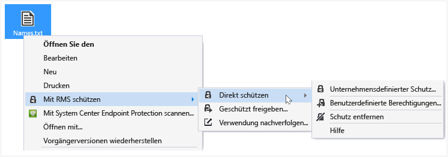

# Sch&#252;tzen einer Datei auf einem Ger&#228;t (direkt sch&#252;tzen) durch Verwenden der Rights Management-Freigabeanwendung
Wenn Sie eine Datei direkt schützen, wird die ursprüngliche, nicht geschützte Datei ersetzt. Sie können die Datei dann dort belassen, wo sie ist, sie in einen anderen Ordner oder auf ein anderes Gerät kopieren oder den Ordner freigeben, in dem sie sich befindet. Die Datei bleibt in jedem Fall geschützt. Sie könnten die geschützte Datei auch an eine E-Mail-Nachricht anfügen, es empfiehlt sich aber, eine geschützte Datei direkt aus dem Datei-Explorer oder aus einer Office-Anwendung per E-Mail freizugeben (weitere Informationen finden Sie unter [Schützen einer per E-Mail freigegebenen Datei mithilfe der Rights Management-Freigabeanwendung](../Topic/Protect_a_file_that_you_share_by_email_by_using_the_Rights_Management_sharing_application.md)).

> [!TIP]
> Werden Fehler angezeigt, wenn Sie versuchen, Dateien zu schützen, sollten Sie [Häufig gestellte Fragen (FAQ) zur Rights Management-Freigabeanwendung für Windows](http://go.microsoft.com/fwlink/?LinkId=303971) lesen.

## So schützen Sie eine Datei auf einem Gerät (direkt schützen)

1.  Wählen Sie im Datei-Explorer eine Datei aus, die Sie schützen möchten. Klicken Sie mit der rechten Maustaste, wählen Sie **Mit RMS schützen** aus, und wählen Sie dann **Direkt schützen** aus. Beispiel:

    

    > [!NOTE]
    > Wenn die Option **Mit RMS schützen** nicht angezeigt wird, ist es wahrscheinlich, dass die RMS-Freigabeanwendung nicht auf Ihrem Computer installiert ist oder der Computer neu gestartet werden muss, um die Installation abzuschließen. Weitere Informationen dazu, wie die RMS-Freigabeanwendung installiert wird, finden Sie unter [Herunterladen und Installieren der Rights Management-Freigabeanwendung](../Topic/Download_and_install_the_Rights_Management_sharing_application.md).

2.  Nehmen Sie eine der folgenden Aktionen vor:

    -   Wählen Sie eine Richtlinienvorlage aus: Hierbei handelt es sich um vordefinierte Berechtigungen, die üblicherweise den Zugriff und die Verwendung auf Personen in Ihrer Organisation beschränken. Wenn der Name Ihrer Organisation z. B. „Contoso, Ltd“ lautet, wird möglicherweise **Contoso, Ltd - Vertraulich** angezeigt. Ist dies das erste Mal, dass Sie eine Datei auf diesem Computer geschützt haben, müssen Sie zunächst **Unternehmensdefinierter Schutz** auswählen, um die Vorlagen herunterzuladen.

        Wenn Sie das nächste Mal auf die Option **Direkt schützen** klicken, werden Ihnen bis zu 10 Vorlagen zur Auswahl angezeigt. Wenn mehr als 10 Vorlagen vorhanden sind und die gewünschte nicht angezeigt wird, klicken Sie auf **Unternehmensdefinierter Schutz**, um alle Vorlagen anzuzeigen und herunterzuladen.

        Wenn Sie eine Richtlinienvorlage auswählen, können Sie auch mehrere Dateien und Ordner schützen. Wenn Sie einen Ordner auswählen, werden alle Dateien in diesem Ordner automatisch für den Schutz ausgewählt, aber neue Dateien, die Sie in diesem Ordner erstellen, werden nicht automatisch geschützt.

    -   Wählen Sie **Benutzerdefinierte Berechtigungen** aus: Wählen Sie diese Option aus, wenn die Vorlagen nicht das Maß an Schutz bieten, das Sie benötigen, oder wenn Sie die Schutzoptionen explizit selbst festlegen möchten. Geben Sie die gewünschten Optionen für diese Datei im Dialogfeld [Schutz hinzufügen](http://technet.microsoft.com/library/dn574738.aspx) an, und klicken Sie dann auf **Übernehmen**.

3.  Möglicherweise wird sehr schnell ein Dialogfeld mit der Meldung angezeigt, dass die Datei geschützt wird, und der Fokus wird dann an den Datei-Explorer zurückgegeben. Die ausgewählten Dateien sind nun geschützt. In einigen Fällen (wenn die Dateinamenerweiterung durch Hinzufügen des Schutzes geändert wird) wird die ursprüngliche Datei im Datei-Explorer durch eine neue Datei mit dem Schlosssymbol für den Rights Management-Schutz ersetzt. Beispiel:

    

Wenn Sie später den Schutz einer Datei aufheben müssen, gehen Sie entsprechend den Beschreibungen unter [Entfernen des Schutzes von einer Datei mithilfe der Rights Management-Freigabeanwendung](../Topic/Remove_protection_from_a_file_by_using_the_Rights_Management_sharing_application.md) vor.

## Beispiele und weitere Anweisungen
Beispiele für die Verwendung der Rights Management-Freigabeanwendung sowie weitere Anweisungen finden Sie in den folgenden Abschnitten des Benutzerhandbuchs für die Rights Management-Freigabeanwendung

-   [Beispiele für die Nutzung der RMS-Freigabeanwendung](../Topic/Rights_Management_sharing_application_user_guide.md#BKMK_SharingExamples)

-   [Was möchten Sie tun?](../Topic/Rights_Management_sharing_application_user_guide.md#BKMK_SharingInstructions)

## Siehe auch
[Rights Management-Freigabeanwendung – Benutzerhandbuch](../Topic/Rights_Management_sharing_application_user_guide.md)

