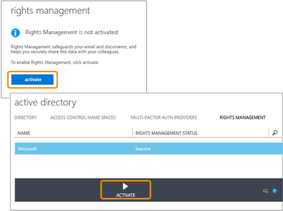

# Schnellstart-Tutorial f&#252;r Azure Rights Management
Verwenden Sie dieses Tutorial, um Microsoft Azure Rights Management (auch bekannt als Azure RMS) in 5 Schritten und weniger als 15 Minuten für Ihre Organisation zu testen. In diesem Tutorial aktivieren Sie den Dienst, versenden ein E-Mail-Dokument vertraulich und sicher an einen Empfänger in einer anderen Organisation und verfolgen, wann das Dokument geöffnet wird. Während der Übermittlung per E-Mail ist das vertrauliche Dokument verschlüsselt und kann nur vom jeweiligen Empfänger gelesen werden. Es gelten die vom Absender festgelegten Berechtigungen.

Dieses Tutorial richtet sich an IT-Administratoren und Berater, die Azure Rights Management als Datenschutzlösung für eine Organisation evaluieren. In einer Produktionsumgebung führt der Administrator die Schritte zum Aktivieren des Diensts und der Endbenutzer die Schritte zum Senden des Dokuments aus. Beide Vorgehensweisen sind Teil dieses Tutorials und veranschaulichen das End-to-End-Szenario für das sichere Versenden vertraulicher Dokumente an Empfänger, die einer anderen Organisation angehören. Falls beim Durcharbeiten dieses Tutorials Probleme auftreten, senden Sie eine E-Mail an [AskIPTeam](mailto:askipteam@microsoft.com?subject=Having%20problems%20with%20the%20Quick%20Start%20tutorial). Wir helfen Ihnen gerne weiter.

Voraussetzungen für dieses Tutorial:

-   Ein Abonnement, das Azure Rights Management unterstützt. Dies kann ein kostenpflichtiges Abonnement oder ein Testabonnement sein. Falls Sie die Dokumentenverfolgung verwenden möchten (wird für Schritt 5 in diesem Tutorial benötigt), muss Ihr Abonnement die Dokumentenverfolgung unterstützen. Weitere Informationen zu den Abonnementoptionen und Links zu kostenlosen Testversionen finden Sie im Abschnitt [Cloud-Abonnements, die Azure RMS unterstützen](../Topic/Requirements_for_Azure_Rights_Management.md#BKMK_SupportedSubscriptions) des Themas [Voraussetzungen für Azure Rights Management](../Topic/Requirements_for_Azure_Rights_Management.md).

    Tipp: Wenn Sie ein Abonnement erwerben müssen, sollten Sie dies rechtzeitig erledigen, da dies einige Zeit in Anspruch nehmen kann.

-   Ein Administratorkonto zur Anmeldung beim Office 365 Admin Center oder beim klassischen Azure-Portal, damit Sie den Rights Management-Dienst aktivieren können. Dieses Konto muss auch über eine E-Mail-Adresse und einen funktionierenden E-Mail-Dienst (z. B. Exchange Online oder Exchange Server) verfügen.

-   Ein Computer unter Windows (mindestens Windows 7 SP1), auf dem Office 2016, Office 2013 oder Office 2010 installiert ist.

Los geht’s!

## Schritt 1: Aktivieren des Rights Management-Diensts

Auch wenn Sie über ein Abonnement mit Unterstützung von Azure Rights Management verfügen, ist der Dienst standardmäßig deaktiviert. Zur Aktivierung können Sie entweder das Office 365 Admin Center oder das klassische Azure-Portal verwenden:

-   Wenn Sie über ein Office 365-Abonnement mit Azure Rights Management oder ein Office 365-Abonnement ohne Azure Rights Management, aber mit einem Abonnement für Azure RMS Premium verfügen: **Verwenden Sie das Office 365 Admin Center**.

-   Wenn Sie über kein Office 365-Abonnement verfügen: **Verwenden Sie das klassische Azure-Portal**.

#### So aktivieren Sie Rights Management über das Office 365 Admin Center

1.  Wechseln Sie zum [Office 365-Portal](https://portal.office.com/), und melden Sie sich mit Ihrem Arbeits- oder Schulkonto an.

2.  Wenn das Office 365 Admin Center nicht automatisch angezeigt wird, wählen Sie in der linken oberen Ecke das Symbol für das App-Startprogramm und dann **Administrator** aus. Die Kachel **Administrator** wird nur Office 365-Administratoren angezeigt.

    > [!TIP]
    > Hilfe zum Admin Center finden Sie in [Informationen zum Office 365 Admin Center - Hilfe für Administratoren](https://support.office.com/article/About-the-Office-365-admin-center-Admin-Help-58537702-d421-4d02-8141-e128e3703547).

3.  Klicken Sie im linken Bereich auf **DIENSTEINSTELLUNGEN**.

4.  Klicken Sie auf **Rights Management**.

5.  Klicken Sie auf der Seite **RIGHTS MANAGEMENT** auf **Verwalten**.

6.  Klicken Sie auf der Seite **Rights Management** auf **Aktivieren**.

7.  Wenn Sie gefragt werden **Möchten Sie die Rechteverwaltung aktivieren?**, klicken Sie auf **Aktivieren**.

**Rechteverwaltung ist aktiviert** und die Option zum Deaktivieren sollte jetzt angezeigt werden (Sie müssen die Seite u. U. manuell aktualisieren).

Klicken Sie zu diesem Zeitpunkt nicht auf **Erweiterte Funktionen**. Dadurch gelangen Sie zum klassischen Azure-Portal, wo Sie Vorlagen konfigurieren können, die für dieses Tutorial jedoch nicht benötigt werden. Stattdessen können Sie das Office 365 Admin Center schließen.

#### So aktivieren Sie Rights Management über das Azure-Portal

1.  Wechseln Sie zum [klassischen Azure-Portal](http://go.microsoft.com/fwlink/p/?LinkID=275081), und melden Sie sich an.

2.  Klicken Sie im linken Bereich auf **ACTIVE DIRECTORY**.

3.  Klicken Sie auf der Seite **Active Directory** auf **RIGHTS MANAGEMENT**.

4.  Wählen Sie das zu verwaltende Verzeichnis für [!INCLUDE[aad_rightsmanagement_2](../Token/aad_rightsmanagement_2_md.md)] aus, klicken Sie auf **AKTIVIEREN**, und bestätigen Sie Ihre Aktion.

Der **RECHTEVERWALTUNGSSTATUS** sollte nun **Aktiv** anzeigen, und die Option **AKTIVIEREN** wird durch **DEAKTIVIEREN** ersetzt.

Im Portal können Sie weitere Rights Management-Optionen konfigurieren, die für dieses Tutorial jedoch nicht erforderlich sind. Sie können das klassische Azure-Portal also schließen.

Dies ist bereits alles im ersten Schritt. Der Dienst ist aktiviert, sodass alle Benutzer Ihrer Organisation sofort beginnen können, wichtige und vertrauliche Dokumente zu schützen. In einer Produktionsumgebung können Sie die Zahl der Benutzer anfangs einschränken, um ein schrittweises Rollout auszuführen. In diesem Tutorial ist dieser Schritt jedoch nicht erforderlich.

Obwohl hier nicht auf benutzerdefinierte Vorlagen eingegangen wird, müssen Sie diese in einer Produktionsbereitstellung wahrscheinlich konfigurieren. Mithilfe von Vorlagen können Benutzer die richtigen Einstellungen zum Dateischutz schnell anwenden. Bei der Rights Management-Aktivierung erhalten Sie automatisch zwei Standardvorlagen. Es ist davon auszugehen, dass Sie in einer Produktionsumgebung eigene benutzerdefinierte Vorlagen hinzufügen werden. Da in diesem Tutorial keine Vorlagen erforderlich sind, können Sie direkt zum nächsten Schritt übergehen.

|Weitere Informationen zu...|Zusätzliche Informationen|
|-------------------------------|-----------------------------|
|Aktivieren von Rights Management und Festlegen der Benutzer, die Dateien und E-Mails nach der Dienstaktivierung schützen können   →|[Aktivieren von Azure Rights Management](../Topic/Activating_Azure_Rights_Management.md)|
|Standardvorlagen und Erstellung neuer benutzerdefinierter Vorlagen   →|[Konfigurieren benutzerdefinierter Vorlagen für Azure Rights Management](../Topic/Configuring_Custom_Templates_for_Azure_Rights_Management.md)|

## Schritt 2: Installieren der Rights Management-Freigabeanwendung

Die Rights Management-Freigabeanwendung (auch bekannt als "RMS-Freigabe-App") ist keine Voraussetzung für Azure Rights Management, sie wird jedoch für alle Computer und mobilen Geräte empfohlen, die Azure Rights Management unterstützen. Die RMS-Freigabeanwendung wird durch Installation eines Office-Add-Ins in Office-Anwendungen integriert. Die Benutzer können Dateien somit direkt über das Menüband schützen. Außerdem ermöglicht sie den generischen Schutz aller Dateitypen, die nicht systemintern von Azure Rights Management unterstützt werden, und bietet eine Dokumentenverfolgungs-Website, auf der Benutzer geschützte Dateien verfolgen und widerrufen können. Die Dokumentenverfolgungs-Website kommt später in diesem Tutorial zum Einsatz.

Die Anwendung steht kostenlos zum Download bereit und unterstützt die skriptgesteuerte Installation in Produktionsumgebungen. In diesem Tutorial wird sie jedoch lokal installiert.

#### So laden Sie die Rights Management-Freigabeanwendung herunter und installieren sie

1.  Navigieren Sie auf der Microsoft-Website zur Seite [Microsoft Rights Management](http://go.microsoft.com/fwlink/?LinkId=303970).

2.  Klicken Sie im Abschnitt **Computer** auf das Symbol für **RMS-App für Windows**, und speichern Sie die Datei **Setup.exe**, um die Microsoft Rights Management-Freigabeanwendung zu installieren.

3.  Bei einer lokalen Installation müssen Sie ein Administratorkonto verwenden, um die heruntergeladene Datei „Setup.exe“ auszuführen. Wenn Sie aufgefordert werden, den Vorgang fortzusetzen, klicken Sie auf **Ja**.

4.  Klicken Sie auf der Seite **Microsoft RMS-Setup** auf **Weiter**, und warten Sie das Ende der Installation ab.

5.  Nach Ende der Installation klicken Sie auf **Neu starten**, falls Sie zum Neustart des Computers aufgefordert werden, oder auf **Schließen**, um die Installation abzuschließen.

Sie können nun mit dem Schutz von Dateien beginnen, deren Inhalt Sie ausgewählten Personen zugänglich machen möchten.

|Weitere Informationen zu...|Zusätzliche Informationen|
|-------------------------------|-----------------------------|
|Lokale Installation der Rights Management-Freigabeanwendung für Windows und Anweisungen für Benutzer   →|[Rights Management-Freigabeanwendung – Benutzerhandbuch](http://technet.microsoft.com/library/dn339006.aspx)|
|Skriptgesteuerte Installation der Rights Management-Freigabeanwendung für Windows und weiterführende technische Informationen   →|[Rights Management-Freigabeanwendung – Administratorhandbuch](http://technet.microsoft.com/library/dn339003.aspx)|
|Unterschied zwischen systemeigenem und generischem Schutz   →|[Worin unterscheiden sich generischer Schutz und integrierter (systemeigener) Schutz?](https://technet.microsoft.com/library/dn574738.aspx)|

## Schritt 3: Versenden eines geschützten Dokuments per E-Mail

Für diesen Schritt erstellen und speichern Sie zuerst ein Word-Dokument, das Sie schützen möchten, und geben ihm den Namen **Confidential.docx**. In diesem Tutorial spielt der enthaltene Text keine Rolle. Etwas Text ist jedoch sinnvoll, damit Sie einfacher überprüfen können, ob der Inhalt vom autorisierten Empfänger gelesen werden kann. Beispielsweise können Sie folgenden Text eingeben: **Wenn dieser Text in der E-Mail-Anlage lesbar ist, hat der Absender eine mit Azure RMS geschützte Datei erfolgreich freigegeben.**

Anschließend können Sie das Dokument sicher per E-Mail freigeben.

#### So geben Sie Ihr Dokument sicher per E-Mail frei

1.  Erstellen Sie in Outlook eine neue Nachricht, und fügen Sie die gerade erstellte Datei an.

2.  Geben Sie in das Feld **An** eine oder mehrere geschäftliche E-Mail-Adressen ein. Sie müssen eine geschäftliche E-Mail-Adresse wie **janetm@contoso.com** oder **p.dover@fabrikam.com** angeben, weil Azure Rights Management momentan keine personenbezogenen E-Mail-Adressen von Internetanbietern unterstützt. Es spielt keine Rolle, ob der Empfänger über Azure Rights Management verfügt oder nicht.

3.  Geben Sie einen Betreff wie **Vertrauliches Dokument** und dann eine kurze E-Mail-Nachricht wie **Vertrauliches Dokument lesen und nicht weiterleiten** ein.

4.  Klicken Sie dann auf der Registerkarte **Nachricht** in der Gruppe **RMS** auf **Geschützt freigeben** und dann erneut auf **Geschützt freigeben**:

5.  Im Dialogfeld **Geschützt freigeben**:

    1.  Wählen Sie **Anzeigender Benutzer - Nur anzeigen**.

        Dies bedeutet, dass die Empfänger das Dokument anzeigen, jedoch nicht bearbeiten oder ausdrucken können.

    2.  Wählen Sie **E-Mail an mich bei Öffnungsversuchen dieser Dokumente durch andere Benutzer**.

        Sie erhalten jedes Mal eine E-Mail-Benachrichtigung, wenn der Empfänger oder eine andere Person (falls der Empfänger die E-Mail an einen Kollegen weiterleitet) versucht, das Dokument zu öffnen. Im Fall der Weiterleitung sehen Sie, dass der Zugriff verweigert wurde. Sie können dann anhand der Benutzerdetails entscheiden, ob Sie dieser Person eine Kopie des Dokuments zum Öffnen senden möchten.

    3.  Wählen Sie **Sofortigen Widerruf des Zugriffs auf diese Dokumente zulassen**.

        Bei dieser Option muss der Empfänger bei jedem Öffnen der Anlage mit dem Internet verbunden sein. Das hat für den Absender den Vorteil, dass ein nachträglich widerrufenes Dokument beim nächsten Mal nicht mehr geöffnet werden kann. Wenn Sie diese Option nicht auswählen, können die Empfänger das Dokument möglicherweise auch ohne Internetverbindung öffnen. Das hat für den Absender den Nachteil, dass ein Widerruf u. U. erst mit Verzögerung wirksam wird.

    4.  Klicken Sie auf **Jetzt senden**.

        Die E-Mail mit der Anlage wird an die angegebenen E-Mail-Adressen gesendet. Zusätzlich zu Ihrer E-Mail erhält der Empfänger Anweisungen zum Lesen des angehängten und durch Azure Rights Management geschützten Dokuments.

Nachdem Sie Ihr geschütztes Dokument nun gesendet haben, bitten Sie die Empfänger, das Dokument anzunehmen und zu öffnen. Outlook sollte zu diesem Zeitpunkt nicht geschlossen werden, da wir es im letzten Schritt zum Verfolgen der Anlage benötigen.

|Weitere Informationen zu...|Zusätzliche Informationen|
|-------------------------------|-----------------------------|
|Umfassende Anweisungen und alternative Methoden zum Schutz der per E-Mail freigegebenen Dateien   →|[Schützen einer per E-Mail freigegebenen Datei mithilfe der Rights Management-Freigabeanwendung](https://technet.microsoft.com/library/dn574735.aspx)|
|Optionen im Dialogfeld **Geschützt freigeben** →|[Dialogfeldoptionen der Rights Management-Freigabeanwendung](https://technet.microsoft.com/library/dn574738.aspx)|

## Schritt 4: Bitten Sie die Empfänger, das E-Mail-Dokument zu öffnen.

Die Empfänger können das als E-Mail-Anlage gesendete, geschützte Dokument auf verschiedenen Geräten lesen. Die Geräte umfassen iPads, iPhones, Android-Tablets und -Smartphones sowie Macintosh- und Windows-Computer.

Bitten Sie die Empfänger, die gesendete E-Mail zu lesen. Die E-Mail wird den Empfängern mit dem folgenden vorangehenden Text angezeigt:

**Der Absender hat die Anlagen mit Microsoft RMS geschützt. Sie müssen sich** [anmelden](http://aka.ms/rms) **, um sie zu öffnen.**

Sobald der Empfänger auf den Link klickt, wird er weitergeleitet und erhält Anweisungen zur Installation der RMS-Freigabe-App und ggf. zur Registrierung für ein kostenloses Konto. Das kostenlose Konto gewährt Zugriff auf ein RMS for Individuals-Abonnement, mit dem autorisierte Benutzer ein geschütztes Dokument immer lesen können, auch wenn ihre Organisation nicht über Azure RMS verfügt. Sie können die geschützte Anlage dann mithilfe der folgenden Anweisungen lesen.

#### So zeigen Sie die Anlage des geschützten Dokuments an

1.  Da die mit Azure Rights Management geschützte Datei ein Word-Dokument ist, verfügt die E-Mail über zwei Anlagen. Es handelt sich tatsächlich um zwei Versionen derselben Datei, aber mit unterschiedlichen Dateierweiterungen. Öffnen Sie die Version mit der Dateierweiterung **.ppdf** (**Confidential.ppdf**).

    Wenn Sie eine [Office-Version mit Rights Management-Unterstützung auf Ihrem Gerät installiert haben](https://technet.microsoft.com/library/dn655136.aspx), können Sie die andere Version der Datei (**Confidential.docx**) öffnen, um sie in Word zu lesen.

2.  Wenn Sie zur Eingabe von Benutzernamen und Kennwort aufgefordert werden, geben Sie Ihren Benutzernamen im gleichen Format wie die E-Mail-Adresse ein, die Sie zum Senden der E-Mail und der Anlage verwendet haben. Beispiel: **janetm@contoso.com** oder **p.dover@fabrikam.com**. Geben Sie das Kennwort ein, das Sie beim Registrieren von RMS for Individuals erhalten haben. Wenn Ihre Organisation jedoch über Azure RMS verfügt, geben Sie Ihr übliches Arbeitskennwort ein.

Das Dokument wird geöffnet, und Sie können nun den Inhalt lesen. Der Text könnte wie folgt lauten: **Wenn dieser Text in der E-Mail-Anlage lesbar ist, hat der Absender eine mit Azure RMS geschützte Datei erfolgreich freigegeben.** Da der Inhalt schreibgeschützt ist, können Sie ihn nicht ändern.

Als optionalen Schritt könnten Sie den Empfänger bitten, die E-Mail an andere Personen weiterzuleiten, die in der ursprünglichen E-Mail nicht enthalten waren. Diese Empfänger sind nicht in der Lage, die Anlage zu öffnen, selbst wenn sie in einer Organisation tätig sind, die über Azure Rights Management verfügt, oder ein eigenes RMS for Individuals-Abonnement angefordert haben. Bei der Aufforderung zur Eingabe des Benutzernamens wird den Empfängern der Zugriff verweigert.

Nachdem der Empfänger die Anlage nun geöffnet und optional an einen anderen Empfänger weitergeleitet hat, erhalten Sie eine E-Mail-Benachrichtigung über die jeweiligen Aktivitäten. Da E-Mails jedoch leicht in Vergessenheit geraten, lassen sich Dokumentzugriffe einfacher mithilfe der Dokumentenverfolgungs-Website überwachen. Dies wird im letzten Schritt veranschaulicht.

|Weitere Informationen zu...|Zusätzliche Informationen|
|-------------------------------|-----------------------------|
|Umfassende Erläuterung dazu, wie die durch Azure Rights Management geschützten Dateien angezeigt werden   →|[Anzeigen und Verwenden der durch Rights Management geschützten Dateien](https://technet.microsoft.com/library/dn574741.aspx)|
|Kostenloses RMS for Individuals-Abonnement   →|[RMS for Individuals und Azure Rights Management](../Topic/RMS_for_Individuals_and_Azure_Rights_Management.md)|
|Informationen zu den beiden Versionen der an die E-Mail angehängten Datei   →|[Erläuterung zur automatisch erstellten PPDF-Datei](https://technet.microsoft.com/library/dn574738.aspx)|

## Schritt 5: Verfolgen des geschützten Dokuments

> [!NOTE]
> Für diesen Schritt benötigen Sie ein Abonnement, das die Dokumentenverfolgung unterstützt. Ob Ihr Abonnement die Dokumentenverfolgung umfasst, können Sie anhand der Informationen unter [Vergleich der Angebote zu den Rights Management Services (RMS)](https://technet.microsoft.com/dn858608.aspx) feststellen.

Dieser Schritt ist optional. Die meisten Absender möchten jedoch gerne wissen, ob, wann und sogar wo die Anlage geöffnet wird. Beispiel:

-   Sie erwarten zu einer bestimmten Uhrzeit eine Antwort von einer anderen Person. Auf der Dokumentenverfolgungs-Website sehen Sie, dass das Dokument trotz der ablaufenden Frist noch nicht geöffnet wurde. Zur Erinnerung senden Sie eine Nachverfolgungs-E-Mail oder rufen den Empfänger an.

-   Sobald Sie sehen, dass das Dokument geöffnet wurde, erkundigen Sie sich, ob noch Fragen offen sind oder zusätzliche Informationen benötigt werden.

#### So verfolgen Sie das geschützte Dokument

1.  Klicken Sie in Outlook auf der Registerkarte **Start** in der Gruppe **RMS** auf **Nutzung nachverfolgen**.

2.  Wenn die Seite mit Schutz- und Freigabeoptionen angezeigt wird, klicken Sie auf **Anmelden** und geben Benutzernamen und Kennwort erneut ein.

3.  Auf der Seite **Freigegebene Dokumente** sehen Sie das an die E-Mail angehängte Dokument **Confidential.docx**. Zu diesem Zeitpunkt wird nur diese Datei angezeigt. Sobald Sie jedoch zusätzliche geschützte Dokumente freigeben, wird die Liste erweitert.

    Auf dieser Seite sehen Sie, wann Sie das Dokument freigegeben (d. h. die E-Mail mit dem geschützten Anhang versendet) haben, sowie das Datum der letzten Aktivität und den Namen des Empfängers der E-Mail. Klicken Sie auf den Dokumentnamen, um weitere Details zu sehen.

4.  Auf der neuen Seite, die den Namen der angeklickten Datei hat, sehen Sie spezifische Übersichtsdetails für das Dokument und eine Liste weiterer Optionen, die für das Dokument verfügbar sind (**Liste**, **Zeitskala**, **Karte**, **Einstellungen**).

    Klicken Sie auf die einzelnen Optionen, um verschiedene Möglichkeiten zum Verfolgen des geschützten Dokuments auszuprobieren. Sie können auf der Seite **Zusammenfassung** aber auch auf **In Excel öffnen** klicken, um die Informationen in eine Kalkulationstabelle zu exportieren, oder auf **Zugriff widerrufen**, um die Freigabe des Dokuments zu beenden.

Sie können zu dieser Website zurückkehren, um weitere Aktivitäten für das geschützte Dokument zu verfolgen oder um den Zugriff ggf. zu widerrufen. Sie können auch von Ihrem mobilen Gerät oder Tablet auf die Website zugreifen, indem Sie den Browserlink [Dokumentenverfolgung](http://go.microsoft.com/fwlink/?LinkId=529562) auswählen.

|Weitere Informationen zu...|Zusätzliche Informationen|
|-------------------------------|-----------------------------|
|Umfassende Anleitung zur Dokumentenverfolgung   →|[Verfolgen und Widerrufen von Dokumenten bei Verwendung der RMS-Freigabeanwendung](https://technet.microsoft.com/library/dn986611.aspx)|
|2-minütiges Video zur Erläuterung der Dokumentenverfolgung   →|[Azure RMS-Dokumentenverfolgung und Widerruf](http://channel9.msdn.com/Series/Information-Protection/Azure-RMS-Document-Tracking-and-Revocation)|
|Problembehandlung und Kundenfragen   →|[Häufig gestellte Fragen zur Dokumentenverfolgung](https://technet.microsoft.com/dn947488)|

## Nächste Schritte
In diesem Tutorial haben Sie nur ein Datenschutzszenario für Azure RMS kennengelernt. Weitere allgemeine Verwendungsmöglichkeiten finden Sie im Abschnitt [Azure RMS in Aktion](https://technet.microsoft.com/library/jj585026.aspx) im Artikel [Was ist Azure Rights Management?](../Topic/What_is_Azure_Rights_Management_.md). Dieser Artikel enthält weitere Abschnitte, die Sie interessieren könnten, z. B. über die Funktionsweise von Azure RMS und die Lösung geschäftlicher Probleme.

Wenn Sie bereit sind, mit der Bereitstellung von Azure RMS zu beginnen, sollten Sie die [Roadmap für die Bereitstellung von Azure Rights Management](../Topic/Azure_Rights_Management_Deployment_Roadmap.md) für die Bereitstellungsschritte sowie für Links zu praktischen Anweisungen verwenden.

## Siehe auch
[Erste Schritte mit Azure Rights Management](../Topic/Getting_Started_with_Azure_Rights_Management.md)

