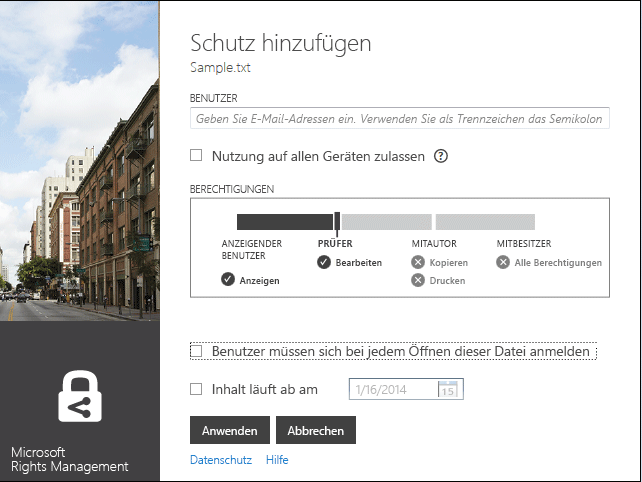

# &#220;berarbeitete Version 3: Microsoft Rights Management-Freigabeanwendung – Benutzerhandbuch
Verwenden Sie dieses Handbuch für die Microsoft Rights Management (RMS)-Freigabeanwendung für Windows zum Schutz wichtiger Dokumente vor Personen, die sie nicht sehen sollen – selbst dann, wenn Sie sie per E-Mail verschicken oder auf einem anderen Gerät speichern. Außerdem können Sie mit dieser Anwendung Dateien öffnen und verwenden, die andere Personen geschützt haben, indem Sie die gleiche Rights Management-Technologie verwenden wie diese Personen.

Diese Freigabeanwendung bietet auf folgende Weise Schutz für Ihre Dateien:

-   Sie fügt Funktionen zum Datei-Explorer (in Windows 7 und früheren Versionen als Windows-Explorer bekannt) hinzu, damit Sie beim Verwalten von Dateien in einem Ordner mühelos eine einzelne Datei, mehrere Datei als Batch oder alle Dateien in einem Ordner schützen können.

-   Sie bietet Schutz für alle Dateitypen und eine integrierten Viewer für häufig verwendete Text- und Bilddateitypen.

-   Sie fügt der Microsoft Office-Symbolleiste für Word, PowerPoint und Excel die Schaltfläche **Geschützt freigeben** hinzu.

Alles, was Sie brauchen, um die RMS-Freigabeanwendung zu installieren, sind ein Computer mit Windows 7 oder Windows 8 und ein lokales Administratorkonto. Laden Sie die kostenlose Anwendung von Microsoft herunter, und installieren Sie sie.

Wenn Sie Fragen haben, die in diesem Handbuch nicht beantwortet werden, finden Sie unter [Häufig gestellte Fragen zur Microsoft Rights Management Freigabe-Anwendung für Windows](http://go.microsoft.com/fwlink/?LinkId=303971) weitere Informationen.

## Beispiele für die Verwendung der RMS-Freigabeanwendung
Hier finden Sie einige Beispiele dafür, wie Sie die RMS-Freigabeanwendung zum Schutz ihrer Dateien verwenden können.

|Szenario|Lösung mit der RMS-Freigabeanwendung|
|------------|----------------------------------------|
|**Ich möchte ein betriebsintern vertrauliches Dokument sicher auf ein anderes Gerät zu kopieren.**<br /><br />Sie arbeiten auf Ihrem PC an einem betriebsintern vertraulichen Strategiepapier und möchten es auf einen USB-Stick kopieren, damit Sie auch dann mit der Arbeit fortfahren können, wenn Sie das Büro verlassen haben und nicht mehr auf das Unternehmensnetzwerk zugreifen können.|Sie haben die RMS-Freigabeanwendung sowohl auf Ihrem PC als auch auf Ihrem Laptop installiert. Verwenden Sie den Datei-Explorer auf Ihrem PC zum Schutz der Datei mithilfe einer Vorlage, damit Personen außerhalb Ihres Unternehmens nicht darauf zugreifen können. Anschließend kopieren Sie die Datei auf das Thumb-Laufwerk, hängen das Thumb-Laufwerk an Ihren Laptop und setzen die Arbeit an Ihrem Dokument fort. Wenn Sie das Thumb-Laufwerk löschen oder der Laptop gestohlen wird, kann niemand außerhalb Ihres Unternehmens auf das Dokument zugreifen.|
|**Ich möchte finanzielle Informationen sicher an eine vertrauenswürdige Person außerhalb meiner Organisation weitergeben**<br /><br />Sie arbeiten mit einem Partnerunternehmen zusammen und möchten diesem per E-Mail ein Excel-Arbeitsblatt mit den geplanten Verkaufszahlen senden. Der Empfänger soll in der Lage ein, die Zahlen anzuzeigen, aber sie nicht ändern können.|Verwenden Sie die Schaltfläche **Geschützt freigeben** auf dem Menüband in Excel, geben Sie die E-Mail-Adressen der beiden Personen im Partnerunternehmen an, mit denen Sie zusammenarbeiten, wählen Sie **Viewer** auf dem Schieberegler, und klicken Sie auf **Senden**.<br /><br />Wenn die E-Mail im Partnerunternehmen eingeht, können nur die in der E-Mail genannten Empfänger  das Arbeitsblatt anzeigen. Sie können es jedoch nicht speichern, bearbeiten, drucken oder weiterleiten.|
|**Ich möchte ein Verfahrenstechnik-Diagramm sicher per E-Mail an jemanden senden, der ein iOS-Gerät verwendet.**<br /><br />Ihr Unternehmen verwendet eine benutzerdefinierte Verfahrenstechnik-Anwendung, und Sie möchten ein streng vertrauliches Diagramm an einem Kollegen senden, von dem Sie wissen, dass er seine Mails regelmäßig auf seinem iOS-Gerät abruft.|Klicken Sie im Datei-Explorer mit der rechten Maustaste auf die Datei, und wählen Sie **Geschützt freigeben**. Die RMS-Freigabeanwendung erkennt, dass die Dateierweiterung nicht von einer Anwendung stammt, die RMS systemeigen unterstützt, also konvertiert sie eine Datei, die sie an eine E-Mail anhängt, automatisch in eine allgemein geschützte Datei und wählt automatisch die Option **Nutzung auf allen Geräten zulassen**.<br /><br />Der Empfänger erhält die E-Mail auf seinem iOS-Gerät, klickt in der E-Mail auf den Link zum Herunterladen der RMS-Freigabeanwendung, installiert die Version für iOS-Geräte und zeigt dann das Diagramm an.|
|**Mein Unternehmen unterstützt Rights Management nicht, aber ich habe eine E-Mail-Nachricht mit einer durch RMS geschützten Anlage erhalten**<br /><br />Der E-Mail-Absender ist eine Person, der Sie vertrauen, da Sie in der Vergangenheit schon Geschäfte mit ihr gemacht haben, und Sie vermuten, dass sie Ihnen Informationen über eine neue Geschäftsmöglichkeit senden möchte.|Sie klicken Sie in der E-Mail auf den Link zum Herunterladen der RMS-Freigabeanwendung auf Ihren Computer, installieren diese und registrieren sich für RMS für Einzelpersonen. Microsoft bestätigt, dass Ihre Organisation nicht über ein Abonnement für Office 365 verfügt, sendet eine E-Mail, um den kostenlosen Anmeldevorgang abzuschließen, und Sie können sich mit Ihren neuen Kontodaten anmelden. Anschließend können sie die E-Mail-Anlage öffnen, um die Informationen über die neue Geschäftsmöglichkeit zu lesen.|

## <a name="BKMK_Install"></a>So laden Sie die RMS-Freigabeanwendung herunter und installieren Sie
> [!IMPORTANT]
> Zum Installieren der RMS-Freigabeanwendung müssen Sie über ein lokales Administratorkonto verfügen. Wenn Sie sich nicht als lokaler Administrator anmelden, können Sie die Option **als Administrator ausführen** verwenden, wenn Sie in Schritt 3 die Setup.exe ausführen.

Gehen Sie folgendermaßen vor, um die RMS-Freigabeanwendung zu installieren:

1.  Rufen Sie die Seite [Microsoft Rights Management](http://go.microsoft.com/fwlink/?LinkId=303970) auf der Microsoft-Website auf.

2.  Klicken Sie im Abschnitt **Computer** auf das Symbol für die **RMS-App für Windows**, und speichern Sie das Installationspaket der Microsoft Rights Management-Freigabeanwendung auf Ihrem Computer.

3.  Doppelklicken Sie auf die heruntergeladene komprimierte Datei, und doppelklicken Sie dann auf **setup.exe** Wenn Sie aufgefordert werden, den Vorgang fortzusetzen, klicken Sie auf **Ja**.

4.  Klicken Sie auf der Seite **Microsoft RMS-Setup** auf **Weiter**, und warten Sie, bis die Installation abgeschlossen ist.

5.  Klicken Sie nach Abschluss der Installation auf **Neu starten**, um Ihren Computer neuzustarten und die Installation abzuschließen. Oder klicken Sie auf **Schließen**, und starten Sie den Computer später neu, um die Installation abzuschließen.

Sie sind nun bereit, mit dem Schützen Ihrer Dateien zu beginnen oder Dateien zu lesen, die von anderen geschützt wurden.

## <a name="BKMK_UsingMSRMSApp"></a>Was möchten Sie tun?
Beachten Sie die folgenden Anweisungen, die Ihnen Arbeit mit geschützten Dateien erleichtern.

### <a name="BKMK_CreatePTXT"></a>Erstellen einer geschützten Datei
Sie können eine normale Textdatei (.txt) in eine geschützte Datei konvertieren, die dann die Dateierweiterung PTXT aufweist.

##### So erstellen Sie eine geschützte Textdatei (PTXT-Datei)

1.  Klicken Sie im Datei-Explorer mit der rechten Maustaste in einen Ordner, klicken Sie auf **Neu**, und klicken Sie dann auf **Textdokument**.

2.  Benennen Sie die Datei um (z. B. in „Beispiel.txt“).

3.  Doppelklicken Sie auf die Datei, um sie in Notepad zu öffnen.

4.  Fügen Sie in Notepad einige Textzeilen in die Datei ein, und speichern Sie sie. Sie können Folgendes als Beispieltext verwenden.

    ```
    This is a sample text file.
    This is a sample text file.
    This is a sample text file.
    This is a sample text file. 
    This is a sample text file.
    This is a sample text file.
    ```

5.  Klicken Sie mit der rechten Maustaste auf die Datei, klicken Sie auf **Direkt schützen**, und wählen Sie eine Vorlage aus der Liste. Ist das Ihre erstmalige Nutzung der RMS-Freigabe ist, müssen Sie zunächst **Unternehmensschutz** auswählen, sodass die Vorlagen für Ihr Unternehmen heruntergeladen werden.

6.  Bestätigen Sie auf dem Bildschirm **Microsoft Rights Management-Freigabeanwendung** die Richtlinie, die Sie anwenden möchten, klicken Sie auf **Übernehmen**, und klicken Sie auf **Schließen**, wenn die Datei geschützt ist.

### <a name="BKMK_ViewPTXT"></a>Anzeigen einer geschützten Textdatei (PTXT-Datei) oder eine geschützte Bilddatei
Wenn Sie eine geschützte Textdatei (PTXT-Datei) anzeigen möchten, doppelklicken Sie im Datei-Explorer auf diese Datei (z. B. Beispiel.ptxt). Möglicherweise werden Sie zur Eingabe von Anmeldeinformationen aufgefordert. Wenn die Datei geöffnet wird, sehen am Anfang der Datei die  Schutzrichtlinie.

Geschützte Bilddateien werden auf die gleiche Weise geöffnet.

### <a name="BKMK_CreatePFILE"></a>Erstellen einer generischen geschützten Datei
Verwenden Sie das Dateiformat für generischen Schutz (PFILE), um eine generische Schutzebene für Dateitypen anzubieten, die nicht direkt durch die RMS-Freigabeanwendung oder andere Anwendungen unterstützt werden, die integrierten RMS-Schutz bieten. Sie können die [Microsoft Rights Management](http://go.microsoft.com/fwlink/?LinkId=303970)-Seite auf der Microsoft-Website verwenden, um schnell zu überprüfen, welche Anwendungen den integrierten RMS-Schutz unterstützen.

Da z. B. Microsoft Visio derzeit integrierten RMS-Schutz nicht unterstützt, können Sie generischen Schutz für VSD-Dateien verwenden, die Sie mit Microsoft Visio erstellen.

> [!TIP]
> Was ist der Unterschied zwischen integriertem (systemeigenem) und generischem Schutz?
> 
> -   Wenn Sie eine Datei generisch schützen, können nicht autorisierte Personen die Datei nicht öffnen. Wenn jedoch autorisierte Benutzer die Datei öffnen, können sie sie ungeschützt an anderer Personen weiterleiten oder an einem Ort speichern, auf den andere zugreifen können. Allerdings sehen diese Benutzer dann am Anfang der Datei die Meldung, welche Berechtigungen für die Datei vorliegen, und werden aufgefordert, diese zu berücksichtigen. Dieser Schutz kann jedoch nicht erzwungen werden. Wenn Sie eine Datei generisch schützen, können Sie außerdem die Berechtigungen noch weiter einschränken als bei der Autorisierung. Wenn Sie benutzerdefinierte Berechtigungen verwenden, wählt der Schieberegler in der RMS-Freigabeanwendung automatisch **CO-OWNER** aus, und Sie können dies nicht in eine restriktivere Berechtigung wie **VIEWER** oder **CO-AUTHOR** ändern.
> -   Wenn Sie Im Vergleich dazu den integrierten RMS-Schutz mit Anwendungen verwenden möchten, die diesen unterstützen (z. B. Office-Dateien), wird der Schutz auch dann auf die Datei angewendet, wenn diese an eine andere Person gesendet oder an einem anderen Speicherort gespeichert wird. Wenn Sie diese Dateien schützen, können Sie z. B. restriktive Berechtigungen wie Schreibschutz oder die Berechtigung zum Bearbeiten ohne Möglichkeit zu drucken oder zu kopieren verwenden. Wenn Sie z. B. benutzerdefinierte Berechtigungen verwenden, wählt der Schieberegler in der Freigabeanwendung automatisch **REVIEWER** für die Berechtigungen, die Sie dann auf restriktivere oder weniger restriktive Berechtigungen ändern können.

##### Beispiel: So erstellen Sie eine generische geschützte Datei (PFILE) aus einer Visio-Zeichnung (VSD-Datei)

1.  Klicken Sie im Datei-Explorer mit der rechten Maustaste in einen Ordner, klicken Sie auf **Neu**, und klicken Sie dann auf **Neues Visio-Dokument**.

2.  Benennen Sie die Datei um (z. B. in Beispiel.vsd).

3.  Doppelklicken Sie auf die Datei, um sie in Visio zu öffnen.

4.  Fügen Sie in Visio Elemente zu der Zeichnung hinzu, und speichern und schließen Sie die Datei.

5.  Klicken Sie mit der rechten Maustaste auf die Datei, klicken Sie auf **Direkt schützen**, und wählen Sie eine Richtlinienvorlage aus der Liste. Ist das Ihre erstmalige Nutzung der RMS-Freigabe ist, müssen Sie zunächst **Unternehmensschutz** auswählen, sodass die Vorlagen für Ihr Unternehmen heruntergeladen werden.

6.  Wählen Sie auf dem Bildschirm **Microsoft Rights Management-Freigabeanwendung** die Richtlinie aus, die Sie übernehmen möchten, und klicken Sie dann auf **Übernehmen**.

7.  Eine Meldung weist darauf hin, dass Ihre geschützte Datei als PFILE-Datei gespeichert wurde (z. B. Beispiel.vsd.pfile). Die ursprüngliche Datei wird gelöscht.

### <a name="BKMK_ViewPFILE"></a>Anzeigen einer generischen geschützten Datei (PFILE-Datei)
Wenn Sie eine generische geschützte Datei (PFILE-Datei) im Datei-Explorer anzeigen möchten, doppelklicken Sie auf die generische geschützte Datei (PFILE-Datei) (z. B. Beispiel.vsd.pfile), und klicken Sie auf **Öffnen**.

### <a name="BKMK_Unprotect"></a>Aufheben des Schutzes für eine Datei
Verwenden Sie zum Aufheben des Schutzes für eine Datei, die zuvor geschützt wurde, die Option **Schutz entfernen**:

1.  Klicken Sie mit der rechten Maustaste auf die Datei (z. B. Sample.ptxt), klicken Sie auf **Direkt schützen**, und klicken Sie dann auf **Schutz entfernen**. Möglicherweise werden Sie zur Eingabe von Anmeldeinformationen aufgefordert.

2.  Die ursprüngliche geschützte Datei (z. B. Beispiel.ptxt) wird gelöscht und durch einer Datei mit dem gleichen Namen, jedoch mit der Dateierweiterung für ungeschützte Dateien (z. B. „Beispiel.txt“) ersetzt.

### <a name="BKMK_ProtectCustom"></a>Schutz einer Datei mit Ihren eigenen benutzerdefinierten Berechtigungen
Der einfachste Weg, eine Datei zu schützen, ist die Verwendung von Vorlagen, aber Sie können auch Ihre eigenen Berechtigungen angeben. Dies wird als vom Benutzer autorisierte Schutz bezeichnet und empfiehlt sich in folgenden Fällen:

-   Sie möchten den Dateizugriff auf eine bestimmte Liste einzelner Benutzer beschränken, die über ihre E-Mail-Adressen identifiziert werden.

-   Sie möchten die Verwendung der Datei auf bestimmte Rechte wie z. B. schreibgeschützten Zugriff auf ein Dokument beschränken.

Klicken Sie zum Schutz einer Datei mit den vom Benutzer autorisierten Berechtigungen mit der rechten Maustaste auf die Datei, klicken Sie auf **Direkt schützen**, und klicken Sie auf **Benutzerdefinierte Berechtigungen**. Der folgende Bildschirm wird angezeigt:



Geben Sie die E-Mail-Adressen der Benutzer ein, verwenden Sie den Schieberegler,um die Berechtigungen für die Datei auszuwählen, und klicken Sie dann auf **Übernehmen**.

### <a name="BKMK_UserDefined"></a>Verwenden von Dateien mit benutzerdefiniertem Schutz
Die meisten geschützten Dateien, die Sie öffnen, sind mithilfe von Vorlagen geschützt. Allerdings können Benutzer Dateien auch mit ihren eigenen benutzerdefinierten Berechtigungen schützen. Dies wird als vom Benutzer autorisierter Schutz bezeichnet.

Bei Text- und Bilddateiformaten erfordert diese Schutzebene, dass alle Anwendungen, mit denen Sie diese Dateien bearbeiten, speichern oder in ihrer Verwendung einschränken, zur Unterstützung von RMS-Schutz konzipiert wurden und die Schutz-APIs nutzen, die im AD RMS-SDK bereitgestellt werden.

Wenn Sie eine durch vom Benutzer autorisierten Schutz geschützte Textdatei anzeigen, werden Sie wie im folgenden Beispiel gezeigt einen kleinen Unterschied in den Berechtigungen bemerken, die für die Datei angezeigt werden.

Bei Dateien, die durch generischen Schutz geschützt sind (Dateiformat PFILE), werden auf dem Bestätigungsbildschirm anstelle des Namens der Vorlage, die zum Schutz der Datei verwendet wurde, die vom Benutzer festgelegten speziellen Rechte oder Berechtigungen angezeigt (siehe folgende Abbildung).


### <a name="BKMK_ShareProtected"></a>Schützen von per E-Mail freigegebenen Inhalten
Wenn Sie Inhalte schützen möchten, die mithilfe einer E-Mail-Nachricht freigegeben werden sollen, klicken Sie mit der rechten Maustaste auf die Datei, und klicken Sie auf **Geschützt freigeben**. Der folgende Bildschirm wird angezeigt:


Geben Sie die E-Mail-Adressen der Benutzer auf der Liste ein, wählen Sie mithilfe des Schiebereglers Berechtigungen für die Datei aus, und klicken Sie auf **Senden**. Anschließend erstellt Outlook eine E-Mail-Nachricht für die Empfänger mit einer kurzen Meldung, die Sie ändern können, und hängt die geschützte Datei an. Die ursprüngliche Datei ist nicht geschützt.

Klicken Sie zum Aktivieren der Ansicht geschützter Dateien auf Nicht-Windows-Geräten für Benutzer auf **Nutzung auf allen Geräten zulassen**. Möglicherweise müssen die Benutzer die RMS-Freigabeanwendung für ihr Gerät herunterladen. Ein Link dafür ist in der E-Mail enthalten.

### <a name="BKMK_Multiple"></a>Anwenden von Schutz auf mehrere Dateien und Ordner
Wenn Sie den Datei-Explorer verwenden, müssen Sie Ihre Dateien nicht einzeln schützen. Stattdessen können Sie mehrere Dateien oder alle Dateien in einem Ordner auswählen, wenn diese Dateien nicht bereits geschützt sind.

##### So schützen Sie mehrere Dateien oder alle Dateien in einem ausgewählten Ordner

1.  Wählen Sie im Datei-Explorer entweder mehrere Dateien aus, oder wählen Sie einen Ordner mit Dateien, die geschützt werden sollen.

2.  Klicken Sie mit der rechten Maustaste auf den ausgewählten Ordner oder die ausgewählten Dateien, klicken Sie auf **Direkt schützen**, und wählen Sie eine Vorlage aus der Liste. Ist das Ihre erstmalige Nutzung der RMS-Freigabe ist, müssen Sie zunächst **Unternehmensschutz** auswählen, sodass die Vorlagen für Ihr Unternehmen heruntergeladen werden.

3.  Bestätigen Sie auf dem Bildschirm **Microsoft Rights Management-Freigabeanwendung** den Schutz der Dateien.

> [!TIP]
> Informationen zu Fehlern finden Sie unter [Häufig gestellte Fragen zur Microsoft Rights Management-Freigabeanwendung für Windows](http://go.microsoft.com/fwlink/?LinkId=303971).

### <a name="BKMK_OfficeToolbar"></a>Verwenden des Office-Symbolleisten-Add-ins
Sie können Word-, PowerPoint- und Excel-Dateien direkt in Microsoft Office mit der Office-Menüband-Add-in für die Microsoft Rights Management-Freigabeanwendung schützen und freigeben.

Klicken Sie in der Gruppe **Schutz** auf **Geschützte freigeben**, um die Microsoft Rights Management-Freigabe-Anwendung zu starten.


### <a name="BKMK_AccessKeys"></a>Verwenden von Tastenkombinationen
Drücken Sie die **ALT**-Taste, um die verfügbaren Zugriffstasten anzuzeigen, und drücken Sie dann **ALT** + Zugriffstaste, um eine Option auszuwählen.

Drücken Sie z. B. im Dialog **Geschützt freigeben** die Taste **ALT**, um die Zugriffstasten anzuzeigen, und drücken Sie **ALT+u**, um die Option **Benutzer müssen sich bei jedem Öffnen dieser Datei anmelden** auszuwählen.


## Siehe auch
[Herunterladen der Microsoft Rights Management-Freigabeanwendung](http://go.microsoft.com/fwlink/?LinkId=303970)
 [Häufig gestellte Fragen zur Microsoft Rights Management-Freigabeanwendung für Windows](http://go.microsoft.com/fwlink/?LinkId=303971)

