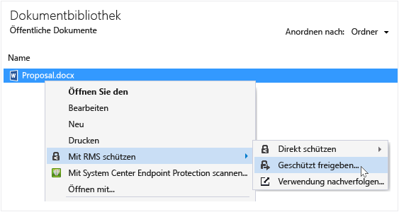

# Rights Management-Freigabeanwendung – Benutzerhandbuch – Revision f&#252;r einzelnes Thema
Mit der Microsoft Rights Management (RMS)-Freigabeanwendung für Windows können Sie wichtige Dokumente und Bilder vor Personen schützen, die diese nicht sehen sollen – selbst wenn Sie sie per E-Mail versenden oder auf einem anderen Gerät speichern. Außerdem können Sie mit dieser Anwendung Dateien öffnen und verwenden, die andere Personen mithilfe der, gleichen Rights Management-Technologie geschützt haben.

Alles, was Sie brauchen, um die RMS-Freigabeanwendung zu installieren, sind ein Computer mit mindestens Windows 7 und ein lokales Administratorkonto. Sie können diese kostenlose Anwendung dann von Microsoft [herunterladen und installieren](http://go.microsoft.com/fwlink/?LinkId=303970).

Wenn Sie Fragen haben, die in diesem Handbuch nicht beantwortet werden, finden Sie weitere Informationen unter [Häufig gestellte Fragen zur Microsoft Rights Management Freigabeanwendung für Windows](http://go.microsoft.com/fwlink/?LinkId=303971).

Im Folgenden werden lediglich einige Beispiele für die Verwendung der Freigabeanwendung zum Schützen von Dateien dargestellt.

|Ziel:|Vorgehensweise|
|---------|------------------|
|**… finanzielle Informationen sicher an eine vertrauenswürdige Person außerhalb meiner Organisation weitergeben**  Sie arbeiten mit einem Partnerunternehmen zusammen und möchten diesem per E-Mail ein Excel-Arbeitsblatt mit den geplanten Verkaufszahlen senden. Der Empfänger soll in der Lage ein, die Zahlen anzuzeigen, aber sie nicht ändern können.|Verwenden Sie die Schaltfläche "Geschützt freigeben" auf dem Menüband in Excel, geben Sie die E-Mail-Adressen der beiden Personen im Partnerunternehmen an, mit denen Sie zusammenarbeiten, wählen Sie "Viewer" auf dem Schieberegler, und klicken Sie auf "Senden".  Wenn die E-Mail im Partnerunternehmen eingeht, können nur die in der E-Mail genannten Empfänger  das Arbeitsblatt anzeigen. Sie können es jedoch nicht speichern, bearbeiten, drucken oder weiterleiten.  Details: Weitere Informationen finden Sie unter **Schützen einer Datei, die Sie per E-Mail freigeben** im Abschnitt [Was möchten Sie tun?](../Topic/Rights_Management_sharing_application_user_guide_-_revision_for_single_topic.md#BKMK_UsingMSRMSApp) dieses Handbuchs.|
|**… ein Dokument sicher per E-Mail an jemanden senden, der ein iOS-Gerät verwendet**  Sie möchten Sie ein streng vertrauliches Word-Dokument per E-Mail an einem Kollegen senden, von dem Sie wissen, dass er seine Mails regelmäßig auf seinem iOS-Gerät abruft.|Klicken Sie im Datei-Explorer mit der rechten Maustaste auf die Datei, und wählen Sie „Geschütztes Freigeben“. Wählen Sie in der RMS-Freigabeanwendung die Option "Nutzung auf allen Geräten zulassen" und senden Sie die Datei als E-Mail-Anhang an Ihren Kollegen.  Der Empfänger erhält die E-Mail auf seinem iOS-Gerät, klickt in der E-Mail auf den Link zum Herunterladen der RMS-Freigabeanwendung, installiert die Version für iOS-Geräte und zeigt dann das Dokument an.  Details: Weitere Informationen finden Sie unter **Schützen einer Datei, die Sie per E-Mail freigeben** im Abschnitt [Was möchten Sie tun?](../Topic/Rights_Management_sharing_application_user_guide_-_revision_for_single_topic.md#BKMK_UsingMSRMSApp) dieses Handbuchs.|
|**… eine sicher freigegebene Anlage lesen, die ich mit einer E-Mail erhalten habe, aber dies ist mir nicht möglich, da mein Unternehmen Rights Management nicht verwendet**  Der E-Mail-Absender ist eine Person, der Sie vertrauen, da Sie in der Vergangenheit schon Geschäfte mit ihr gemacht haben, und Sie vermuten, dass sie Ihnen Informationen über eine neue Geschäftsmöglichkeit senden möchte.|Folgen Sie den Anweisungen in der E-Mail, und klicken Sie auf den Link zum Registrieren für Microsoft Rights Management. Microsoft bestätigt, dass Ihre Organisation nicht über ein Abonnement für Office 365 verfügt, sendet eine E-Mail, um den kostenlosen Anmeldevorgang abzuschließen, und Sie können sich mit Ihren neuen Kontodaten anmelden. Klicken Sie auf den zweiten Link in der E-Mail, um die Rights Management-Freigabe-App zu installieren. Anschließend können sie die E-Mail-Anlage öffnen, um die Informationen über die neue Geschäftsmöglichkeit zu lesen.  Details: Weitere Informationen finden Sie unter **Anzeigen und Verwenden von Dateien, die mit Rights Management geschützt wurden** im Abschnitt [Was möchten Sie tun?](../Topic/Rights_Management_sharing_application_user_guide_-_revision_for_single_topic.md#BKMK_UsingMSRMSApp) dieses Handbuchs.|
|**… betriebsintern vertrauliche Dateien auf meinem Laptop schützen, sodass Personen außerhalb der Firma nicht darauf zugreifen können**  Sie reisen viel und verwenden Ihren Laptop, um auf Dateien in einem Ordner zuzugreifen, die gegen unautorisierten Zugriff geschützt werden müssen, und diese Dateien zu aktualisieren.|Sie haben die RMS-Freigabeanwendung auf dem Laptop installiert. Sie verwenden den Datei-Explorer zum Schutz von Dateien mithilfe einer Vorlage, die die Dateien schnell schützt. Wenn der Laptop gestohlen wird, können Sie ganz beruhigt sein, denn niemand außerhalb Ihres Unternehmens kann auf das Dokument zugreifen.  Details: Weitere Informationen finden Sie unter **Schützen einer Datei auf einem Gerät (direktes Schützen)** im Abschnitt [Was möchten Sie tun?](../Topic/Rights_Management_sharing_application_user_guide_-_revision_for_single_topic.md#BKMK_UsingMSRMSApp) dieses Handbuchs.|

## Was möchten Sie tun?
Beachten Sie die folgenden Anweisungen, die Ihnen Arbeit mit geschützten Dateien erleichtern.

### Herunterladen und Installieren der Rights Management-Freigabeanwendung

1.  Navigieren Sie zur Seite [Microsoft Rights Management](http://go.microsoft.com/fwlink/?LinkId=303970) auf der Microsoft-Website.

2.  Klicken Sie im Bereich **Computer** auf das Symbol für die **RMS-App für Windows**, und speichern Sie das Installationspaket für die Microsoft Rights Management-Freigabeanwendung auf Ihrem Computer.

3.  Doppelklicken Sie auf die heruntergeladene komprimierte Datei, und doppelklicken Sie dann auf **setup.exe**. Wenn Sie zum Fortfahren aufgefordert werden, klicken Sie auf **Ja**.

    > [!TIP]
    > Sie müssen möglicherweise bis zum Ende der Liste im aktuellen Ordner scrollen, um **setup.exe** anzuzeigen.

4.  Klicken Sie auf der Seite **Microsoft RMS-Setup** auf **Weiter**, und warten Sie, bis die Installation abgeschlossen ist.

5.  Wenn die Installation fertig gestellt wurde, klicken Sie auf **Neu starten**, um Ihren Computer neu zu starten und die Installation abzuschließen. Oder klicken Sie auf **Schließen**, und starten Sie Ihren Computer zum Abschließen der Installation später neu.

Sie sind nun bereit, mit dem Schützen Ihrer Dateien zu beginnen oder Dateien zu lesen, die von anderen geschützt wurden.

#### Weitere Informationen
Sie benötigen ein lokales Administratorkonto, um die Freigabeanwendung zu installieren. Wenn Sie sich nicht als lokaler Administrator anmelden, können Sie die Option **Als Administrator ausführen** verwenden, wenn Sie in Schritt 3 Setup.exe ausführen.

### Schützen einer Datei auf einem Gerät (direkt schützen)

1.  Wählen Sie im Datei-Explorer eine Datei, einen Ordner oder mehrere Dateien aus, die geschützt werden sollen. Klicken Sie mit der rechten Maustaste, und wählen Sie dann **Direkt schützen** aus. Zum Beispiel:

    

    > [!NOTE]
    > Wenn die Option **Direkt schützen** nicht angezeigt wird, ist die Freigabeanwendung wahrscheinlich nicht auf dem Computer installiert ist, oder Sie müssen den Computer neu starten, um die Installation abzuschließen. Weitere Informationen zur Installation der Freigabeanwendung finden Sie in den Anweisungen unter **Herunterladen und Installieren der Rights Management-Freigabeanwendung** im Abschnitt [Was möchten Sie tun?](../Topic/Rights_Management_sharing_application_user_guide_-_revision_for_single_topic.md#BKMK_UsingMSRMSApp) dieses Handbuchs.

2.  Führen Sie einen der folgenden Schritte aus:

    -   Wählen Sie eine Richtlinienvorlage aus: Hierbei handelt es sich um vordefinierte Berechtigungen, die den Zugriff und Verwendung für Personen in Ihrer Organisation einschränken. Wenn Sie erstmals eine Datei auf diesem Computer geschützt haben, müssen Sie zunächst **Unternehmensdefinierter Schutz** auswählen, um die Vorlagen herunterzuladen. Der Name der Vorlagen beginnt mit dem Namen Ihres Unternehmens. Danach folgt ein aussagekräftiger Name für die Berechtigung. Zum Beispiel: **Contoso - Vertraulich**

    -   Wählen Sie **Benutzerdefinierte Berechtigungen** aus: Wählen Sie diese Option aus, wenn die Vorlagen nicht den Schutz bereitstellen, den Sie benötigen. Wenn Sie beispielsweise Personen von außerhalb Ihrer Organisation Zugriff gewähren möchten oder die Schutzoptionen explizit selbst festlegen möchten. Geben Sie die für diese Datei gewünschten Optionen im Dialogfeld **Geschützt freigeben** an, und klicken Sie dann auf **Anwenden**.

        > [!NOTE]
        > Weitere Informationen zu den Optionen in diesem Dialogfeld finden Sie in den Anweisungen unter **Angeben von Optionen im Dialogfeld „Rights Management“** im Abschnitt [Was möchten Sie tun?](../Topic/Rights_Management_sharing_application_user_guide_-_revision_for_single_topic.md#BKMK_UsingMSRMSApp) dieses Handbuchs.

3.  Möglicherweise wird sehr schnell ein Dialogfeld mit der Meldung angezeigt, dass die Datei geschützt wird. Anschließend liegt der Fokus wieder auf dem Datei-Explorer. Die ausgewählten Dateien werden nun geschützt. In einigen Fällen (wenn die Dateinamenerweiterung durch den Schutz geändert wird) wird die ursprüngliche Datei im Datei-Explorer durch eine neue Datei mit dem Schlosssymbol für den Rights Management-Schutz ersetzt. Zum Beispiel:

    

Wenn Sie später den Schutz für eine Datei aufheben müssen, finden Sie weitere Informationen in den Anweisungen unter **Aufheben des Schutzes für eine Datei** im Abschnitt [Was möchten Sie tun?](../Topic/Rights_Management_sharing_application_user_guide_-_revision_for_single_topic.md#BKMK_UsingMSRMSApp) dieses Handbuchs.

#### Weitere Informationen
Wenn Sie eine Datei direkt schützen, wird die ursprüngliche, nicht geschützte Datei ersetzt. Sie können dann die Datei dort lassen, wo sie ist, sie in einen anderen Ordner oder auf ein anderes Gerät kopieren oder den Ordner freigeben, in dem sie sich befindet. Die Datei bleibt in jedem Fall geschützt. Sie können die geschützte Datei auch an eine E-Mail-Nachricht anfügen. Die empfohlene Methode ist jedoch, eine geschützte Datei direkt aus dem Datei-Explorer oder einer Office-Anwendung per E-Mail freizugeben (weitere Informationen finden Sie unter **Schützen einer Datei, die Sie per E-Mail freigeben** im Abschnitt [Was möchten Sie tun?](../Topic/Rights_Management_sharing_application_user_guide_-_revision_for_single_topic.md#BKMK_UsingMSRMSApp) dieses Handbuchs).

Mit dem gleichen Verfahren können Sie mehrere Dateien gleichzeitig oder einen Ordner schützen. Wenn Sie einen Ordner schützen, werden alle Dateien in diesem Ordner automatisch für Schutz ausgewählt. Neue Dateien, die Sie in diesem Ordner erstellen, werden jedoch nicht automatisch geschützt.

Wenn bei dem Versuch, Dateien zu schützen, Fehler angezeigt werden, finden Sie weitere Informationen unter [Häufig gestellte Fragen zur Microsoft Rights Management-Freigabeanwendung für Windows](http://go.microsoft.com/fwlink/?LinkId=303971).

### Schützen einer Datei, die Sie per E-Mail freigeben

1.  Wählen Sie eine der folgenden Optionen:

    -   Im Datei-Explorer: Klicken Sie mit der rechten Maustaste auf die Datei, und wählen Sie **Geschützt freigeben** aus:

        

    -   Office-Anwendung: Vergewissern Sie sich, dass Sie die Datei gespeichert haben. Klicken Sie dann in der Gruppe **Schutz** auf **Geschützt freigeben**.

        

    > [!NOTE]
    > Wenn diese Optionen für den Freigabeschutz nicht angezeigt werden, ist die Freigabeanwendung möglicherweise nicht auf Ihrem Computer installiert ist, oder der Computer neu gestartet werden, um die Installation fertig zu stellen. Weitere Informationen zur Installation der Freigabeanwendung finden Sie in den Anweisungen unter **Herunterladen und Installieren der Rights Management-Freigabeanwendung** im Abschnitt [Was möchten Sie tun?](../Topic/Rights_Management_sharing_application_user_guide_-_revision_for_single_topic.md#BKMK_UsingMSRMSApp) dieses Handbuchs.

2.  Geben Sie die für diese Datei gewünschten Optionen im Dialogfeld **Geschützt freigeben** an, und klicken Sie dann auf **Senden**.

    

    > [!NOTE]
    > Weitere Informationen zu den Optionen in diesem Dialogfeld finden Sie in den Anweisungen unter **Angeben von Optionen im Dialogfeld „Rights Management“** im Abschnitt [Was möchten Sie tun?](../Topic/Rights_Management_sharing_application_user_guide_-_revision_for_single_topic.md#BKMK_UsingMSRMSApp) dieses Handbuchs.

3.  Möglicherweise wird schnell ein Dialogfeld mit der Mitteilung angezeigt, dass die Datei geschützt wird. Dann wird eine E-Mail-Nachricht mit dem Betreff **Ich habe Ihnen Dateien gesichert freigegeben** für Sie erstellt. In dieser E-Mail ist die ausgewählte Datei im Anhang enthalten und geschützt, und der Text der E-Mail enthält Links zu folgenden Elementen:

    -   RMS für Einzelpersonen

    -   RMS-Freigabeanwendung

    -   Benutzerhandbuch

    Beispiel:

    

4.  Optional: Sie können in dieser E-Mail-Nachricht alles ändern, was Sie möchten. Sie können z. B. die Betreffzeile oder den Text der Nachricht ändern oder hinzufügen

    > [!WARNING]
    > Obwohl Sie Personen zu dieser E-Mail-Nachricht hinzufügen oder aus ihr löschen können, werden dadurch nicht die Berechtigungen für die Anlage geändert, die Sie im Dialogfeld **Geschützt freigeben** angegeben haben. Wenn Sie diese Berechtigungen ändern möchten, also z. B. einem neuen Empfänger die Berechtigung gewähren möchten, die Datei zu öffnen, schließen Sie die E-Mail, ohne Sie zu speichern oder zu senden, und kehren Sie zu Schritt 1 zurück.

5.  Senden Sie die E-Mail-Nachricht.

#### Weitere Informationen
Wenn Sie eine Datei schützen, die Sie per E-Mail freigeben, wird eine neue Version der ursprünglichen Datei erstellt. Die ursprüngliche Datei bleibt ungeschützt, und die neue Version wird geschützt und automatisch an eine E-Mail-Nachricht angehängt, die Sie senden.

Die E-Mail weist einen Standardbetreff und Standardtext auf, den Sie vor dem Senden ändern können.

Es gibt zwei Möglichkeiten, eine Datei zu schützen, die Sie per E-Mail freigeben:

-   Im Datei-Explorer: Diese Methode funktioniert für alle Dateien.

-   In einer Office-Anwendung: Diese Methode funktioniert für Anwendungen, die von der Rights Management-Freigabeanwendung unterstützt werden, indem Sie das Office-Add-In verwenden, sodass im Menüband die Gruppe **Schutz** angezeigt wird.

> [!NOTE]
> In dieser Version der Rights Management-Freigabeanwendung ist kein Add-In für Outlook vorhanden, sodass Sie Dateien und Ordner nicht direkt über die Outlook-Anwendung schützen können. Verwenden Sie stattdessen das Verfahren in diesem Abschnitt.

### Anzeigen und Verwenden von Dateien, die durch Rights Management geschützt wurden

#### Anzeigen einer geschützten Datei
Verwenden Sie den Datei-Explorer oder die E-Mail-Nachricht, die die Anlage enthält. Doppelklicken Sie auf die geschützte Datei und geben Sie nach Aufforderung Ihre Anmeldeinformationen ein. Wie die Datei geöffnet wird, hängt davon ab, wie sie geschützt wurde.

-   Wenn die Datei allgemein geschützt ist (Dateinamenerweiterung ".pfile"):

    Das Dialogfeld **Geschützte Datei** aus der Freigabeanwendung wird angezeigt. Hier erfahren Sie, wer die Datei geschützt hat und dass von Ihnen erwartet wird, die Berechtigungen des Mitbesitzers zu berücksichtigen. Sie werden darüber informiert, dass der Vorgang beim Öffnen der Datei überwacht wird.

    

    Klicken Sie auf **Öffnen**, um die Datei zu lesen.

-   Wenn die Datei systemintern geschützt wurde (keine Dateierweiterung "pfile"):

    Die Datei wird mithilfe der Anwendung geöffnet, die mit der ursprünglichen Dateinamenerweiterung verknüpft ist. Ein Beschränkungsbanner wird am oberen Rand der Datei angezeigt. Das Banner zeigt möglicherweise die Berechtigungen an, die auf die Datei angewendet werden. Alternativ kann es einen Link zum Anzeigen der Berechtigungen bereitstellen. Beispielsweise wird möglicherweise Folgendes angezeigt, wobei Sie auf **Die Berechtigung ist zurzeit eingeschränkt** klicken müssen, um die tatsächlichen auf die Datei angewendeten Berechtigungen und die Personen anzuzeigen, die darauf zugreifen können:

    

    Diese Datei wird auch überwacht, und zwar so lange sie geschützt ist.

##### Weitere Informationen
Bevor Sie die geschützte Datei ansehen können, muss RMS bestätigen, dass Sie zur Ansicht der Datei berechtigt sind. Dies geschieht, indem Ihr Benutzername und Ihr Kennwort überprüft werden. In einigen Fällen können die Informationen zwischengespeichert werden. Sie erhalten dann keine Eingabeaufforderung, in der nach den Anmeldeinformationen gefragt wird. In anderen Fällen werden Sie aufgefordert, Ihre Anmeldeinformationen einzugeben.

Wenn Ihre Organisation Microsoft Azure Rights Management (Microsoft Azure RMS) oder AD RMS nicht verwendet, können Sie ein kostenloses Konto erstellen, das Ihre Anmeldeinformationen akzeptiert, damit Sie Dateien öffnen können, die mithilfe von RMS geschützt sind. Klicken Sie zum Beantragen dieses Kontos auf den Link zur Beantragung von [RMS für Einzelpersonen](http://go.microsoft.com/fwlink/?LinkId=309469).

#### Zum Verwenden von Dateien, die geschützt wurden (z. B. bei Datei bearbeiten oder drucken)
Führen Sie die folgenden Schritte aus, wenn die geschützte Datei eine Dateinamenerweiterung "pfile" hat:

-   Speichern Sie die geöffnete Datei und vergeben Sie an diese eine neue Dateinamenerweiterung, die mit der Anwendung verknüpft ist, welche Sie verwenden möchten.

    Wenn eine Datei beispielsweise unter Verwendung des Dateinamens "document.vsdx.pfile" geschützt wurde, lassen Sie die Datei anzeigen. Speichern Sie sie im Datei-Explorer als document.vsdx.

    Die neue Datei ist nicht mehr geschützt. Wenn Sie sie schützen möchten, müssen Sie dies manuell vornehmen. Anweisungen hierzu finden Sie unter **So schützen Sie eine Datei auf einem Gerät (direkt schützen) mithilfe der Rights Management-Freigabeanwendung** im Abschnitt [Was möchten Sie tun?](../Topic/Rights_Management_sharing_application_user_guide_-_revision_for_single_topic.md#BKMK_UsingMSRMSApp) dieses Handbuchs.

Führen Sie die folgenden Schritte aus, wenn die ursprünglich geschützte Datei keine Erweiterung "pfile" aufweise:

-   Sie können nur die Datei anzeigen und können nichts Weiteres tun, bis Sie eine Anwendung haben, die Rights Management unterstützt. Diese Anwendungen werden Rights Management-fähige Anwendungen genannt. Anwendungen von Office 2013 und Office 2010 (z. B. Word, Excel, PowerPoint und Outlook) sind Beispiele für Anwendungen, die für Rights Management geeignet sind. Anwendungen, die nicht von Microsoft stammen, wie z. B. die anderer Softwarehersteller oder Ihre eigenen Line-of-Business-Anwendungen, können unter Umständen dennoch für Rights Management geeignet sein.

    Anwendungen, die für Rights Management geeignet sind, verfügen über die Fähigkeit, Dateien zu öffnen, die über andere Rights Management-fähige Anwendungen geschützt werden. Sie behalten außerdem den auf sie angewendeten Schutz bei, auch wenn Sie die Datei bearbeiten oder unter einem anderen Dateinamen oder an einem anderen Speicherort speichern. Mit diesen Anwendungen können Sie die Datei entsprechend den Berechtigungen verwenden, die derzeit auf die Datei angewendet werden. Wenn Sie also über Berechtigungen zum Verwenden der Datei verfügen, können Sie diese auch nutzen. Wenn die Datei z. B im schreibgeschützten Modus geschützt wurde, können Sie keine Änderungen vornehmen und können die Datei nicht drucken.

### Aufheben des Schutzes für eine Datei
Klicken Sie im Datei-Explorer mit der rechten Maustaste auf die Datei (z. B. Sample.ptxt), klicken Sie auf **Direkt schützen**, und klicken Sie dann auf **Schutz entfernen**:

Möglicherweise werden Sie zur Eingabe von Anmeldeinformationen aufgefordert.

#### Weitere Informationen
Die ursprüngliche geschützte Datei (z. B. Beispiel.ptxt) wird gelöscht und durch einer Datei mit dem gleichen Namen, jedoch mit der Dateierweiterung für ungeschützte Dateien (z. B. „Beispiel.txt“) ersetzt.

Zum Entfernen des Schutzes für eine Datei (d. h. das Aufheben des Dateischutzes), die zuvor durch die RMS-Freigabeanwendung geschützt wurde, verwenden Sie die Option **Schutz entfernen** im Datei-Explorer.

> [!IMPORTANT]
> Sie müssen Besitzer der Datei sein, um den Schutz entfernen zu können.

### Verwenden von Tastenkombinationen in der Rights Management-Freigabeanwendung
Drücken Sie die **ALT**-Taste, um die verfügbaren Tastenkombinationen anzuzeigen, und drücken Sie dann **ALT** und die entsprechende Tastenkombination, um eine Option auszuwählen.

#### Weitere Informationen
Drücken Sie beispielsweise im Dialogfeld **Geschützt freigeben** die **ALT**-Taste, um die Tastenkombinationen anzuzeigen, und drücken Sie dann **ALT + U**, um das Kontrollkästchen **Benutzer müssen sich bei jedem Öffnen dieser Datei anmelden** zu aktivieren.

### Festlegen von Optionen im Rights Management-Dialogfeld

|Option|Beschreibung|
|----------|----------------|
|**USERS**|Geben Sie die E-Mail-Adressen der Personen ein, die die Datei öffnen können sollen. Verwenden Sie Semikolons für mehrere Adressen. Dabei kann es sich um E-Mail-Adressen außerhalb oder innerhalb Ihrer Organisation handeln.  Zum Beispiel: janetm@contoso.com; pdover@fabricom.com|
|**Verbrauch auf allen Geräten zulassen**|Wenn Sie diese Option auswählen, mit der Benutzer die Datei auf mobilen Geräten wie einem iPad öffnen können, werden die Berechtigungen automatisch auf **MITBESITZER** (alle Berechtigungen) festgelegt, damit der generische Schutz zum Schützen der Datei verwendet wird.|
|**PERMISSIONS**|Verschieben Sie den Schieberegler auf die Berechtigung, die Sie auf diese Datei anwenden möchten.  In einigen Fällen werden die Berechtigungen automatisch auf CO-OWNER festgelegt und können nicht geändert werden. Dazu kommt es, wenn Sie die Option **Nutzung auf allen Geräten zulassen** auswählen. Es geschieht auch, wenn Sie eine Datei schützen, die nicht systemintern durch RMS geschützt werden kann und deshalb generisch geschützt werden muss. Die Freigabeanwendung ermittelt dies anhand der Dateinamenerweiterung. **Tip:** Auf der Seite [Microsoft Rights Management](http://go.microsoft.com/fwlink/?LinkId=303970) auf der Microsoft-Website können Sie schnell überprüfen, welche Anwendungen den integrierten Schutz unterstützen.|
|**Benutzer müssen sich bei jedem Öffnen dieser Datei anmelden**|Wählen Sie diese Option, wenn Sie größere Sicherheit für eine Datei benötigen, da sie erfordert, dass Benutzer bei jedem Zugriff auf die Datei authentifiziert werden. Hierzu werden die Benutzer, wenn Ihre Anmeldeinformationen nicht zwischengespeichert sind, aufgefordert, ihren Benutzernamen und Ihr Kennwort anzugeben. Allerdings ist bei dieser Einstellung dauerhafter Internetzugriff zum Öffnen der Datei erforderlich, und die Aufforderung zum Aufheben des Schutzes für eine Datei und das Warten, bis der Authentifizierungsprozess abgeschlossen ist, kann für Benutzer frustrierend sein.|
|**Inhalt läuft ab am**|Wählen Sie diese Option nur für zeitabhängige Dateien, die die ausgewählten Benutzer nach einem von Ihnen festgelegten Datum nicht mehr öffnen können sollen. Sie können die ursprüngliche Datei weiterhin öffnen.|

#### Weitere Informationen
Die Tabelle hilft Ihnen, die Optionen im Dialogfeld **Schutz hinzufügen** oder **Geschützt freigeben** der Freigabeanwendung anzugeben. Dieses Dialogfeld wird angezeigt, wenn Sie eine vorhandene Datei direkt schützen und benutzerdefinierte Berechtigungen wählen, oder eine freizugebende Datei schützen.

Weitere Informationen zum direkten Schützen einer Datei und zum Schützen einer freizugebenden Datei finden Sie im Abschnitt [Was möchten Sie tun?](../Topic/Rights_Management_sharing_application_user_guide_-_revision_for_single_topic.md#BKMK_UsingMSRMSApp) dieses Handbuchs.

## Siehe auch
[Rights Management-Freigabeanwendung – Administratorhandbuch](../Topic/Rights_Management_sharing_application_administrator_guide.md)
 [Herunterladen der Microsoft Rights Management-Freigabeanwendung](http://go.microsoft.com/fwlink/?LinkId=303970)
 [Häufig gestellte Fragen zur Microsoft Rights Management-Freigabeanwendung für Windows](http://go.microsoft.com/fwlink/?LinkId=303971)

