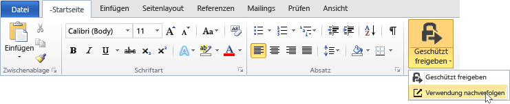
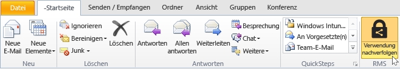
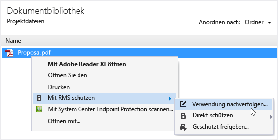
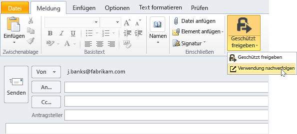

# Nachverfolgen und Widerrufen Ihrer Dokumente bei Verwendung der RMS-Freigabeanwendung
Wenn Sie Ihre Dokumente mit der RMS-Freigabeanwendung geschützt haben und Ihre Organisation nicht Active Directory Rights Management Services, sondern Azure Rights Management verwendet, können Sie verfolgen, wie die Benutzer die geschützten Dokumente verwenden. Falls nötig, können Sie den Zugriff auf diese Dokumente widerrufen, um ein unerwünschtes Weitergeben und Teilen zu unterbinden. Verwenden Sie hierfür die **Website zum Nachverfolgen von Dokumenten**, auf die Sie von Windows-Computern, Mac-Computern und sogar mit Tablets und Smartphones zugreifen können.

> [!TIP]
> Zwei-Minuten-Video: [Azure RMS-Dokumentenverfolgung und -widerruf](http://channel9.msdn.com/Series/Information-Protection/Azure-RMS-Document-Tracking-and-Revocation)

Wenn Sie auf diese Website zugreifen möchten, melden Sie sich dort an, um Ihre Dokumente zu nachzuverfolgen. Sofern Ihre Organisation über ein [Abonnement verfügt, das das Nachverfolgen und Sperren von Dokumenten unterstützt](https://technet.microsoft.com/dn858608.aspx), und Ihnen eine Lizenz für dieses Abonnement zugewiesen ist, können Sie sehen, wer versucht hat, die geschützten Dateien zu öffnen. Sie können außerdem sehen, ob dieser Versuch erfolgreich war (ob die Betreffenden erfolgreich authentifiziert wurden). Jeder Versuch, auf das Dokument zuzugreifen und der zum Zeitpunkt geltende Standort werden dokumentiert. Zusätzlich:

-   Wenn Sie die Freigabe eines Dokuments aufheben müssen: Klicken Sie auf **Zugriff widerrufen**, notieren Sie den Zeitraum, für den das Dokument weiterhin verfügbar sein wird, und entscheiden Sie, ob Sie den Personen mitteilen möchten, dass Sie den Zugriff auf das zuvor freigegebene Dokument widerrufen, und verfassen Sie bei Bedarf eine angepasste E-Mail-Nachricht.

-   Wenn Sie das Dokument nach Excel exportieren möchten: Klicken Sie auf **In Excel öffnen**, um die Daten ändern und eigene Ansichten und Diagramm erstellen zu können.

-   Wenn Sie E-Mail-Benachrichtigungen konfigurieren möchten: Klicken Sie auf **Einstellungen**, und geben Sie an, wie und ob Sie bei einem Zugriff auf das Dokument per E-Mail benachrichtigt werden möchten.

-   Wenn Sie Fragen haben oder Feedback zur Website zum Nachverfolgen von Dokumenten geben möchten: Klicken Sie auf das Symbol „Hilfe“, um auf die [Häufig gestellten Fragen zur Nachverfolgung von Dokumenten](http://go.microsoft.com/fwlink/?LinkId=523977) zuzugreifen.

## Verwenden von Office für den Zugriff auf die Website zum Nachverfolgen von Dokumenten

-   Bei den Office-Anwendungen wie Word, Excel und PowerPoint: Klicken Sie auf der Registerkarte **Start** ihn der Gruppe **RMS** auf **Geschützt freigeben**, und klicken Sie dann auf **Verwendung nachverfolgen**.

    

-   In Outlook: Klicken Sie auf der Registerkarte **Start** in der Gruppe **RMS** auf **Verwendung nachverfolgen**:

    

Wenn diese Optionen für RMS nicht angezeigt werden, ist die RMS-Freigabeanwendung entweder nicht oder nicht in der neuesten Version auf Ihrem Computer installiert, oder der Computer muss neu gestartet werden muss, um die Installation abzuschließen. Weitere Informationen dazu, wie die Freigabeanwendung installiert wird, finden Sie unter [Herunterladen und Installieren der Rights Management-Freigabeanwendung](../Topic/Download_and_install_the_Rights_Management_sharing_application.md).

### Weitere Methoden zum Nachverfolgen von und zum Widerrufen des Zugriffs auf Dokumente
Neben den Funktionen zum Nachverfolgen Ihrer Dokumente auf Windows-Computern mithilfe von Office-Anwendungen gibt es auch die folgenden Alternativen:

-   **Verwenden eines Webbrowsers**: Diese Methode kann auf allen unterstützten Geräten angewendet werden.

-   **Verwenden des Datei-Explorers**: Diese Methode funktioniert auf Windows-Computern.

-   **Verwenden einer Outlook-E-Mail-Nachricht**: Diese Methode funktioniert auf Windows-Computern.

##### Verwenden eines Webbrowsers für den Zugriff auf die Website zum Nachverfolgen von Dokumenten

-   Öffnen Sie einen der unterstützten Webbrowser, und wechseln Sie zur [Website zum Nachverfolgen von Dokumenten](http://go.microsoft.com/fwlink/?LinkId=529562).

    Unterstützte Browser: Wir empfehlen Internet Explorer in der neuesten Version 10, Sie können aber auch alle der folgenden Browser verwenden, um auf die Website zum Nachverfolgen von Dokumenten zuzugreifen:

    -   Internet Explorer: Mindestens Version 10

    -   Internet Explorer 9 mit mindestens MS12-037: Kumulatives Sicherheitsupdate für Internet Explorer: 12. Juni 2012

    -   Mozilla Firefox: Mindestens Version 12

    -   Apple Safari 5: Mindestens Version 5

    -   Google Chrome: Mindestens Version 18

##### Verwenden des Datei-Explorers für den Zugriff auf die Website zum Nachverfolgen von Dokumenten

-   Klicken Sie mit der rechten Maustaste auf die Datei, wählen Sie **Mit RMS schützen** und dann **Verwendung nachverfolgen** aus:

    

##### Verwenden einer Outlook-E-Mail-Nachricht für den Zugriff auf die Website zum Nachverfolgen von Dokumenten

-   Klicken Sie in einer E-Mail-Nachricht auf der Registerkarte **Nachricht** in der Gruppe **RMS** auf **Geschützt freigeben** und dann auf **Verwendung nachverfolgen**:

    

## Beispiele und andere Anweisungen
Beispiele für die Verwendung der Rights Management-Freigabeanwendung sowie weitere Anweisungen finden Sie in den folgenden Abschnitten des Benutzerhandbuchs für die Rights Management-Freigabeanwendung

-   [Beispiele für die Nutzung der RMS-Freigabeanwendung](../Topic/Rights_Management_sharing_application_user_guide.md#BKMK_SharingExamples)

-   [Was möchten Sie tun?](../Topic/Rights_Management_sharing_application_user_guide.md#BKMK_SharingInstructions)

## Siehe auch
[Rights Management-Freigabeanwendung – Benutzerhandbuch](../Topic/Rights_Management_sharing_application_user_guide.md)

