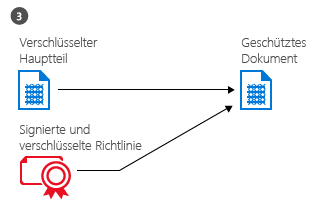
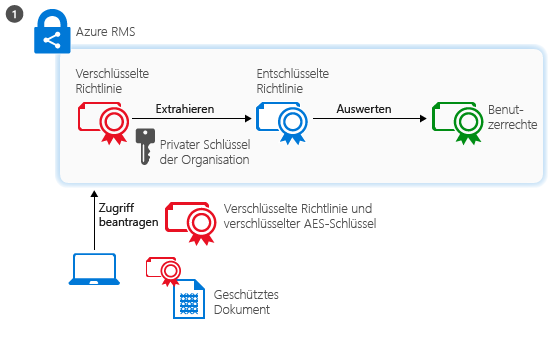

# Was ist Azure Rights Management?
Azure Rights Management (Azure RMS) ist eine Lösung zum Schutz von Informationen für Organisationen, die ihre Daten in den immer komplexer werdenden Arbeitsumgebungen von heute schützen möchten.

Zu dieser Komplexität zählen die Notwendigkeit einer Verbindung mit dem Internet, da Benutzer persönliche Geräte mit zur Arbeit bringen, unterwegs und von zuhause auf Unternehmensdaten zugreifen sowie sensible Informationen mit wichtigen Geschäftspartnern gemeinsam nutzen. Zum Tagesgeschäft der Benutzer gehört es, Informationen durch Verwenden von E-Mails, Websites zum Dateienaustausch sowie Cloud-Diensten gemeinsam zu nutzen. In diesen Zusammenhängen haben herkömmliche Sicherheitsvorkehrungen (etwa Zugriffssteuerungslisten und NTFS-Berechtigungen) sowie Firewalls eingeschränkte Effektivität, wenn Sie die Daten Ihres Unternehmens schützen und gleichzeitig den Benutzern ermöglichen möchten, effizient arbeiten zu können.

Im Gegensatz dazu kann Azure RMS vertrauliche Daten Ihres Unternehmens in all diesen Szenarien schützen. Azure RMS verwendet Verschlüsselungs-, Identitäts- und Autorisierungsrichtlinien zum Schützen Ihrer Dateien und E-Mails und funktioniert auf verschiedenen Geräten – Telefone, Tablets und PCs. Daten können innerhalb Ihrer Organisation und außerhalb Ihrer Organisation geschützt werden, da dieser Schutz sogar dann bei den Daten bleibt, wenn sie den Bereich Ihrer Organisation verlassen. Mitarbeiter senden ein Dokument beispielsweise per E-Mail an ein Partnerunternehmen oder speichern ein Dokument auf einem Cloud-Laufwerk. Der dauerhafte Schutz, den Azure RMS bereitstellt, ermöglicht nicht nur das Schützen Ihrer Unternehmensdaten, sondern kann sogar gesetzlich vorgeschrieben sein: zur Einhaltung von Vorgaben, für Anforderungen zu gesetzlichen Ermittlungen oder einfach für bewährte Verfahren der Informationsverwaltung.

Aber sehr wichtig ist, dass autorisierte Personen und Dienste (beispielsweise Such- und Indizierungsdienste) die Daten weiterhin lesen und auswerten können, die von Azure RMS geschützt werden. Dies lässt sich mit anderen Datenschutzlösungen, in denen Peer-zu-Peer-Verschlüsselung verwendet wird, nicht einfach erreichen. Diese Fähigkeit wird gelegentlich als "Schlussfolgern über Daten" (reasoning over data) bezeichnet und ist ein ausschlaggebendes Element dabei, die Kontrolle über die Daten Ihrer Organisation zu behalten.

In der folgenden Abbildung wird verdeutlicht, wie Azure RMS als Lösung zur Rechteverwaltung für Office 365 sowie für lokale Server und Dienste fungiert. Außerdem unterstützt Azure RMS gängige Endbenutzergeräte, die unter Windows, Mac OS, iOS, Android oder Windows Phone ausgeführt werden.

> [!TIP]
> An diesem Punkt können zusätzliche Ressourcen ggf. nützlich sein:
> 
> -   Zwei-Minuten-Video: [Was ist Microsoft Azure Rights Management?](http://technet.microsoft.com/dn833005.aspx)
> -   Lernprogramm in fünf Schritten: [Schnellstart-Tutorial für Azure Rights Management](../Topic/Quick_Start_Tutorial_for_Azure_Rights_Management.md)
> -   Azure RMS-Anforderungen, einschließlich der Abonnementoptionen zum Erwerb oder für die Auswertung: [Voraussetzungen für Azure Rights Management](../Topic/Requirements_for_Azure_Rights_Management.md)

In den folgenden Abschnitte erfahren Sie mehr zu Azure RMS:

-   [Welche Probleme werden von Azure RMS gelöst?](../Topic/What_is_Azure_Rights_Management_.md#BKMK_RMSrequirements)

    -   [Sicherheits-, Compliance- und gesetzliche Anforderungen](../Topic/What_is_Azure_Rights_Management_.md#BKMK_RMScompliance)

-   [Azure RMS in Aktion: Was Administratoren und Benutzer sehen](../Topic/What_is_Azure_Rights_Management_.md#BKMK_RMSpictures)

    -   [Aktivieren und Konfigurieren von Rights Management](../Topic/What_is_Azure_Rights_Management_.md#BKMK_Example_ManagementPortal)

    -   [Automatischer Schutz von Dateien auf Dateiservern, auf denen Windows Server und Dateiklassifizierungsinfrastruktur ausgeführt wird](../Topic/What_is_Azure_Rights_Management_.md#BKMK_Example_FCI)

    -   [Richtlinien zum automatischen Schützen von E-Mails mit Exchange Online und zum Verhindern von Datenverlusten](../Topic/What_is_Azure_Rights_Management_.md#BKMK_Example_DLP)

    -   [Automatischer Schutz von Dateien mit SharePoint Online und geschützten Bibliotheken](../Topic/What_is_Azure_Rights_Management_.md#BKMK_Example_SharePoint)

    -   [Sicheres Freigeben von Anlagen für mobile Benutzer](../Topic/What_is_Azure_Rights_Management_.md#BKMK_Example_SharingApp)

-   [Funktionsweise von Azure RMS Hinter den Kulissen](../Topic/What_is_Azure_Rights_Management_.md#BKMK_HowRMSworks)

    -   [Von Azure RMS verwendete kryptografische Steuerelemente: Algorithmen und Schlüssellängen](../Topic/What_is_Azure_Rights_Management_.md#BKMK_RMScrytographics)

    -   [Exemplarische Vorgehensweise zur Funktionsweise von Azure RMS: Erste Verwendung, Inhaltsschutz, Inhaltsaufnahme](../Topic/What_is_Azure_Rights_Management_.md#BKMK_Walthrough)

-   [Nächste Schritte](../Topic/What_is_Azure_Rights_Management_.md#BKMK_NextSteps)

## Welche Probleme werden von Azure RMS gelöst?
Anhand der folgenden Tabelle können Sie Geschäftsanforderungen oder -probleme bestimmen, die Ihre Organisation möglicherweise hat, und können ermitteln, wie sich diese Probleme mit Azure RMS lösen lassen.

|Anforderung oder Problem|Gelöst durch Azure RMS|
|----------------------------|--------------------------|
|Schützen von Dateien beliebigen Typs|√ In früheren Implementierungen von Azure Rights Management können nur Office-Dateien geschützt werden, wozu systemeigener Schutz verwendet wird. Nun gibt es [generischen Schutz](https://technet.microsoft.com/library/dn574738%28v=ws.10%29.aspx), d. h., es werden alle Dateitypen unterstützt.|
|Schützen von Dateien überall|√ Wenn eine Datei in einem Speicherort gespeichert wird ([direkt schützen](https://technet.microsoft.com/library/dn574733%28v=ws.10%29.aspx)), verbleibt der Schutz bei der Datei, und zwar selbst dann, wenn sie in Speicher kopiert wird, der nicht von der IT-Abteilung betreut wird, beispielsweise ein Cloud-Speicherdienst.|
|Sicheres Freigeben von Dateien per E-Mail|√ Wird eine Datei per E-Mail freigegeben ([geschützt freigeben](https://technet.microsoft.com/library/dn574735%28v=ws.10%29.aspx)), wird die Datei als Anlage einer E-Mail-Nachricht geschützt mit Anweisungen, wie die geschützte Anlage geöffnet werden kann. Der Text der E-Mail ist nicht verschlüsselt, sodass der Empfänger diese Anweisungen immer lesen kann. Da das als Anlage angehängte Dokument aber geschützt ist, kann es nur von autorisierten Benutzern geöffnet werden, auch wenn die E-Mail oder das Dokument an andere Personen weitergeleitet wird.|
|Überprüfung und Überwachung|√ Sie können die [Nutzung Ihrer geschützten Dateien selbst dann noch überprüfen und überwachen](https://technet.microsoft.com/library/dn529121.aspx), wenn diese Dateien die Grenzen Ihrer Organisation verlassen haben.  Sie arbeiten z. B. für Contoso, Ltd. Sie arbeiten mit drei Mitarbeitern von Fabrikam, Inc. an einem gemeinsamen Projekt. Sie senden diesen 3 Personen ein Dokument per E-Mail, das Sie schützen und mit einem Schreibschutz versehen. Azure RMS-Überprüfung kann die folgenden Informationen bereitstellen:  -   Ob und wann die von Ihnen angegebenen Fabrikam-Personen das Dokument geöffnet haben. -   Ob andere Personen, die Sie nicht angegeben haben, versucht haben, das Dokument zu öffnen (und dabei gescheitert sind): Das Dokument wurde möglicherweise weitergeleitet oder in einem freigegebenen Speicherort gespeichert, auf den andere Personen Zugriff haben. -   Ob eine der angegebenen Personen versucht hat (und gescheitert ist), das Dokument zu drucken oder zu ändern.|
|Unterstützung für häufig verwendete Geräte, nicht nur Windows-Computer|√ Zu den [unterstützten Geräten](https://technet.microsoft.com/library/dn655136.aspx) gehören:  -   Windows-Computer und -Telefone -   Mac-Computer -   iOS-Tablets und -Telefone -   Android-Tablets und -Telefone|
|Unterstützung von Business-to-Business-Zusammenarbeit|√ Weil Azure RMS ein Cloud-Dienst ist, ist es nicht erforderlich, explizit Vertrauensstellungen zu anderen Organisationen zu konfigurieren, bevor Sie geschützte Inhalte mit diesen gemeinsam nutzen können. Sofern diese Organisationen bereits ein Office 365- oder Azure AD-Verzeichnis haben, wird Zusammenarbeit zwischen Organisationen automatisch unterstützt. Haben die Organisationen kein solches Verzeichnis, können sich Benutzer für das kostenfreie [RMS für Einzelpersonen](https://technet.microsoft.com/library/dn592127.aspx)-Abonnement anmelden.|
|Unterstützung sowohl für lokale Dienste als auch für Office 365|√  Azure RMS arbeitet [nahtlos mit Office 365](https://technet.microsoft.com/library/jj585004.aspx) zusammen. Außerdem können Sie Azure RMS mit den folgenden lokalen Diensten verwenden, wenn Sie den [RMS-Verbindungsdienst](https://technet.microsoft.com/library/dn375964.aspx) bereitstellen:  -   Exchange Server -   SharePoint Server -   Windows Server mit Dateiklassifizierungsinfrastruktur (File Classification Infrastructure)|
|Einfache Aktivierung|√ Für das [Aktivieren des Rechteverwaltungsdiensts](https://technet.microsoft.com/library/jj658941.aspx) für Benutzer sind nur einige Mausklicks im klassischen Azure-Portal erforderlich.|
|Fähigkeit, nach Bedarf über die gesamte Organisation zu skalieren|√ Weil Azure RMS als Cloud-Dienst mit der Azure-Flexibilität für zentrales und horizontales Hochskalieren ausgeführt wird, müssen Sie keine zusätzlichen lokalen Server bereitstellen.|
|Fähigkeit, einfache und flexible Richtlinien zu erstellen|√ [Angepasste Vorlagen für Benutzerrechterichtlinien](https://technet.microsoft.com/library/dn642472.aspx) bieten schnelle und einfache Lösungen, mit denen Administratoren Richtlinien anwenden und Benutzer das richtige Maß an Schutz für jedes Dokument anwenden sowie den Zugriff auf Personen in der eigenen Organisation beschränken können.  Soll beispielsweise ein unternehmensweites Strategiepapier für alle Mitarbeiter freigegeben werden, könnten Sie eine Schreibschutzrichtlinie für alle internen Mitarbeiter anwenden. Für ein Dokument mit sensibleren Daten, etwa einen Finanzbericht, könnten Sie den Zugriff auf Führungskräfte beschränken.|
|Breite Anwendungsunterstützung|√ Azure RMS ist eng auf Microsoft Office-Anwendungen und -Dienste abgestimmt und ermöglicht durch Verwenden der RMS-Freigabe-Anwendung erweiterte Unterstützung für andere Anwendungen.  √ Im [Microsoft Rights Management SDK](https://msdn.microsoft.com/library/hh552972%28v=vs.85%29.aspx) werden Ihren internen Entwicklern sowie Softwareherstellern APIs bereitgestellt, mit denen sie angepasste Anwendungen schreiben können, die Azure RMS unterstützen.  Weitere Informationen finden Sie unter [Unterstützung von Azure Rights Management durch Anwendungen](../Topic/How_Applications_Support_Azure_Rights_Management.md).|
|IT-Abteilung muss Kontrolle über die Daten behalten|√ Eine Organisation hat die Wahl, ihren eigenen Mandantenschlüssel zu verwalten sowie die [BYOK (Bring Your Own Key)](https://technet.microsoft.com/library/dn440580.aspx)-Lösung zu verwenden und ihren Mandantenschlüssel in Hardwaresicherheitsmodulen (HSMs) zu speichern.  √ Unterstützung für Überwachung und [Nutzungsprotokollierung](https://technet.microsoft.com/library/dn529121.aspx), sodass Sie hinsichtlich Geschäftseinblicken analysieren, auf Missbrauch überwachen und (wenn es ein Informationsleck gibt) forensische Analysen ausführen können.  √ Delegierter Zugriff mithilfe der Funktion [Administrator](https://technet.microsoft.com/library/mt147272.aspx) stellt sicher, dass die IT-Abteilung immer auf geschützte Inhalte zugreifen kann, auch wenn ein Dokument von einem Mitarbeiter geschützt wurde, der die Organisation dann verlassen hat. Bei Peer-zu-Peer-Verschlüsselungslösungen besteht dagegen das Risiko, dass Zugriff auf Unternehmensdaten verloren geht.  √ Synchronisieren [nur der Verzeichnisattribute, die Azure RMS für die Unterstützung einer allgemeinen Identität für Ihre lokalen Active Directory-Konten benötigt](https://azure.microsoft.com/documentation/articles/active-directory-aadconnectsync-attributes-synchronized/), indem ein [Verzeichnissynchronisierungstool](https://azure.microsoft.com/documentation/articles/active-directory-aadconnect-get-started-tools-comparison/) wie Azure AD Connect verwendet wird.  √ Aktivieren von einmaligem Anmelden, ohne Kennwörter in die Cloud zu replizieren, mithilfe von AD FS.  √ Organisationen haben immer die Möglichkeit, Azure RMS nicht mehr zu verwenden, ohne den Zugriff auf Inhalte zu verlieren, die zuvor von Azure RMS geschützt wurden. Informationen zu Außerbetriebnahmeoptionen finden Sie unter [Außerbetriebsetzen und Deaktivieren von Azure Rights Management](../Topic/Decommissioning_and_Deactivating_Azure_Rights_Management.md). Organisationen, die Active Directory Rights Management Services (AD RMS) bereitgestellt haben, können darüber hinaus [zu Azure RMS migrieren](https://technet.microsoft.com/library/dn858447.aspx), ohne den Zugriff auf Daten zu verlieren, die zuvor durch AD RMS geschützt waren.|
> [!TIP]
> Wenn Sie mit der lokalen Version von Rights Management, Active Directory Rights Management Services (AD RMS), vertraut sind, ist die Vergleichstabelle in [Vergleich zwischen Azure Rights Management und AD RMS](../Topic/Comparing_Azure_Rights_Management_and_AD_RMS.md) möglicherweise für Sie interessant.

### Sicherheits-, Compliance- und gesetzliche Anforderungen
Azure RMS unterstützt die folgenden Sicherheits-, Compliance- und gesetzlichen Anforderungen:

√ Verwendung von Kryptografie gemäß Industriestandard und Unterstützung von FIPS 140-2. Weitere Informationen finden Sie in diesem Thema im Abschnitt [Von Azure RMS verwendete kryptografische Steuerelemente: Algorithmen und Schlüssellängen](../Topic/What_is_Azure_Rights_Management_.md#BKMK_RMScrytographics).

√ Unterstützung für Thales Hardwaresicherheitsmodule (HSMs), damit Sie Ihren Mandantenschlüssel in Microsoft Azure-Rechenzentren speichern können. Azure RMS verwendet getrennte Security Worlds für seine Rechenzentren in Nordamerika, EMEA (Europa, Naher Osten und Afrika) und Asien, sodass Ihre Schlüssel nur in Ihrer Region verwendet werden können.

√ Zertifiziert für Folgendes:

-   ISO/IEC 27001:2013 (enthält [ISO/IEC 27018](http://azure.microsoft.com/blog/2015/02/16/azure-first-cloud-computing-platform-to-conform-to-isoiec-27018-only-international-set-of-privacy-controls-in-the-cloud/))

-   SOC 2 SSAE 16/ISAE 3402 Attestations

-   HIPAA BAA

-   EU-Modellklauseln

-   FedRAMP als Teil von Azure Active Directory in Office 365-Zertifizierung, ausgestellt von FedRAMP Agency Authority to Operate durch HHS

-   PCI DSS Level 1

Weitere Informationen zu diesen externen Zertifizierungen finden Sie unter [Azure Trust Center](http://azure.microsoft.com/support/trust-center/compliance/).

## Azure RMS in Aktion: Was Administratoren und Benutzer sehen
Die Bilder in diesem Abschnitt zeigen einige typische Beispiele dafür, wie Administratoren und Benutzer Azure RMS aufrufen und verwenden können, um vertrauliche Informationen zu schützen.

> [!NOTE]
> In all diesen Beispielen, in denen Azure RMS Daten schützt, hat der Inhaltsbesitzer weiterhin vollen Zugriff auf die Daten (Dateien oder e-Mails), auch wenn der angewendete Schutz einer Gruppe Berechtigungen gewährt, welcher der Besitzer nicht angehörte, oder auch wenn der angewendete Schutz ein Ablaufdatum enthält.
> 
> Entsprechend kann die IT stets ohne Einschränkungen mithilfe der Funktion „Administrator“ von Rights Management auf die geschützten Daten zugreifen. Diese Funktion gewährt autorisierten Benutzern oder Diensten, die Sie angeben, delegierten Zugriff. Darüber hinaus kann die IT die Verwendung geschützter Daten verfolgen und überwachen, z. B. wer wann auf die Daten zugreift.

Weitere Screenshots und Videos, die RMS in Aktion zeigen, finden Sie im [Microsoft Rights Management Services-Portal](http://www.microsoft.com/rms), im [Blog des Microsoft Rights Management-Teams (RMS)](http://blogs.technet.com/b/rms) und im [kuratierten Inhalt für Azure RMS auf der Curah!-Website](http://curah.microsoft.com/Search?query="Azure%20RMS").

### Aktivieren und Konfigurieren von Rights Management
Obwohl Sie Windows PowerShell zum Aktivieren und Konfigurieren von Azure RMS verwenden können, geschieht dies am einfachsten über das Verwaltungsportal. Sobald der Dienst aktiviert ist, stehen Ihnen zwei Standardvorlagen zur Verfügung, die Administratoren und Benutzer auswählen können, um schnell und einfach Informationsschutz auf Dateien anzuwenden. Sie können aber auch eigene benutzerdefinierten Vorlagen für zusätzliche Optionen und Einstellungen erstellen.

|||
|-|-|
|  [Größeres Bild](http://technet.microsoft.com/98d53a12-3b19-4622-bb1e-75ef56df5438) (standardmäßig im gleichen Browserfenster)|Zum Aktivieren von RMS können Sie entweder das Office 365-Administrationscenter (erstes Bild) oder das klassische Azure-Portal (zweites Bild) verwenden.  Sie benötigen nur einen Mausklick zum Aktivieren und einen weiteren zum Bestätigen, anschließend ist der Schutz von Informationen für Administratoren und Benutzer in Ihrer Organisation aktiviert.|
|  [Größeres Bild](http://technet.microsoft.com/596e4fec-124c-41b1-8efd-63d5179193fb) (standardmäßig im gleichen Browserfenster)|Nach der Aktivierung stehen zwei Vorlagen für Benutzerrechterichtlinien automatisch für Ihre Organisation zur Verfügung. Eine Vorlage ist für den schreibgeschützten Zugriff (**Confidential View Only** ist im Namen enthalten) vorgesehen, die andere für den Lese- und Änderungszugriff (**Confidential**).  Wenn diese Vorlagen auf Dateien oder E-Mails angewendet werden, beschränken sie den Zugriff auf Benutzer in Ihrer Organisation. Auf diese Weise können Sie sehr schnell und einfach verhindern, dass Firmendaten an Personen außerhalb Ihrer Organisation gelangen. **Tip:** Diese Standardvorlagen können Sie leicht erkennen, da ihnen der Name Ihrer Organisation automatisch vorangestellt wird. In unserem Beispiel lautet er **VanArsdel, Ltd**. Wenn Sie Benutzer diese Vorlagen nicht anzeigen sollen oder wenn Sie eigene Vorlagen erstellen möchten, verwenden Sie das klassische Azure-Portal. Wie in dieser Abbildung gezeigt, gibt Ihnen ein Assistent Anleitung beim Erstellen benutzerdefinierter Vorlagen.|
|  [Größeres Bild](http://technet.microsoft.com/f5df80e5-efc9-4c0f-91be-060225977356) (standardmäßig im gleichen Browserfenster)|Offlinezugriff, Ablaufeinstellungen und ob die Vorlage sofort veröffentlicht (Sichtbarmachen in Anwendungen, die Rights Management unterstützen) werden soll, sind einige der Konfigurationseinstellungen, die Ihnen beim Erstellen eigener Vorlagen zur Verfügung stehen.|
|  [Größeres Bild](http://technet.microsoft.com/597a3402-fd5a-4bcf-b5e6-5c983dbde697) (standardmäßig im gleichen Browserfenster)|Durch das Veröffentlichen dieser Vorlagen können Benutzer sie nun in Anwendungen, z. B. Datei-Explorer und Microsoft Word, auswählen:  -   Ein Benutzer kann z. B. die Standardvorlage **VanArsdel, Ltd – Vertraulich** auswählen. Dann können nur Mitarbeiter der Organisation VanArsdel dieses Dokument öffnen und verwenden, auch wenn es später per E-Mail an jemanden außerhalb der Organisation gesendet oder an einem öffentlichen Speicherort gespeichert wird. -   Ein Benutzer kann die benutzerdefinierte Vorlage auswählen, die der Administrator erstellt hat: **Vertrieb und Marketing – Nur lesen und drucken**. Dann ist die Datei nicht nur vor Personen außerhalb des Unternehmens geschützt, sondern sie ist auch auf Mitarbeiter aus der Vertriebs und Marketingabteilung beschränkt. Darüber hinaus haben diese Mitarbeiter keinen Vollzugriff auf das Dokument, sondern können es nur lesen und drucken. Sie können keine es z. B. nicht ändern oder Teile daraus kopieren.|
Weitere Informationen finden Sie unter [Aktivieren von Azure Rights Management](../Topic/Activating_Azure_Rights_Management.md) und [Konfigurieren benutzerdefinierter Vorlagen für Azure Rights Management](../Topic/Configuring_Custom_Templates_for_Azure_Rights_Management.md).

Weitere Informationen zum Schützen wichtiger Unternehmensdateien durch Benutzer finden Sie unter [Unterstützung von Benutzern beim Schützen von Dateien unter Verwendung von Azure Rights Management](../Topic/Helping_Users_to_Protect_Files_by_Using_Azure_Rights_Management.md).

Im Folgenden finden Sie einige Beispiele dafür, wie Administratoren die Vorlagen anwenden können, um automatisch den Datenschutz für Dateien und E-Mails zu konfigurieren.

### Automatischer Schutz von Dateien auf Dateiservern, auf denen Windows Server und Dateiklassifizierungsinfrastruktur ausgeführt wird
Dieses Beispiel zeigt, wie Sie Azure RMS verwenden können, um Dateien auf Dateiservern automatisch zu schützen, die mindestens Windows Server 2012 ausführen und für die Verwendung der Dateiklassifizierungsinfrastruktur konfiguriert sind.

Es gibt viele Möglichkeiten, die Klassifizierungswerte auf Dateien anzuwenden. Sie können z. B. den Inhalt von Dateien untersuchen und entsprechend integrierte Klassifizierungen wie Vertraulichkeit und personenbezogene Informationen anwenden. In diesem Beispiel erstellt ein Administrator jedoch eine benutzerdefinierte Klassifizierung **Marketing**, die automatisch für alle Benutzerdokumente angewendet wird, die im Ordner **Marketingaktionen** gespeichert werden. Obwohl dieser Ordner mit NTFS-Berechtigungen geschützt ist, die den Zugriff auf Mitglieder der Gruppe „Marketing“ beschränken, weiß der Administrator, dass diese Berechtigungen verloren gehen können, wenn jemand aus dieser Gruppe die Dateien verschiebt oder per E-Mail sendet. Danach könnten unbefugte Benutzer auf die Informationen in den Dateien zugreifen.

|||
|-|-|
|  [Größeres Bild](http://technet.microsoft.com/cf18c56b-c301-4640-8d9e-9e677e494091) (standardmäßig im gleichen Browserfenster)|Der Administrator installiert und konfiguriert den Rights Management (RMS) Connector, der als Relais zwischen lokalen Servern und Azure RMS fungiert.|
|  [Größeres Bild](http://technet.microsoft.com/ba3e247d-ea5e-4009-8eac-74f70270ece0) (standardmäßig im gleichen Browserfenster)|Auf dem Dateiserver konfiguriert der Administrator die Klassifizierungsregeln und -aufgaben, damit alle Benutzerdateien im Ordner **Marketingaktionen** automatisch als **Marketing** klassifiziert und mit RMS-Verschlüsselung geschützt werden.  Er die benutzerdefinierte RMS-Vorlage aus, die im ersten Beispiel erstellt wurde und die den Zugriff auf die Mitglieder der Vertriebs- und Marketingabteilung beschränkt: **Vertrieb und Marketing – nur Lesen und Drucken**  Daher werden alle Dokumente in diesem Ordner automatisch mit der Klassifizierung Marketing konfiguriert und von der RMS-Vorlage für Vertrieb und Marketing geschützt.|
|  [Größeres Bild](http://technet.microsoft.com/ad666594-68df-4289-835a-235b2af9bf4b) (standardmäßig im gleichen Browserfenster)|So verhindert RMS, dass Daten an Personen ausgegeben werden, die keinen Zugriff auf vertrauliche Informationen haben sollten:  -   Julia aus der Marketingabteilung, sendet per E-Mail einen vertraulichen Bericht aus dem Ordner Marketing Promotions. Dieser Bericht enthält neue Produktfeatures und Werbepläne und wird von einem Kollegen angefordert, der derzeit auf Geschäftsreise ist. Julia sendet den Bericht allerdings versehentlich per E-Mail an die falsche Person. Sie hat nicht bemerkt, dass sie versehentlich einen Empfänger mit einem ähnlichen Namen in einem anderen Unternehmen ausgewählt hat.     Der Empfänger kann den vertraulichen Bericht nicht lesen, da er kein Mitglied der Gruppe Vertrieb und Marketing ist.|
Weitere Informationen finden Sie unter [Bereitstellen des Azure Rights Management-Verbindungsdiensts](../Topic/Deploying_the_Azure_Rights_Management_Connector.md).

### Richtlinien zum automatischen Schützen von E-Mails mit Exchange Online und zum Verhindern von Datenverlusten
Im vorherigen Beispiel wurde gezeigt, wie Sie Dateien automatisch schützen können, die vertrauliche Informationen enthalten. Doch was geschieht, wenn die Informationen nicht in einer Datei, sondern in einer E-Mail-Nachricht enthalten sind? Hier kommen die Exchange Online Data Loss Prevention (DLP)-Richtlinien ins Spiel. Diese fordern die Benutzer entweder auf, den Informationsschutz anzuwenden (mithilfe von Richtlinientipps), oder wenden den Schutz (mithilfe von Transportregeln) automatisch an.

In diesem Beispiel konfiguriert der Administrator eine Richtlinie, damit die Organisation die US-Bestimmungen zum Schutz personenbezogener Daten einhält; Regeln können jedoch auch für andere Vorschriften oder benutzerdefinierte Regeln konfiguriert werden, die Sie definieren.

|||
|-|-|
|  [Größeres Bild](http://technet.microsoft.com/58461319-3981-4b7f-a195-956a1778e907) (standardmäßig im gleichen Browserfenster)|Die Exchange-Vorlage namens **USA Daten mit persönlich identifizierbaren Informationen (PII)** wird vom Administrator zum Erstellen und Konfigurieren einer neuen DLP-Richtlinie verwendet. Diese Vorlage sucht nach Informationen in E-Mail-Nachrichten, z. B. nach Sozialversicherungsnummern und Führerscheinnummern.  Die Regeln sind so konfiguriert, dass auf E-Mail-Nachrichten, die diese Informationen enthalten und an Adressaten außerhalb der Organisation gesendet werden, automatisch der Rechteschutz angewendet wird. Dazu wird eine RMS-Vorlage verwendet, die den Zugriff auf Mitarbeiter des Unternehmens beschränkt.  Hier wird die Regel so konfiguriert, dass eine der Standardvorlagen verwendet wird: **VanArsdel, Ltd – Vertraulich** aus unserem ersten Beispiel. Sie können jedoch auch sehen, dass die Vorlagenauswahl alle benutzerdefinierten Vorlagen enthält, die Sie erstellt haben, sowie eine Option **Nicht weiterleiten**, die für Exchange spezifisch ist.|
|  [Größeres Bild](http://technet.microsoft.com/bfb0762d-06fb-42e4-beff-eb391f4bedf0) (standardmäßig im gleichen Browserfenster)|Der Personalmanager schreibt eine E-Mail-Nachricht, die die Sozialversicherungsnummer eines kürzlich eingestellten Mitarbeiters enthält. Er sendet diese E-Mail-Nachricht an Sherrie in der Personalabteilung.|
|  [Größeres Bild](http://technet.microsoft.com/59e3b68e-4bed-4962-bb1e-e82d82f8000a) (standardmäßig im gleichen Browserfenster)|Wenn diese E-Mail-Nachricht an eine Person außerhalb der Organisation gesendet oder weitergeleitet wird, wendet die DLP-Regel automatisch den Rechteschutz an.  Die E-Mail wird verschlüsselt, wenn sie die Infrastruktur der Organisation verlässt, damit die Sozialversicherungsnummer in der E-Mail-Nachricht während der Übertragung oder im Posteingang des Empfängers nicht gelesen werden kann. Der Empfänger kann die Nachricht nur lesen, wenn er ein Mitarbeiter von VanArsdel ist.|
Weitere Informationen finden Sie in den folgenden Abschnitten:

-   [Exchange Online und Exchange Server](../Topic/How_Applications_Support_Azure_Rights_Management.md#BKMK_ExchangeIntro) im Thema [Unterstützung von Azure Rights Management durch Anwendungen](../Topic/How_Applications_Support_Azure_Rights_Management.md).

-   [Exchange Online: IRM-Konfiguration](../Topic/Configuring_Applications_for_Azure_Rights_Management.md#BKMK_ExchangeOnline) im Thema [Konfigurieren von Anwendungen für Azure Rights Management](../Topic/Configuring_Applications_for_Azure_Rights_Management.md).

### Automatischer Schutz von Dateien mit SharePoint Online und geschützten Bibliotheken
Dies zeigt, wie leicht Sie Dokumente schützen können, wenn Sie SharePoint Online und geschützte Bibliotheken verwenden.

In diesem Beispiel hat der SharePoint-Administrator für Contoso für jede Abteilung eine Bibliothek erstellt, die dazu dient, Dokumente zentral zu speichern und Dokumenten für die Bearbeitung und Versionskontrolle auszuchecken. Es gibt z. B. eine Bibliothek für Vertrieb, eine für Marketing, eine für die Personalabteilung usw. Wenn ein neues Dokument hochgeladen oder in einer der geschützten Bibliotheken erstellt wird, erbt dieses Dokument den Schutz der Bibliothek (die Auswahl einer Vorlage für Rechterichtlinie ist nicht erforderlich), und das betreffende Dokument wird automatisch geschützt und bleibt geschützt, auch wenn es aus SharePoint-Bibliothek verschoben wird.

|||
|-|-|
|  [Größeres Bild](http://technet.microsoft.com/2fc90989-9289-4431-9e6a-07740b7f6e5a) (standardmäßig im gleichen Browserfenster)|Der Administrator aktiviert Information Rights Management für die SharePoint-Website.|
|  [Größeres Bild](http://technet.microsoft.com/a18f2e99-5ac4-4103-a88c-527846374091) (standardmäßig im gleichen Browserfenster)|Anschließend aktiviert sie Rights Management für eine Bibliothek. Obwohl zusätzliche Optionen vorhanden sind, reicht häufig schon diese einfache Einstellung aus.  Wenn Dokumente nun aus dieser Bibliothek heruntergeladen werden, sind sie automatisch durch Rights Management geschützt. Sie erben den Schutz, der für die Bibliothek konfiguriert ist.|
|  [Größeres Bild](http://technet.microsoft.com/0ebd6806-0190-441e-84db-72ac4b97e4a2) (standardmäßig im gleichen Browserfenster)|Wenn jemand aus der Vertriebsabteilung diesen Umsatzbericht aus der Bibliothek auscheckt, sieht er anhand des Informationsbanners oben, dass es sich um ein geschütztes Dokument mit Zugriffsbeschränkung handelt.  Das Dokument bleibt geschützt, auch wenn der Benutzer es umbenennt, es an einem anderen Ort speichert oder per E-Mail weitergibt. Unabhängig davon, wie die Datei benannt wird, wo sie gespeichert oder per E-Mail weitergegeben wird, können nur Mitglieder der Vertriebsabteilung sie lesen.|
Weitere Informationen finden Sie in den folgenden Abschnitten:

-   [SharePoint Online und SharePoint Server](../Topic/How_Applications_Support_Azure_Rights_Management.md#BKMK_SharePointIntro) im Thema [Unterstützung von Azure Rights Management durch Anwendungen](../Topic/How_Applications_Support_Azure_Rights_Management.md).

-   [SharePoint Online und OneDrive for Business: IRM-Konfiguration](../Topic/Configuring_Applications_for_Azure_Rights_Management.md#BKMK_SharePointOnline) im Thema [Konfigurieren von Anwendungen für Azure Rights Management](../Topic/Configuring_Applications_for_Azure_Rights_Management.md).

### Sicheres Freigeben von Anlagen für mobile Benutzer
Die vorherigen Beispiele haben verdeutlicht, wie Administratoren den Informationsschutz automatisch auf vertrauliche Daten anwenden können. In bestimmten Fällen müssen die Benutzer diesen Schutz jedoch eventuell selbst anwenden. Dies gilt beispielsweise, wenn sie mit Partnern in einer anderen Organisation zusammenarbeiten, wenn sie benutzerdefinierte Berechtigungen oder Einstellungen benötigen, die nicht in Vorlagen definiert sind oder die für Ad-hoc-Situationen vorgesehen sind, die nicht von den vorherigen Beispielen abgedeckt sind. In diesen Fällen können die Benutzer die RMS-Vorlagen selbst anwenden oder benutzerdefinierte Berechtigungen konfigurieren.

Das folgende Beispiel zeigt, wie Benutzer ein Dokument ohne weiteres für Personen eines anderen Unternehmens freigeben können, mit denen sie zusammenarbeiten, wie sie das Dokument aber dennoch schützen und sicher sein können, dass Empfänger es auch auf einem gängigen mobilen Gerät lesen können. Im folgenden Szenario wird die Rights Management-Freigabeanwendung verwendet, die Sie auf Windows-Computern in Ihrer Organisation automatisch bereitstellen können. Sie kann jedoch auch von Benutzern selbst installiert werden.

In diesem Beispiel sendet Alice von Contoso ein vertrauliches Word-Dokument per E-Mail an Bob bei Fabrikam. Er liest das Dokument auf seinem iPad, könnte es jedoch ebenso gut auf einem iPhone, einem Android-Tablet oder -Telefon, einem Macintosh-Computer oder einem Windows-Telefon oder -Computer lesen.

|||
|-|-|
|  [Größeres Bild](http://technet.microsoft.com/feeef78d-3c2e-432b-817d-d06f784be226) (standardmäßig im gleichen Browserfenster)|Alice erstellt auf ihrem Windows-PC eine normale E-Mail-Nachricht und hängt ein Dokument an.  Sie klickt in der Multifunktionsleiste auf **Geschütztes Freigeben**. Dadurch wird das Dialogfeld **Geschütztes Freigeben** aus der RMS-Freigabeanwendung geladen.  Da Bob nach dem Willen von Alice das Dokument nur anzeigen und bearbeiten, nicht jedoch kopieren oder drucken können soll, wählt sie **PRÜFER – Anzeigen und Bearbeiten** aus. Sie möchte auch eine E-Mail erhalten, wenn jemand versucht, das Dokument öffnen, und Sie möchte die Möglichkeit haben, das Dokument später bei Bedarf zu sperren und zu wissen, dass die Sperrung sofort wirksam wird.|
|  [Größeres Bild](http://technet.microsoft.com/e748fd78-8bba-4168-96cf-f96def078283) (standardmäßig im gleichen Browserfenster)|Bob sieht die E-Mail auf seinem iPad.  Neben der Nachricht und Anlage enthält die E-Mail von Alice Anweisungen, die er befolgt, um sich anzumelden und die RMS-Freigabeanwendung auf seinem iPad zu installieren.|
|  [Größeres Bild](http://technet.microsoft.com/7dba5ff9-a61d-4a83-8adc-d6ffb0e85df6) (standardmäßig im gleichen Browserfenster)|Jetzt kann Bob die Anlage öffnen. Er wird zuerst aufgefordert, sich anzumelden, um zu bestätigen, dass er der vorgesehene Empfänger ist.  Wenn Bob das Dokument anzeigt, sieht er auch Informationen zum eingeschränkten Zugriff, die ihm mitteilen, dass er das Dokument anzeigen und bearbeiten, jedoch nicht kopieren oder drucken kann.|
|  [Größeres Bild](http://technet.microsoft.com/9f642a2e-58ad-44ab-9f81-f890d15380f9) (standardmäßig im gleichen Browserfenster)|Alice erhält eine E-Mail-Nachricht, die sie darüber informiert, dass Bob das von ihr gesendete Dokument erfolgreich geöffnet hat und wann er auf das Dokument zugegriffen hat.  Wenn Bob seine E-Mail-Nachricht mit der Anlage weiterleitet oder an einem Ort speichert, wo andere Benutzer darauf zugreifen können, oder wenn sie im Netzwerk abgefangen wird, können andere Personen das Dokument nicht lesen.|
Weitere Informationen finden Sie unter [Schützen einer Datei, die Sie per E-Mail freigeben](https://technet.microsoft.com/library/dn574735.aspx) und [Anzeigen und Verwenden von Dateien, die geschützt wurden](https://technet.microsoft.com/library/dn574741.aspx) im [Benutzerhandbuch zur RMS-Freigabeanwendung](https://technet.microsoft.com/library/dn339006.aspx).

Darüber hinaus enthält das [Schnellstart-Tutorial für Azure Rights Management](../Topic/Quick_Start_Tutorial_for_Azure_Rights_Management.md) eine schrittweise Anleitung für dieses Szenario.

Nachdem Sie nun einige Beispiele für die Möglichkeiten von Azure RMS kennengelernt haben, möchten Sie ggf. mehr über die Funktionsweise erfahren. Technische Informationen zur Funktionsweise von Azure RMS finden Sie im nächsten Abschnitt.

## Funktionsweise von Azure RMS Hinter den Kulissen
Es ist wichtig, hinsichtlich der Funktionsweise von Azure RMS zu verstehen, dass der Rechteverwaltungsdienst (und Microsoft) Ihre Daten als Teil des Informationsschutzvorgangs weder sieht noch speichert. Informationen, die Sie schützen, werden niemals an Azure gesendet oder dort gespeichert – es sei denn, dass Sie diese explizit in Azure speichern oder einen anderen Cloud-Dienst verwenden, der sie in Azure speichert. Durch Azure RMS werden die Daten in einem Dokument einfach nicht lesbar für Personen, die keine autorisierten Benutzer und Dienste sind:

-   Die Daten werden auf der Anwendungsebene verschlüsselt und enthalten eine Richtlinie, die die autorisierte Verwendung für dieses Dokument definiert.

-   Wenn ein geschütztes Dokument von einem legitimen Benutzer verwendet oder von einem autorisierten Dienst verarbeitet wird, werden die Daten im Dokument entschlüsselt, und die Rechte, die in der Richtlinie definiert werden, werden durchgesetzt.

Die folgende Abbildung zeigt die Funktionsweise dieses Vorgangs als Übersicht. Ein Dokument, das die geheime Formel enthält, ist geschützt und wird dann von einem autorisierten Benutzer oder Dienst erfolgreich geöffnet. Das Dokument wird durch einen Inhaltsschlüssel (der grüne Schlüssel in der Abbildung) geschützt. Er ist für jedes Dokument eindeutig und wird im Dateiheader gespeichert. Dort ist er durch den Stammschlüssel Ihres RMS-Mandanten geschützt (der rote Schlüssel in der Abbildung). Ihr Mandantenschlüssel kann von Microsoft generiert und verwaltet werden, oder Sie generieren und verwalten Ihren eigenen Mandantenschlüssel.

Während des gesamten Schutzvorgangs (wenn Azure RMS Daten verschlüsselt und entschlüsselt, autorisiert und Einschränkungen durchsetzt) wird die geheime Formel niemals an Azure gesendet.

Eine ausführliche Beschreibung der Funktionsweise finden Sie im Abschnitt [Exemplarische Vorgehensweise zur Funktionsweise von Azure RMS: Erste Verwendung, Inhaltsschutz, Inhaltsaufnahme](../Topic/What_is_Azure_Rights_Management_.md#BKMK_Walthrough) in diesem Thema.

Technische Details zu den Algorithmen und Schlüssellängen, die Azure RMS verwendet, finden Sie im nächsten Abschnitt.

### Von Azure RMS verwendete kryptografische Steuerelemente: Algorithmen und Schlüssellängen
Auch wenn Sie selbst die Funktionsweise von RMS nicht kennen müssen, werden Sie ggf. zu den verwendeten kryptografischen Steuerelementen befragt, um sicherzustellen, dass ein Sicherheitsschutz nach Branchenstandard verwendet wird.

|||
|-|-|
|Schutzmethode für Dokumentation:|Algorithmus: AES  Schlüssellänge: 128 Bits und 256 Bits 1|
|Schlüsselschutzmethode:|Algorithmus: RSA  Schlüssellänge: 2.048 Bits|
|Zertifikatsignatur:|Algorithmus: SHA-256|
1 256 Bits werden von der Rights Management-Freigabeanwendung für den generischen und und den systemeigenen Schutz verwendet, wenn die Datei eine PPDF-Dateinamenerweiterung aufweist oder eine geschützte Text- oder Imagedatei (z. B. eine PTXT- oder PJPG-Datei) ist.

### Exemplarische Vorgehensweise zur Funktionsweise von Azure RMS: Erste Verwendung, Inhaltsschutz, Inhaltsaufnahme
Sehen Sie sich zum besseren Verständnis der Funktionsweise von Azure RMS einen typischen Ablauf an, nachdem [Azure RMS aktiviert wurde](https://technet.microsoft.com/library/jj658941.aspx) und ein Benutzer RMS erstmals auf seinem Windows-Computer verwendet (ein Vorgang, der auch als **Initialisierung der Benutzerumgebung** oder Bootstrapping bezeichnet wird), **Inhalte geschützt werden** (ein Dokument oder eine E-Mail) und dann ein Inhalt **genutzt** (geöffnet und verwendet) wird, der durch eine andere Person geschützt wurde.

Nach der Initialisierung der Benutzerumgebung kann der Benutzer Dokumente schützen oder geschützte Dokumente auf diesem Computer nutzen.

> [!NOTE]
> Wenn dieser Benutzer zu einem anderen Windows-Computer wechselt oder ein anderer Benutzer den gleichen Windows-Computer verwendet, wird der Initialisierungsvorgang wiederholt.

#### Initialisieren der Benutzerumgebung
Bevor ein Benutzer Inhalte schützen oder geschützte Inhalte auf einem Windows-Computer nutzen kann, muss die Benutzerumgebung auf dem Gerät vorbereitet werden. Dies ist ein einmaliger Vorgang. Er geschieht automatisch ohne Benutzereingriff, wenn ein Benutzer versucht, Inhalte zu schützen oder geschützte Inhalte zu nutzen:

|||
|-|-|
||Der RMS-Client auf dem Computer stellt zunächst eine Verbindung mit Azure RMS her und authentifiziert den Benutzer mithilfe seines Azure Active Directory-Kontos.  Wenn das Konto des Benutzers einen Verbund mit Azure Active Directory aufweist, erfolgt diese Authentifizierung automatisch, und der Benutzer wird nicht zur Eingabe von Anmeldeinformationen aufgefordert.|

|||
|-|-|
||Nachdem der Benutzer authentifiziert wurde, wird die Verbindung automatisch an den RMS-Mandanten der Organisation umgeleitet, der Zertifikate ausstellt, mit denen sich der Benutzer bei Azure RMS authentifiziert, um geschützte Inhalte zu nutzen und Inhalte offline zu schützen.  Eine Kopie des Zertifikats des Benutzers wird in Azure RMS gespeichert, damit die Zertifikate mithilfe der gleichen Schlüsseln erstellt werden, wenn der Benutzer ein anderes Gerät verwendet.|

#### Inhaltsschutz
Wenn ein Benutzer ein Dokument schützt, führt der RMS-Client die folgenden Aktionen für ein ungeschütztes Dokument aus:

|||
|-|-|
||Der RMS-Client erstellt einen zufälligen Schlüssel (den Inhaltsschlüssel) und verschlüsselt das Dokument mithilfe dieses Schlüssels mit dem symmetrischen Verschlüsselungsalgorithmus AES.|

|||
|-|-|
||Der RMS-Client erstellt dann ein Zertifikat, das eine Richtlinie für das Dokument enthält. Diese basiert auf einer Vorlage oder auf der Angabe bestimmter Rechte für das Dokument. Diese Richtlinie umfasst die Rechte für verschiedene Benutzer oder Gruppen und andere Einschränkungen, z. B. ein Ablaufdatum.  Der RMS-Client verwendet dann den Schlüssel der Organisation, der abgerufen wurde, als die Benutzerumgebung initialisiert wurde. Er verwendet diesen Schlüssel zum Verschlüsseln der Richtlinie und des symmetrischen Inhaltsschlüssels. Der RMS-Client signiert die Richtlinie außerdem mit dem Zertifikat des Benutzers, das abgerufen wurde, als die Benutzerumgebung initialisiert wurde.|

|||
|-|-|
||Schließlich bettet der RMS-Client die Richtlinie in eine Datei mit dem Text des zuvor verschlüsselten Dokuments ein. Zusammen ergibt dies ein geschütztes Dokument.  Dieses Dokument kann an einem beliebigen Ort gespeichert oder mithilfe einer beliebigen Methode freigegeben werden. Die Richtlinie verbleibt immer im verschlüsselten Dokument.|

#### Inhaltsnutzung
Wenn ein Benutzer ein geschütztes Dokument nutzen möchte, fordert der RMS-Client im ersten Schritt Zugriff auf den Azure RMS-Dienst an:

|||
|-|-|
||Der authentifizierte Benutzer sendet die Dokumentrichtlinie und die Zertifikate des Benutzers an Azure RMS. Der Dienst entschlüsselt die Richtlinie und wertet sie aus und erstellt dann eine Liste der Rechte (sofern vorhanden), die der Benutzer für das Dokument besitzt.|

|||
|-|-|
||Der Dienst extrahiert dann den AES-Inhaltsschlüssel aus der entschlüsselte Richtlinie. Dieser Schlüssel wird dann mit öffentlichen RSA-Schlüssel des Benutzers verschlüsselt, der mit der Anforderung abgerufen wurde.  Der erneut verschlüsselte Inhaltsschlüssel wird dann in eine verschlüsselte Nutzungslizenz mit der Liste der Benutzerberechtigungen eingebettet, die dann an den RMS-Client zurückgegeben wird.|

|||
|-|-|
||Schließlich verwendet der RMS-Client die verschlüsselte Nutzungslizenz und entschlüsselt diese mit dem privaten Schlüssel seines eigenen Benutzers. Auf diese Weise kann der RMS-Client den Text des Dokuments nach Bedarf entschlüsseln und auf dem Bildschirm darstellen.  Der Client entschlüsselt außerdem die Rechteliste und übergibt sie an die Anwendung, die diese Rechte in der Benutzeroberfläche der Anwendung durchsetzt.|

#### Variationen
Die vorherigen exemplarischen Vorgehensweisen beschreiben die Standardszenarien. Es gibt jedoch einige Varianten:

-   **Mobile Geräte**: Wenn mobile Geräte Dateien mit Azure RMS schützen oder nutzen, sind die Prozessabläufe wesentlich einfacher. Mobile Geräte durchlaufen nicht zuerst den Initialisierungsprozess, weil stattdessen jede Transaktion (zum Schützen oder Nutzen von Inhalten) unabhängig ist. Ebenso wie Windows-Computer stellen mobile Geräte eine Verbindung mit dem Azure RMS-Dienst her und authentifizieren sich. Zum Schützen von Inhalten übermitteln mobile Geräte eine Richtlinie, und Azure RMS sendet ihnen dann eine Veröffentlichungslizenz und einen symmetrischen Schlüssel zum Schützen des Dokuments. Zum Nutzen von Inhalten senden mobile Geräte die Dokumentrichtlinie an Azure RMS und fordern eine Nutzungslizenz an, um das Dokument zu nutzen, wenn sie eine Verbindung mit dem Azure RMS-Dienst herstellen und sich authentifizieren. Als Antwort sendet Azure RMS die erforderlichen Schlüssel und Einschränkungen an das mobile Gerät. Beide Prozesse verwenden TLS, um den Schlüsselaustausch und andere Kommunikation zu schützen.

-   **RMS-Verbindungsdienst**: Wenn Azure RMS mit dem RMS-Verbindungsdienst verwendet wird, bleiben die Prozessabläufe unverändert. Der einzige Unterschied besteht darin, dass der Verbindungsdienst als Relay zwischen den lokalen Diensten (z. B. Exchange Server und SharePoint Server) und Azure RMS fungiert. Der Verbindungsdienst selbst führt keine Vorgänge aus, z. B. die Initialisierung der Benutzerumgebung oder Ver- und Entschlüsselung. Es leitet lediglich die Kommunikation weiter, die normalerweise an einen AD RMS-Server gesendet würde, der die Übersetzung zwischen den Protokollen verarbeitet, die auf jeder Seite verwendet werden. In diesem Szenario können Sie Azure RMS mit lokalen Diensten verwenden.

-   **Allgemeiner Schutz (PFILE-Datei)**: Wenn Azure RMS eine Datei allgemein schützt, ist der Datenfluss grundsätzlich mit der Ausnahme, dass der RMS-Client eine Richtlinie erstellt, die alle Rechte gewährt, identisch mit dem Inhaltsschutz. Wenn die Datei genutzt wird, wird sie entschlüsselt, bevor sie an die Zielanwendung übergeben wird. In diesem Szenario können Sie alle Dateien selbst dann schützen, wenn sie keine systemeigene Unterstützung für RMS besitzen.

-   **Geschützte PDF-Datei (PPDF-Datei)**: Wenn Azure RMS eine Office-Datei mit systemeigenen Schutz versieht, wird auch eine Kopie dieser Datei erstellt und auf die gleiche Weise geschützt. Der einzige Unterschied besteht darin, dass die Dateikopie im PPDF-Dateiformat vorliegt. Die RMS-Freigabeanwendung weiß, wie diese ausschließlich für die Anzeige geöffnet wird. In diesem Szenario können Sie geschützte Anlagen per E-Mail senden und dabei sicher sein, dass der Empfänger auf einem mobilen Gerät diese immer lesen kann – selbst dann, wenn das mobile Gerät nicht über eine App verfügt, die systemeigene Unterstützung für geschützte Office-Dateien bietet.

## Nächste Schritte
Wenn Sie weitere Informationen zu Azure RMS wünschen, lesen Sie die weiteren Themen im Abschnitt [Erste Schritte mit Azure Rights Management](../Topic/Getting_Started_with_Azure_Rights_Management.md), beispielsweise [Unterstützung von Azure Rights Management durch Anwendungen](../Topic/How_Applications_Support_Azure_Rights_Management.md), um zu erfahren, wie Ihre vorhandenen Anwendungen auf Azure RMS abgestimmt werden können, um eine Lösung mit Informationsschutz bereitzustellen. Lesen Sie [Terminologie für Azure Rights Management](../Topic/Terminology_for_Azure_Rights_Management.md), um sich mit den Begriffen vertraut zu machen, denen Sie möglicherweise begegnen, wenn Sie Azure RMS konfigurieren und verwenden. Außerdem sollten Sie unbedingt [Voraussetzungen für Azure Rights Management](../Topic/Requirements_for_Azure_Rights_Management.md) lesen, bevor Sie mit der Bereitstellung beginnen. Wenn Sie es ohne Vorbereitung gleich selbst ausprobieren möchten, verwenden Sie das [Schnellstart-Tutorial für Azure Rights Management](../Topic/Quick_Start_Tutorial_for_Azure_Rights_Management.md).

Wenn Sie soweit sind, mit der Bereitstellung von Azure RMS für Ihre Organisation zu beginnen, sollten Sie die [Roadmap für die Bereitstellung von Azure Rights Management](../Topic/Azure_Rights_Management_Deployment_Roadmap.md) für die Bereitstellungsschritte und sowie für Links zu praktischen Anweisungen verwenden.

> [!TIP]
> Weitere Informationen und Hilfe finden Sie über die Ressourcen und Links in [Informationen zu und Unterstützung für Azure Rights Management](../Topic/Information_and_Support_for_Azure_Rights_Management.md).

## Siehe auch
[Erste Schritte mit Azure Rights Management](../Topic/Getting_Started_with_Azure_Rights_Management.md)

